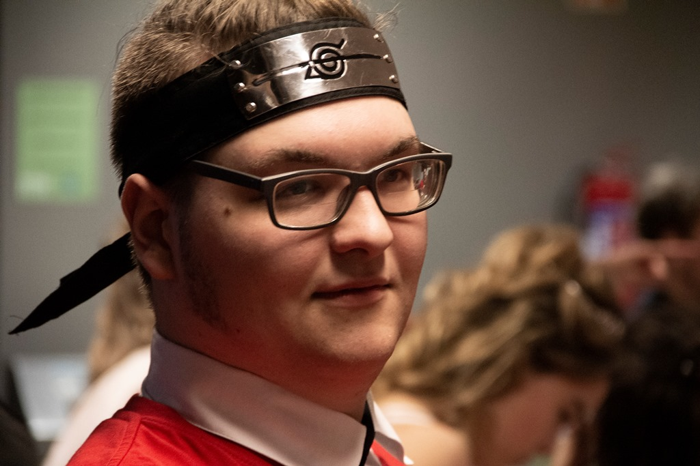
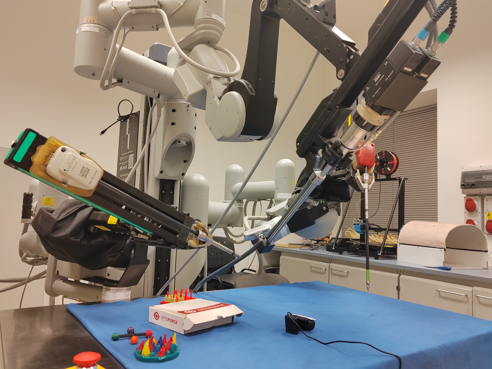
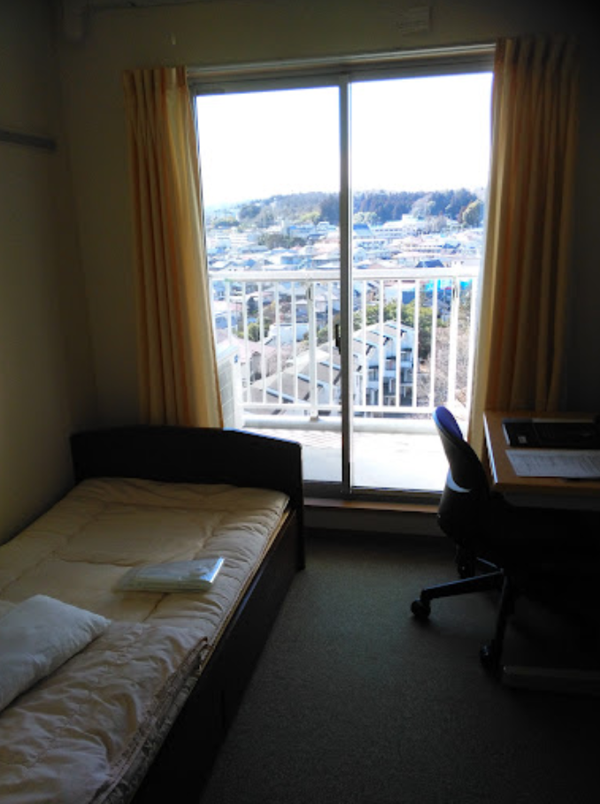
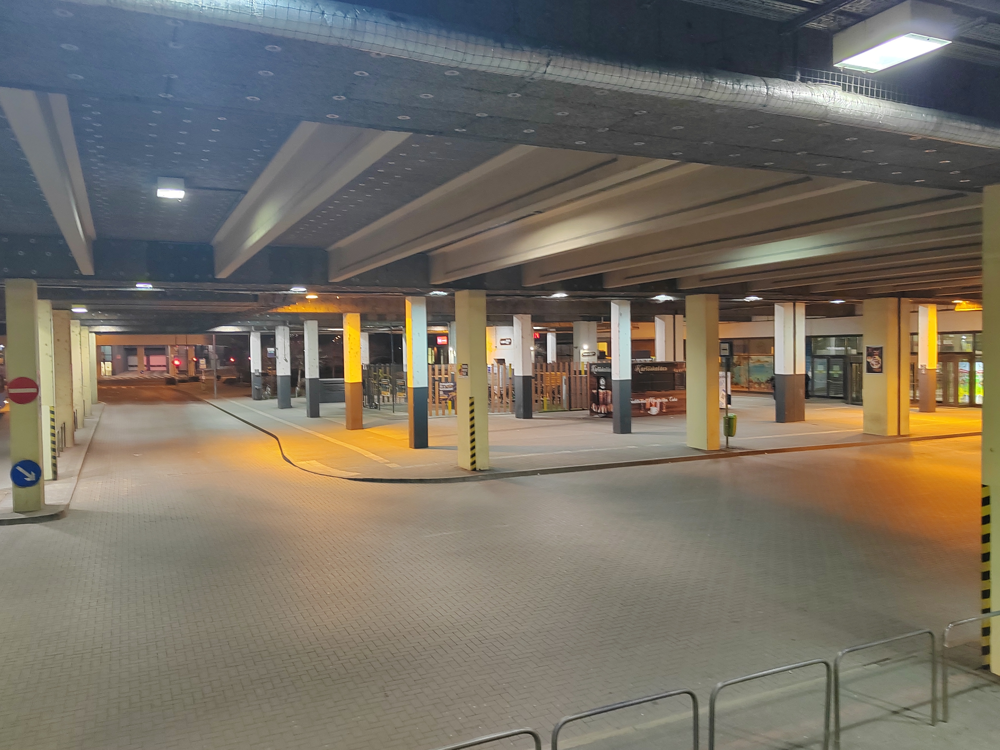

## Kezdjük az elején

Olyan 2019 magasságában elkezdtem tanulni japánul. Akkoriban épp lebegtetve volt, hogy 2 nyelvvizsga fog majd kelleni az egyetemi diplomához, és gondoltam, akkor lehet akár japán is, hogy ne kelljen dalszöveg- és képregényfordításokra várnom. Hiába a nyolc év német általánosban, ha egyszer nem volt semmi motivációm használni. Úgyhogy beiratkoztam egy japán nyelviskolába, és megcéloztam egy olyan haladó-középfok jellegű nyelvvizsgát.

5 évvel később, nyelvvizsga megvan, és a diplomához se volt sok hátra. Ezen a ponton már elég sokat interaktáltam a helyi japánokkal, és kifejezetten bírtam őket. És valamiért ők is bírták az én búrámat. Ez az a nép akik megeszik a *fugu* halat, ami a legmérgezőbb állat a világon, szóval ez mindent elmond az ízlésükről.

Mindenesetre ezen a ponton tudomást szereztem egy olyan ösztöndíjról, amivel ki tudnék költözni Japánba, ingyenesen tovább tudnék tanulni a legjobb egyetemeik egyikén, és még annyi költőpénzt is kapnék havonta, amiből egy visszafogott életet el lehet tartani. Sok lépésből álló, masszívan bürokratikus procedúra ez, és az utóbbi években 3-4 embert küldtek ki Magyarországról. Van az angoloknak egy kifejezésük, a *longshot*. Google professzor úr az alábbi módon definiálja:


**Egy próbálkozás vagy tipp, amelynek csak a legcsekélyebb esélye van a sikerre vagy a pontosságra.**


Szóval igen, megpályáztam az ösztöndíjat. Akármennyire is *longshot*, egy ilyen lehetőséget nem hagyna békében, ha elszalasztanék. Úgyse jön össze, de legalább nyugodtan fogok aludni.

## Erre összejött

Upsz. 2025 Február első hetében az esztergomi strandfürdőben, átöltözés közben kaptam a hírt, hogy április elején költözöm ki. Nyilván nem először mondtam a családon és baráti köreimen belül, hogy ez a terv. Van viszont egy tendenciám nagy hangerővel belecsapni komoly tervekbe, aztán nagyon gyorsan feladni őket. Szóval valószínűleg többen (valamelyest magamat is beleértve) arra számítottak, hogy ez az egész Japános terv is ennek a sorozatnak lesz a folytatása. De akkor és ott leesett, hogy ezt nem úszom meg olyan könnyen.

## A konkrétumok

Április elején költözök ki Japán északkeleti régiójába, Sendai-ba. Kb 1 milliós a lakossága, van 2 metró is, plusz vonatok dögivel. De nem egy kifejezetten turistacentrum, egy meglehetősen csendes város, aránylag kevés ismertebb látnivalóval.

<!-- markdownlint-disable MD033 -->

<iframe src="https://www.google.com/maps/embed?pb=!1m18!1m12!1m3!1d342787.9460932301!2d140.439174017994!3d38.31463023602812!2m3!1f0!2f0!3f0!3m2!1i1024!2i768!4f13.1!3m3!1m2!1s0x5f8a2aee30cd55d3%3A0xba2579e0b846b1ee!2sSendai%2C%20Miyagi%2C%20Japan!5e1!3m2!1sen!2shu!4v1740058284224!5m2!1sen!2shu" width="600" height="450" style="border:3px solid black;" allowfullscreen="" loading="lazy" referrerpolicy="no-referrer-when-downgrade"></iframe>

De én amúgy sem turistaútra megyek ki, hanem továbbtanulni. Egészen konkrétan egy 5 éves osztatlan mester-doktori kurzuson a Tohoku Egyetemen, ami stabilan Japán 3 legerősebbike között van, mérnöki tudományokban pedig kényelmesen a világ 100 legjobbjában. Az alapképzésen túl viszont már nem csak a vizsgatárgyak biflázásáról szól az egyetem. Végig kutatás-fejlesztést fogunk végezni. Én speciel az Óbudain beleszerettem a robotikába, és a Tohokun is egy ilyen témájú laborhoz csatlakoztam, katasztrófaelhárítási robotok készítésébe fogok beszállni. Kifejezetten érdekelnek ennek a műfajnak a problémái, és ezek mérnöki megoldásai. Plusz Japán (elég egyértelmű okokból) a világ élvonalán van a témában, ezért teljesen összeálltak a csillagok.

## Az első 6 hónap

Japánban a tanév rendje kicsit máshogy van, mint MO-n. A fő különbség az, hogy a félévek áprilisban és októberben kezdődnek. Én idén októberben kezdek az Alkalmazott Informatikai Karon; feltéve, hogy bejutok. Mivelhogy ide is felvételiznem kell majd. Hálaégnek volt annyi eszem, hogy felvettem utolsó félévemben pár tárgyat még az Óbudain, ami segített felkészülni, szóval abszolút nem nulláról indulok. Plusz a labor egyik professzora elvállalta, hogy az akadémiai tanácsadóm legyen. Amennyit eddig email-eztem vele, egy nagyon segítőkész alaknak tűnik, szóval nem aggódom túlzottan.

Az első 6 hónapom így a felvételire felkészüléssel fog telni. Legalábbis részben. Normál esetben ilyenkor be kellene iratkozni egy intenzív nyelvi felkészítőre. Ezt viszont én, a mérhetetlen zsenialitásommal már effektíve kipipáltam (hehe). Úgyhogy élből kutatni fogok, amiből remélhetőleg lesz majd mesterdiploma-téma, és talán még doktori disszertáció is.

## Lakhatás

Ebben a felkészülési időszakban életemben először kollégiumban fogok lakni. Lesz saját szobám és mosdóm/fürdőm, de a konyha 8 emberrel lesz közös. A lakótársaim másoddiplomások lesznek, várhatóan keverten japánok és külföldiek, leginkább Délkelet-Ázsiából. Betettem egy referenciaképet arról a fajta szobáról, amiben lakni fogok. Ha mázlim van, még a kilátás is ilyen jó lesz.

 

Koliban viszont limitált ideig lehet lakni, ezért ez alatt az időszak alatt egy garzonlakást is kinézek majd. Külföldiként meglesznek az albérlésnek az izgalmai, de az egyetem pont idén vezetett be egy programot a folyamat egyszerűsítésére. De ezen még ráérek aggódni.

## Erről a blogról

Itt fogom dokumentálni, miket láttam aznap, milyen batár menő dolgokat csináltam épp, meg hogy úgy általában hogy bírom a strapát 9000 kilométerre a szülővárosomtól. Szóval ha bármikor felmerülne az a kérdés, hogy vajon merre járok épp, tudod hol keresd a választ.

Lesznek a kiutazás előtt is azért izgalmak, amikről beszámolok majd itt. Diplomaosztó, búcsúbulik, és még egy nürnbergi tanulmányút is. Bár azokhoz már ígérem, nem fogok ennyit költeni.

Japánul sokféleképp lehet elköszönni. A *szajónara* kifejezést a legtöbben valószínű ismeritek, de manapság annak van egy kényelmetlen, véglegesnek ható utóíze, így azt nem használjuk túl sokat a mindennapokban. Helyette valami olyasmit szoktunk mondani, hogy *dzsaa, mata ne*. Ezt úgy fordítanám, hogy "nos akkor, nemsoká találkozunk". Ez tipikusan egy egyszerű, valós tény. Suliban, munkában, barátokkal lógáskor több mint valószínű, hogy nemsoká újból keresztezik egymást az útjaitok.

Előfordul olyan is viszont, hogy mindkét fél tudja, hogy ez egy jó darabig nem lesz így. Egy amolyan szürke hazugság. Ilyenkor talán azt remélik, hogy a kicsi világ újból összesodorja őket. Vagy egyszerűen nem tudnak vagy akarnak megbírkózni azzal a gondolattal, hogy nem lesznek egymás életében egy igen hosszú ideig, hacsak vagy akár soha többé. Vagy talán csak egy megkérdőjelezetlen társadalmi normáról van szó. Egy amolyan szürke hazugságról. Ezt a részét még nem tudtam a japánok pszichéjének megtörni. Ha egyszer sikerül, majd posztolom ide az eredményeimet. Mindaddig pedig:

*Dzsaa, mata ne!*

