## A koncepció

Még szilveszter tájékán kaptam egy hírt, hogy ki tudunk menni egy 4 napos tanulmányútra Nürnbergbe, részt venni az idei *Embedded World* kiálltáson. Ez egy beágyazott rendszerek témájú expo, és kijön mindenféle robotikával, otthoni automatizációval, drónokkal, nyomtatott áramkörökkel, haditechnikával, stb. foglalkozó cég bemutatni a termékeiket. Szóval úgy döntöttem, lecsapok a lehetőségre, ha már így adatott, még ha ugyan 2 héttel a Japánba kiköltözésem előtt is. Legalább még egyszer tudok jó német sört inni.


A német sör vegyszermentes, Németország részemről rendben.


Viszont az ázsiaiakban nem bízom, hogy jók legyenek a sörfőzésben.

## Az odaút

Március 10-én indultunk reggel a Keletiből. Az osztrák vasútról sok rosszat nem tudok mondani. Railjettel mentünk, tiszta is volt, gyors is volt, pontos is volt azon az osztrák szakaszon, ahol engedték neki. Az egyetlen amibe bele tudnék kötni, hogy elég szorosan voltak az ülőhelyek elrendezve, szóval hosszabb utat nem mennék feltétlen második osztályon, de arra a pár órára amíg rajta voltunk, teljesen rendben volt. Bécsben átszálltunk a Nürnbergbe induló Intercity Expressre, és az meg aztán tényleg nyomta neki. Osztrák síneken. Aztán jött a Deutsche Bahn szakasza.

Megérkezünk Passauba, a német határhoz. Végigmegy a rendőrség a vonaton, semmi extra. Aztán vártunk. És vártunk. Fél órán át helyben. Mert a DB, a németek drága vasúttársasága berendelt egy tehervonatot elénk. Azután pedig terelt úton kellett haladnunk egy hosszú szakaszon, ahol meg egy lokális járat mögött kullogtunk, 300 kilométerórás maximum sebesség ide vagy oda.

## A szállás

Nade, egy óra késéssel ugyan végül, de megérkeztünk Nürnbergbe.

 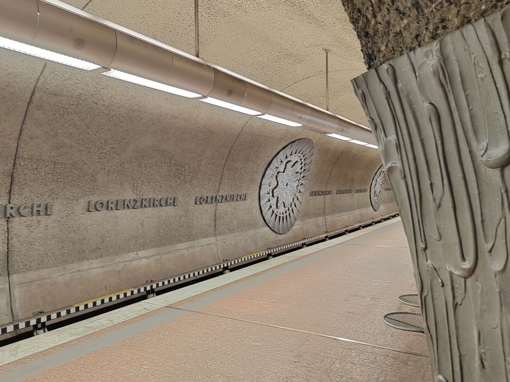

A szállásunk az úgynevezett *Kaiserburg*, azaz a Császári Kastély volt. Mint kiderült, át alakítva félig ifjúsági hotellé, félig konferenciaközponttá. Mi konkrétan a 8.emeleten voltunk, az egyik toronyban.

  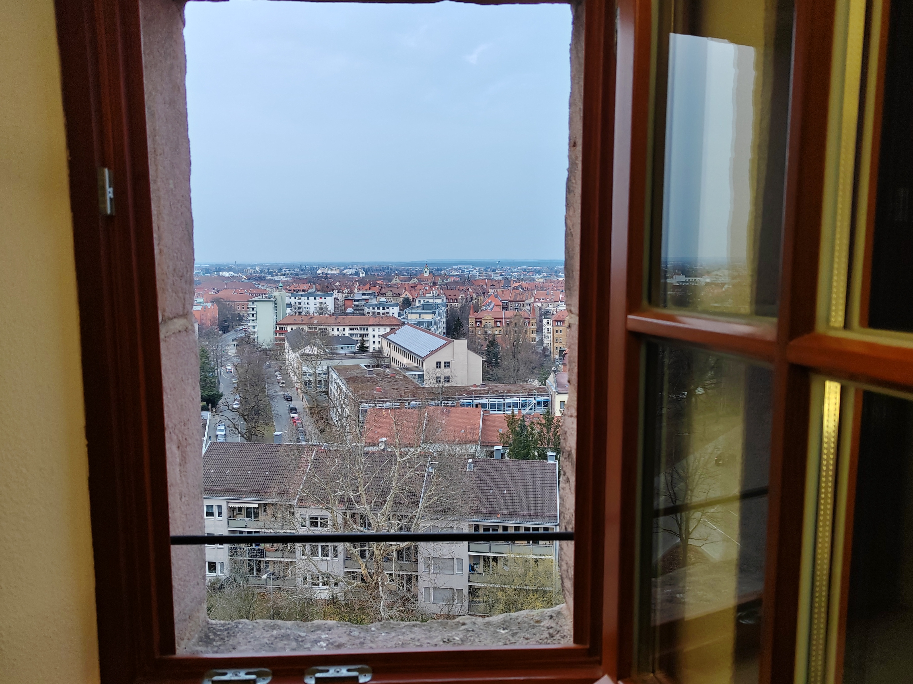

Lepakoltuk a cuccainkat, beágyaztunk, aztán elmentünk egy kis kör városnézésre. Normál esetben a templom tornyán délben van ilyen animatronikus táncoló bábkórus, kábé mint a Shrekben amikor Shrek és Szamár megérkezik a várba. De most épp karbantartás alatt volt, szóval arról lemaradtunk.

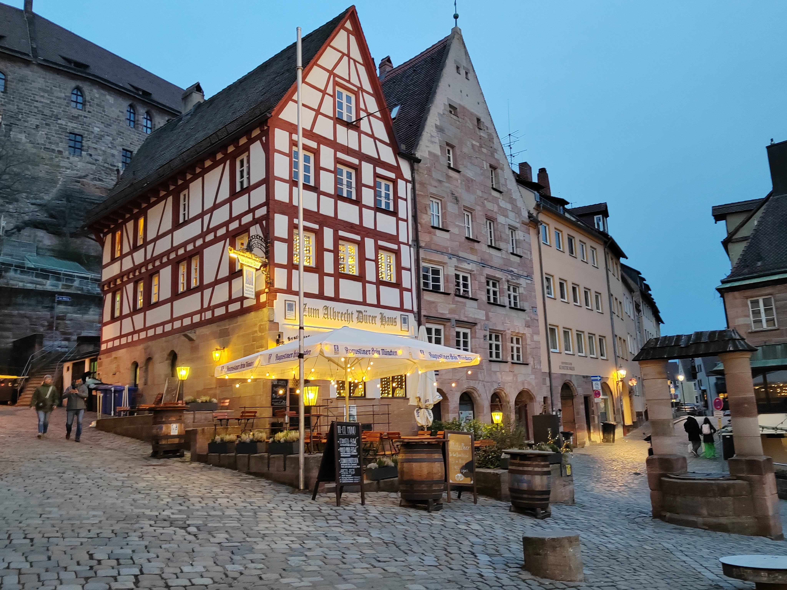 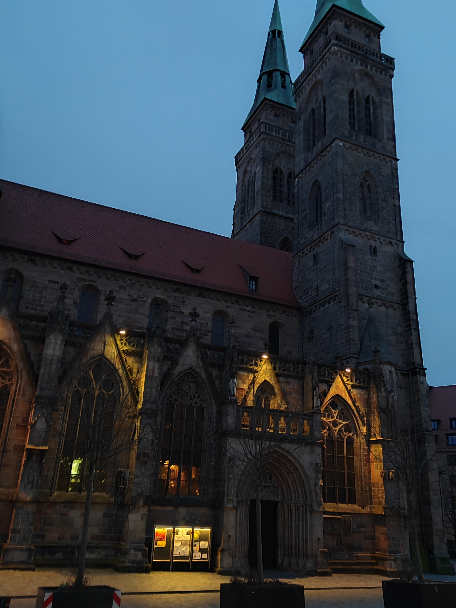 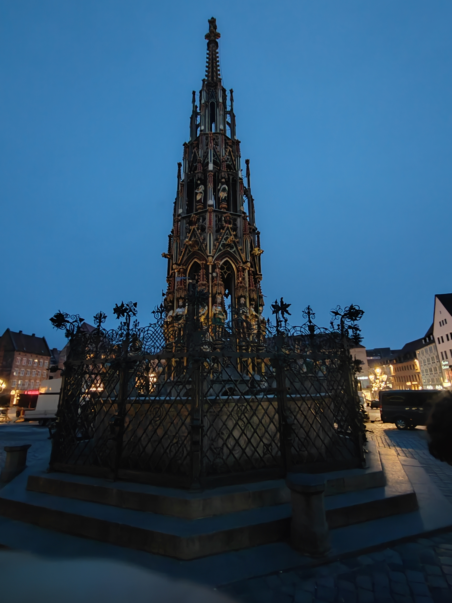

Aztán elmentünk megvacsizni egy helyi étterembe, az *Im Keller*-be. Németesek előnyben, ez valóban egy pince volt, ilyen jó kis bajor stílusban kialakítva. Angolul a leírások katasztrofálisak voltak, úgyhogy életemben nagyjából előszőr kapóra jött az a 8 évnyi nyelvóra. Én sertésmedálokat ettem borsszószban, *spätzle*-lel, ami olyan, mint a nokedli, csak tészta formában. Nagyon eltalálták a szószt is, meg a tészta is ilyen jó ruganyos, rágcsálnivaló volt. És persze itt helyi specialitás a *Rauchbier* azaz füstsör, amit apám egyszer úgy írt le, mintha sonkalével főztek volna barnasört. Nekem bejött, de enyhén fogalmazva megosztó. De legalább én tudtam magabiztosan rendelni, és a többiek meg tudták kóstolni. Ahogy vártam, mindenki utálta, minusz egy srácot, akinek nagyon bejött.

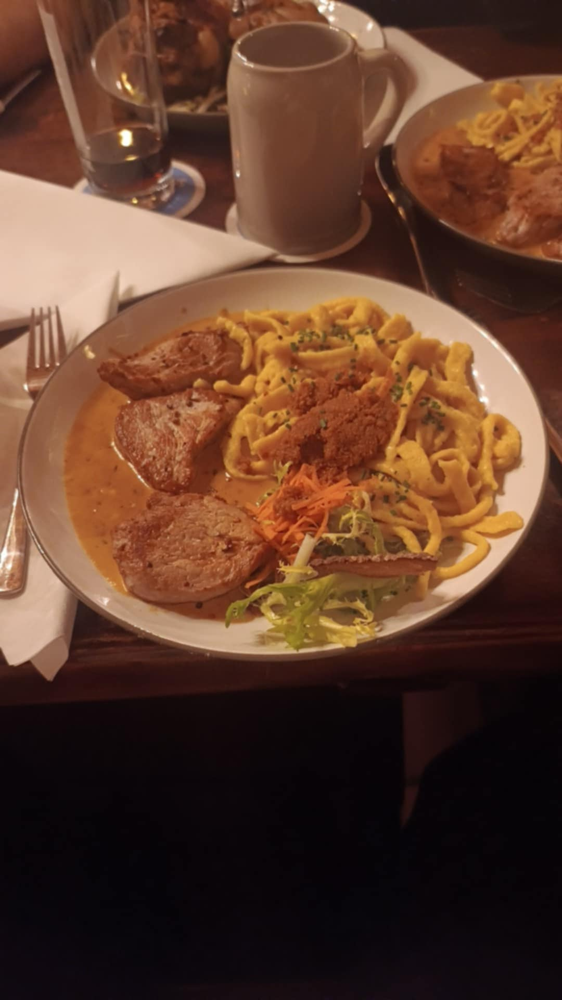 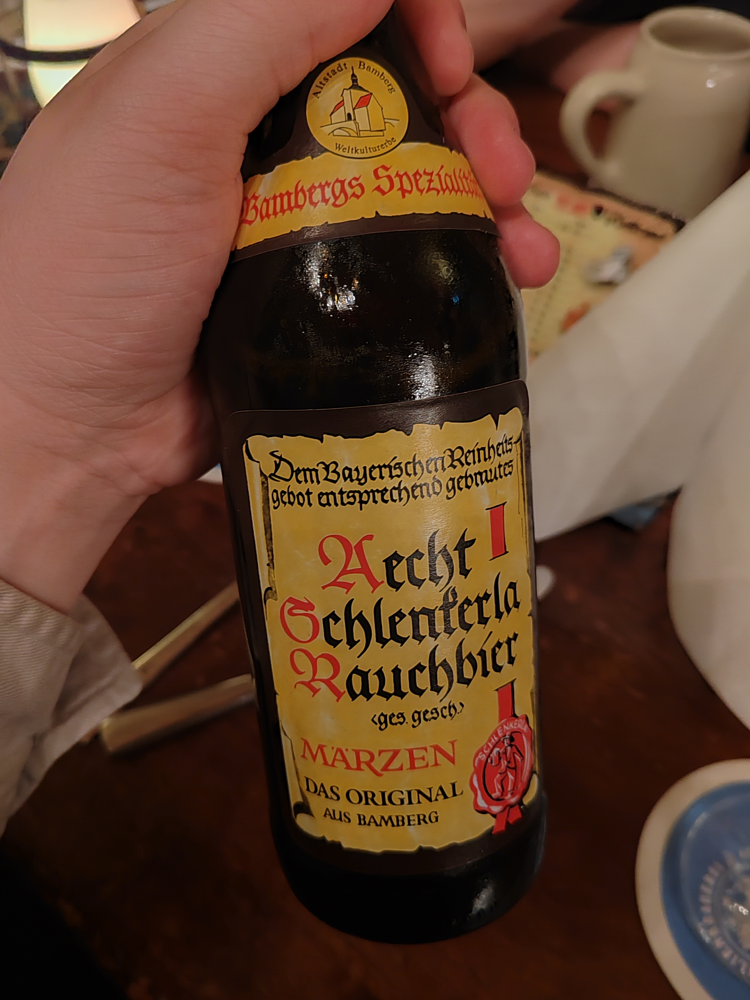

Le is haverkodtam az asztalnál a srácokkal. Vicces módon az egyiküket úgyszint Papp Andrásnak hívták. És mivel ez egy mérnöki esemény volt, talán meg se kellett volna lepjen, hogy mindhárman Linuxosok voltak. Ráadásul ketten, Tamás és Tibi ugyanazt a verziót használták, mint én. András nem, szóval őt egész végig nyúztuk is miatta. Mindenesetre elég gyorsan megtaláltuk a hangot. Ez kábé olyan, mintha mindannyian autómániások lettünk volna, és kiderült volna, hogy ugyanazt vezetjük. Sokat elmond az ember filozófiájáról, hogy hogy mibe/mihez ül le. Befejeztük a zabát, aztán visszabattyogtunk a szállásra, és ki is dőlt mindenki elég gyorsan.

## A kiállítás - EW25

Másnap egy tipikus német menzás stílusú reggelivel indítottunk. Sokféle friss zsemle, sajtok, lekvárok, felvágottak, joghurtok, gyümölcslevek, ilyesmi. De minden nap volt valami kis extra finomság.

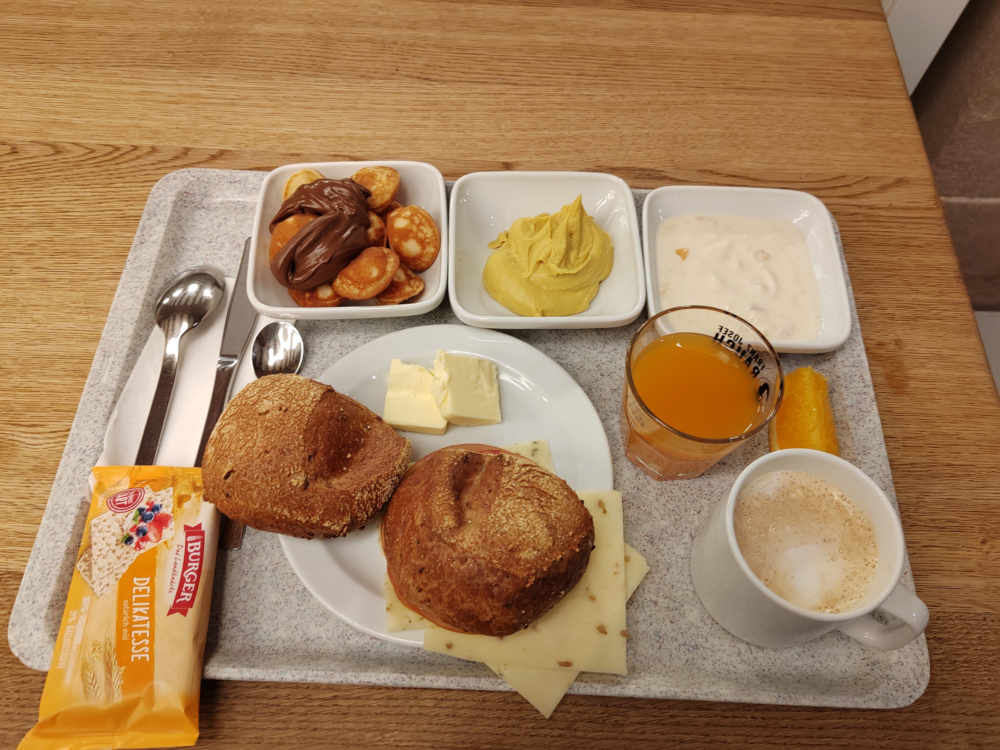

Aztán felpattantunk a metróra, és elmentünk a kiállításra. Arra viszont nem voltam felkészülve, hogy úgy igazán mekkora lesz a hely. 7 csarnok volt teljesen megtöltve kiállítócégekkel. Néhány helyen még lehetett mindenféle ajándékot is szerezni. Voltak páran, akik már másodjára-harmadjára voltak ezen a tanulmányúton, és ők élből a zsákmányra mentek. Elvileg most gyengébb volt a szerezhető dolgok kínálata, de egyik srác még így is 90 ezer forintnyi cuccal jött el a végén. Ezek többnyire prototípusozáshoz használható fejlesztőpanelek, vagyis olyan mikroszámítógépek, amikkel szenzorokat lehet vezérelni, motorokat meghajtani, ilyesmik. Én azért adtam magamnak több időt körbenézni, de a standok nagyrésze vagy eléggé testidegen témákkal foglalkozott, vagy olyan szintű problémákkal foglalkozott, ami nekem még masszívan túl magas volt. Azért eléggé érződött, hogy informatikus vagyok a villamosmérnökök világában. De néhány standnál azért le tudtam egy-egy fél órára állni beszélgetni az előadókkal. Direkt arról érdeklődtem, hogy kinek milyen kínálata van olyan robotokhoz, amikkel áprilistól foglalkozni fogok. Szóval azért mindenképp informatív volt.

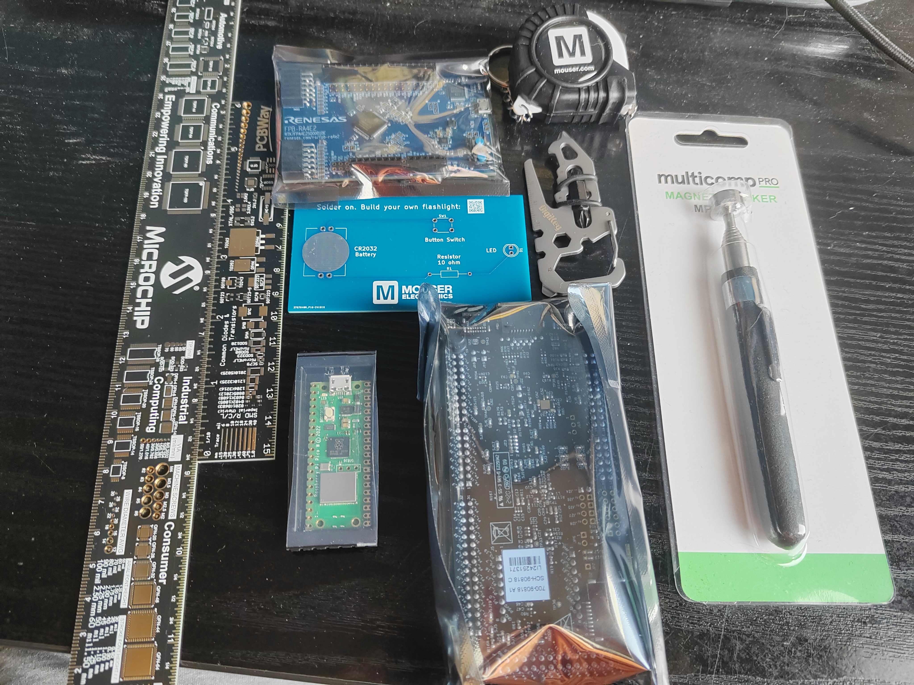

## Sörfőzde Fürth-ben

A Nürnberg és Fürth határán lévő *Tucher Privatbrauerei*-ba is elmentünk délután. A főzőmester, egy Helmut nevű úriember vezetett minket körbe. Eredetileg nem volt beígérve, hogy lesz angol nyelvű körbevezetés, mert a saját elmondása szerint nem a legjobb az angolja. Ehhez képest amúgy komplett folyékonysággal leadta a túrát. Az egyetlen pont ahol elgondolkozott, az volt, hogy hogy van az *amiláz* angolul, de ebben örömmel kisegítettem. Végre kapóra jött a 4 év angol kémia középsuliból. *Viva Petrik!*

Mint kiderült, az elhelyezkedés a városhatáron nem véletlen műve. Évszázadokra visszamenő rivalizálás volt Fürth és Nürnberg között, ami a söreikre is kiterjedt. Mindkét városnak tucatnyi főzdéje volt, de az egyik lakosai nem itták a másik város sörét, és vice versa. Az évszázadok alatt egyre inkább konszolidálódtak a főzdék, és a 2.világháború végére csak a fürthi Grüner és a nürnbergi Tucher maradt, amelyeket 2008-ban egy müncheni figura felvásárolt. De a rivalizálás ennek ellenére tovább élt. Jelenleg is a főzde a városhatáron áll, és a Grüner-t a fürthi oldalon, a Tucher-t a nürnbergi oldalon főzik. Hogy ez mennyire igaz, és mennyire mitológia... Hát nem értek annyira a sörgyártáshoz, hogy meg tudjam mondani, de a látszatra kétségtelenül adnak.

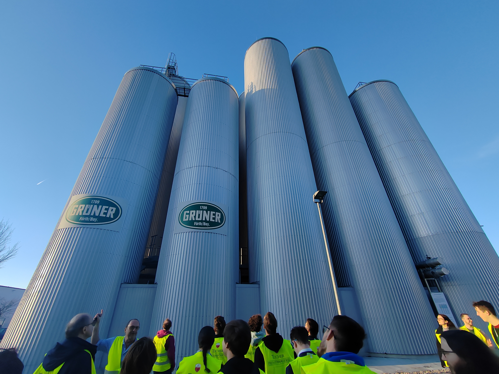 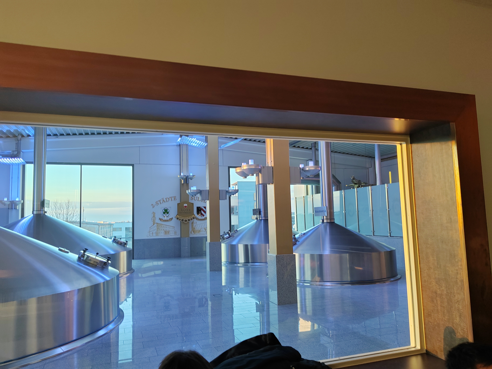

Volt egy előadás a folyamatról, ahol tanultam egy nekem eddig teljesen ismeretlen dolgot a sörfőzésről: vannak alsó meg felső erjesztésű sörök. Ez attól függ, hogy a főzde élesztőkultúrája alacsonyabb vagy magasabb hőfokon emészt optimálisan. Alsó erjesztésűeknél az élesztő feladata csak annyi, hogy lebontsa a malátában a cukrokat alkoholra és szén-dioxidra. Ilyen pl. egy lager vagy pilsner. Ezzel szemben a felső erjesztésűeknél az élesztő maga is hozzájárul az ízhez. Például egy jó friss búzasörben az a banános mellékíz az az élesztő műve. De még például egy stout is ilyen, bár ott a maláta pörköltsége méginkább hozzájárul az ízprofilhoz. A kettő fajtában amúgy a fő különbséget az adja, hogy mennyire fér az élesztő hozzá oxigénhez. Mert a felső erjesztésűben az élesztő a felszínen több levegőt kap, mint az alsók esetében, a tartály alján; ha jól értettem. Ezen a ponton a negyedik korsó gratis sörömet ittam, és az intellektuális értekezési készségeim egy kilométer mély kráterbe zuhantak.

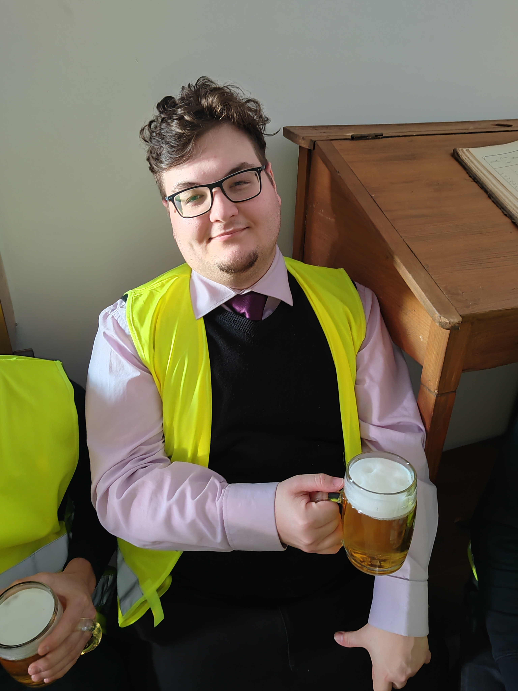

Onnan pedig továbbmentünk vacsorázni. Sajnos az akkori hamit nem fotóztam le, de az megmaradt, hogy a német krumplipüré is egész más, mint amit egy otthoni étteremben kapnál. Mintha valami extra keményítőt kevertek volna hozzá, olyan ruganyos, jobban egybe marad. De ehhez képest mégis sima és krémes. Szóval ezt majd valahogy ki kell kísérleteznem.

## Katakombák

Másnap reggeli után lementünk a nürnbergi katakombákba. A középkor óta bővűl ez a pincerendszer, eredetileg sörfőzésre és -tárolásra volt kialakítva. A sör védelme nagyon fontos volt, mert a pasztörizálás előtt a sört biztonságosabb volt inni, mint a helyi vizet. Még az 1800-as években is 500 liter sört fogyasztott évente az átlag nürnbergi. Így hát közérdek volt a sörpince karbantartása. A felső részeket 1942-ben átalakították bunkerré. A britek persze nem vártak a bombázással, úgyhogy sietős munka volt, aminek köszönhetően épphogy nem voltak éppen a legtágasabbak a járatok. Ide hozták a középkori festményeket, templomi színezett üvegablakokat, és egyéb mozdítható mentenivalókat.

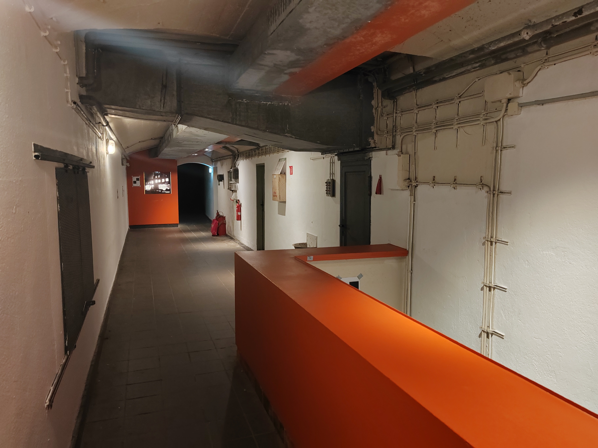 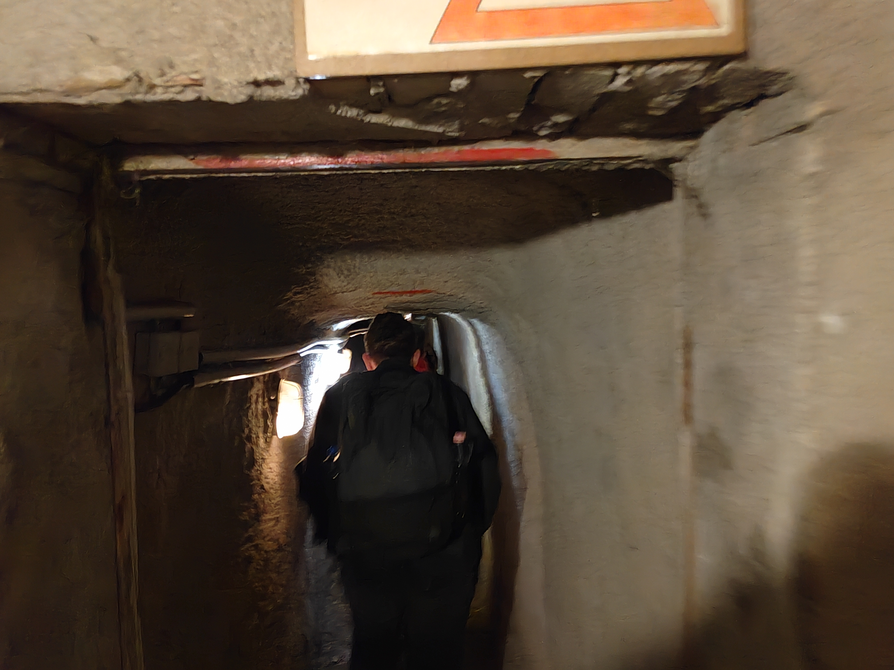

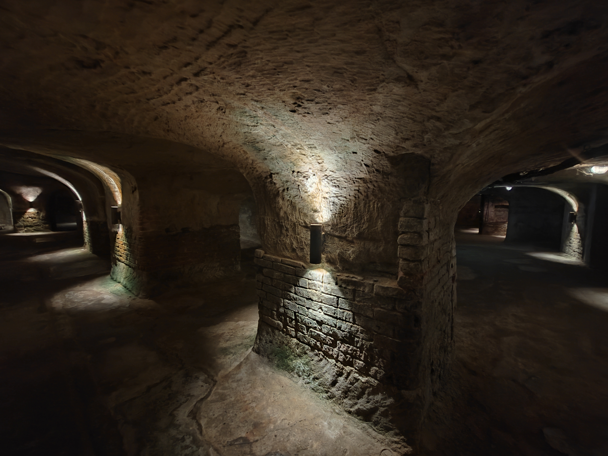 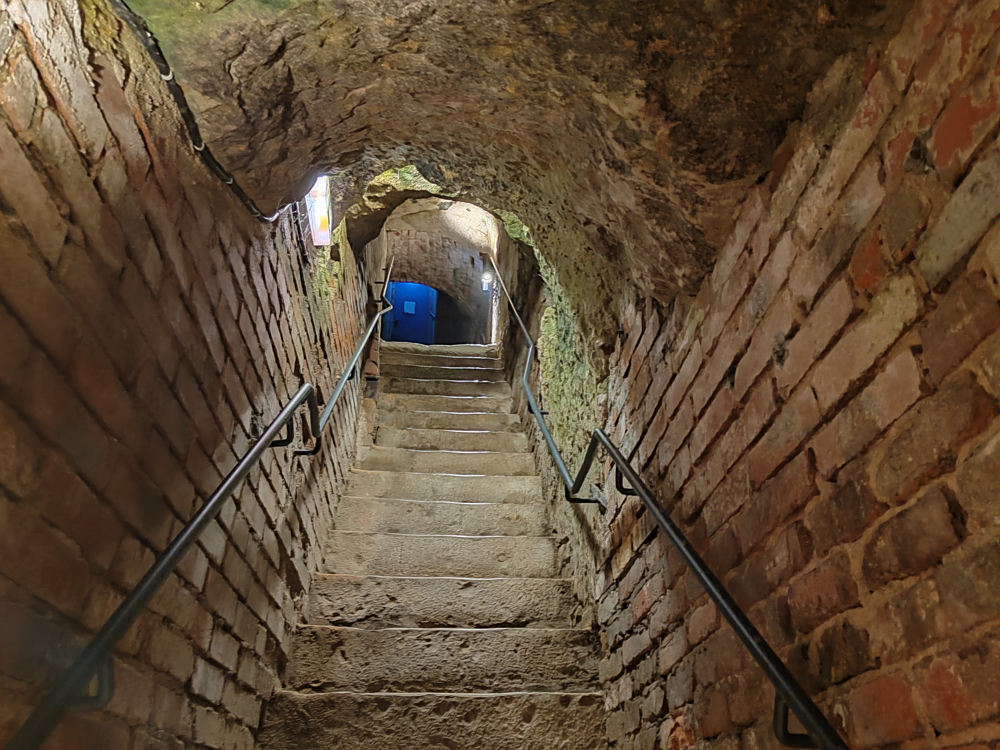

Voltak lenn jégkamrák is, amiket a 70-es évekig használtak, amíg csak nem váltak teljesen elterjedté a hűtőszekrények. A Harrer cég tartósított ezekben húsokat, zöldségeket, gyümölcsöket. Savanyítottak káposztát is ott, de hálaégnek az a szag már rég kiment, különben igénybe kellett volna vennem azokat a menekülőjáratokat.

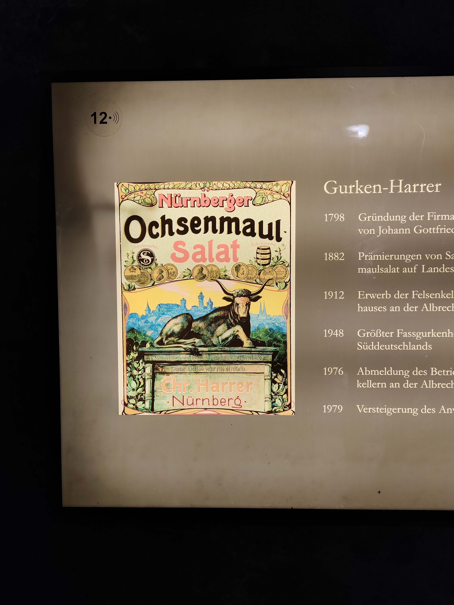 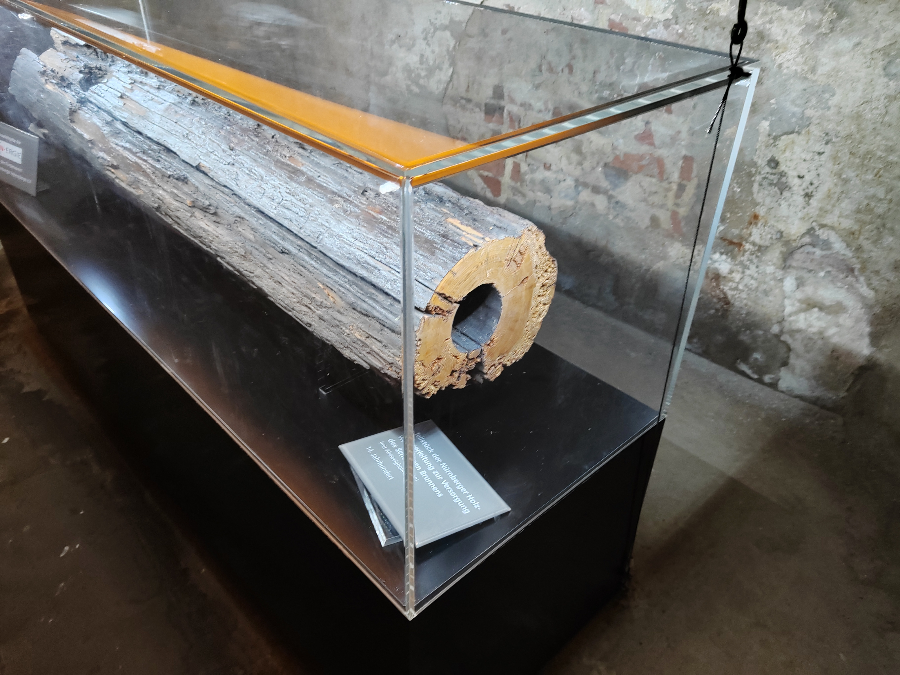

A légforgatásra kitaláltak a középkorban egy hatalmas trükköt. A házak két keleti és nyugati oldalában építettek a tetőig felmenő szellőzőjáratokat, és így az egyik a nap nagy részében melegebb volt, mint a másik, attól függően, hogy a nap épp melyik oldalálát sütötte a háznak. Így a hőkülönbség megforgatta a levegőt, és az egész pincerendszerben generált megfelelő légmozgást. Legalábbis egész addig, amíg egy kora 19.századi úriember nem telepített le oda egy masszív gőzgépet. Azt az esetet leszámíŧva ez a rendszer évszázadok óta működik. Viszont a 2.világháború után nem foglalkoztak a város újraépítésekor nem foglalkoztak a szellőzőnyílások rekonstruálásával, rájuk építettek. Légforgás nélkül beázott az egész, ami miatt a házak fölötte elkezdtek omladozni, mert az egész város mészkövön épül, ami jól elkezdte megszívni magát a felgyülemlő vízzel. Szerencsére még időben fel tudtak pár megmaradt nyílást szabadítani és ki tudott a pincerendszer száradni.

Sört ma már nem tárolnak a pincében, mert azért mégis van egy 7-8 fokos hőingadozása az évben, ami egy jól kiépített ipari környezetben elkerülhető. De a végén azért meglátogattunk egy kis magán főzdét is, ami a pince fölött volt, és akik a túrát szervezték. Ők foglalkoznak sörrel, brandyvel és whiskey-vel is. A sörfőzde részbe mentünk be először. Az a malátaillat, ami odabenn fogadott, valami fenomenális volt. Szoktam mondani, hogy egyszer meg akarok próbálni magam is sört főzni, és ez csak még jobban meggyőzött, mert akarom még ezt az illatot érezni. Egy ott főzött vörös sörrel meg is kínáltak minket. Esküszöm, mintha gyümölcsös ízesítése lett volna, pedig ebben nem hogy gyümölcs nem volt, de még komló se. Csak nagyon precízen pörkölt helyi árpamaláta, meg saját speckó élesztőkultúra. Akartam venni, de vicces módon nem volt nyitva a bolt szekció, és már nem volt lehetőségem visszamenni.

Aztán a whiskey szekciót is megnéztük. Mint kiderült, szeretnek náluk cégek és magánemberek saját bélyegzésű whiskey-t is hordóban érleltetni. Emlékszem, hogy az Óbudai Egyetemnek is van saját pálinkája, amivel még tavaly márciusban a Japánból látogató hallgatókat jó alaposan leitattuk, úgyhogy ez valószínű hasonló felállás.

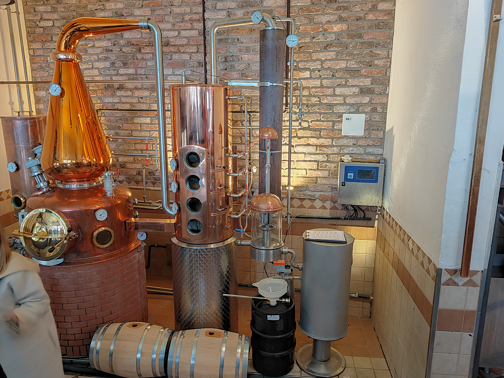 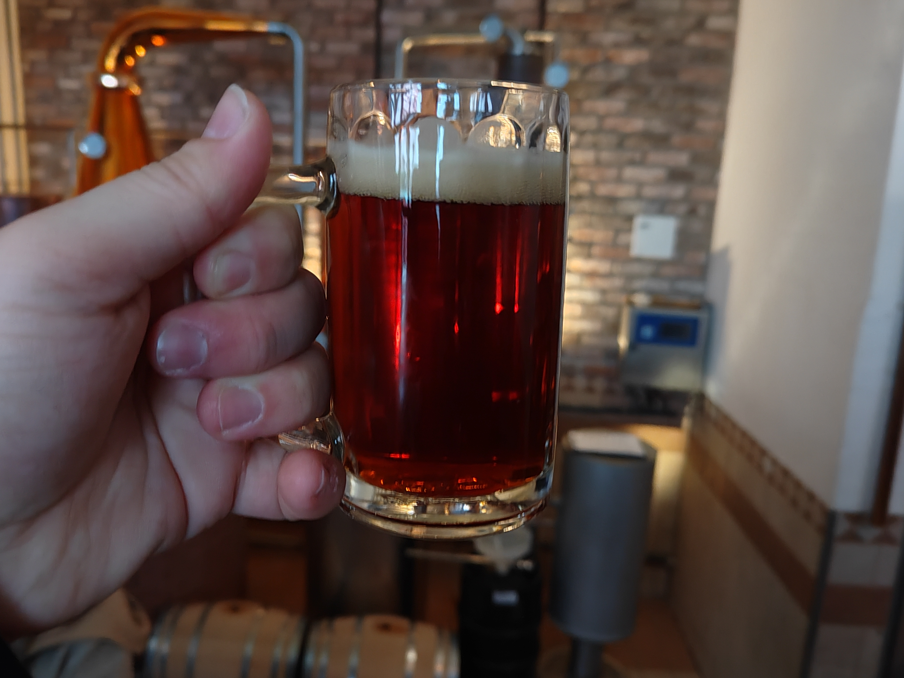 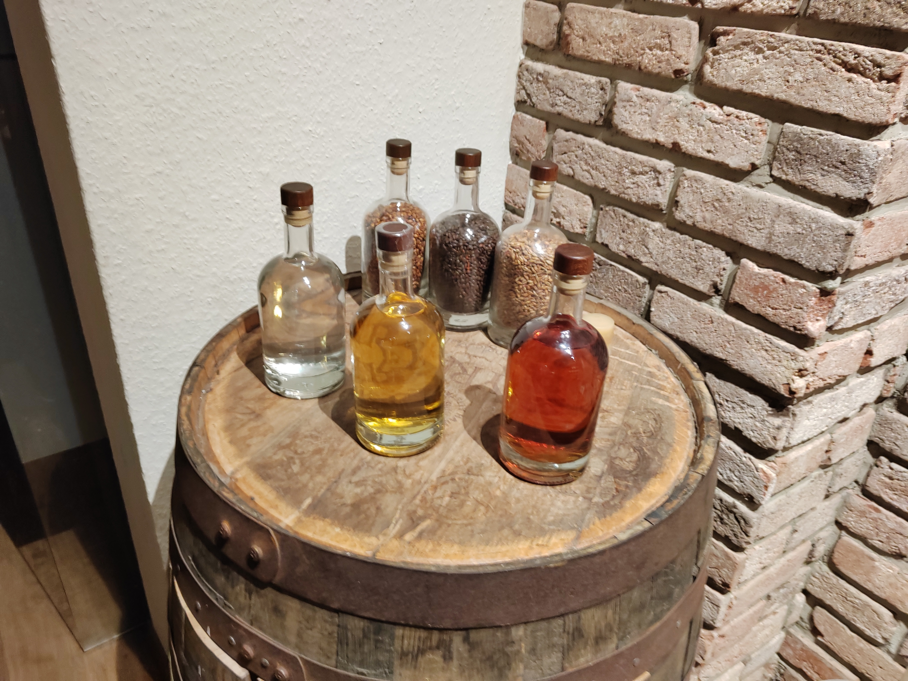

## Négy srác kontra Five Guys

Onnan mentünk volna a kommunikációs múzeumba, de odaúton az egyik csodálatos macskaköves emelkedőn szépen félreléptem, és majdnem kitörtem a lábam. Semmi bajom nem volt hálaégnek, de Nürnberg még olyan ékes magyar nyelvű káromkodásokat még nem hallott az előtt amit ott elkiabáltam. Így viszont a múzeumról lemondtam, elkezdtem szép komótosan visszabattyogni a szállásra. Az úton viszont összefutottam azokkal a srácokkal akikkel az első nap a pinceétteremben lehaverkodtam. Mint kiderült, ők épp vacsorázni voltak úton, és ezen a ponton késő délután már nekem is kedvem volt enni valamit. És nekik meg is volt a nagybetűs tervük: *Five Guys*.

Naszóval a Five Guys-ról annyit kell tudni, hogy egy nagyon híres felsőbb kategóriás gyorsétterem az amcsiknál. Európában nincs nagy jelenléte, de Németország turistavárosaiban előfordul. Hannoverben is nézegettem, amikor kint voltam 2023-ban, de nem jött össze. A srácok is várost néztek egész nap, és akkor így a sok mászkálás után nagyon vágytunk mindannyian egy jó burger-sültkrumpli-milkshake mesterhármasra. úgyhogy megejtettük. A hamburger elég standard téma volt, de nagyon tömör. Nem az a széllelbélelt buci, amit a magyar kajáldákban találsz. Plusz, friss jalapeno paprikát használtak, nem a savanyított konzervet, amit még nagyon máshol nem láttam, de jó ötlet volt. A krumpli pedig *cajun* fűszerrel volt megszórva, ami a dél-USÁban a Louisiana-iak ízvilága. Egy pikáns, füstölt paprikás-kakukkfüves-zelleres veszett aromás keverék, már csak illatra kegyetlen jó volt. Legközelebb ha sütök krumplit, egész biztosan megpróbálom egy ilyennel megküldeni. De a milkshake vert mindent. Olyan krémes volt, mintha tejszínből lett volna. Plusz, mivel popcornos ízű volt, voltak benne tényleges popcorn darabkák, ami meglepően jól hatott rá. Kerül így bele egy jó kis


HETEROGÉNSÉG!


ami nélkül szerintem egy milkshake sem az igazi. Ezután pedig vettünk pár sört és pattanásig teli hassal valahogy felmásztunk a szállásra. A srácok 9-edik emeleti szobájában jól eldumáltunk, ittunk egy pár órát. Így utólag belegondolva ezzel tudtam kicsit pótolni a gólyatábort, ami nekem a COVID miatt kimaradt. Aztán pedig, az utolsó napra felkészülve, lementem egy emeletet, és kidőltem aludni.

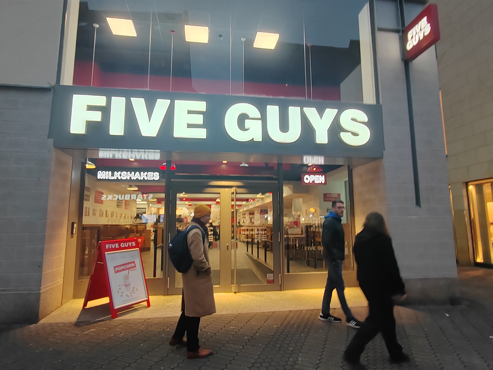 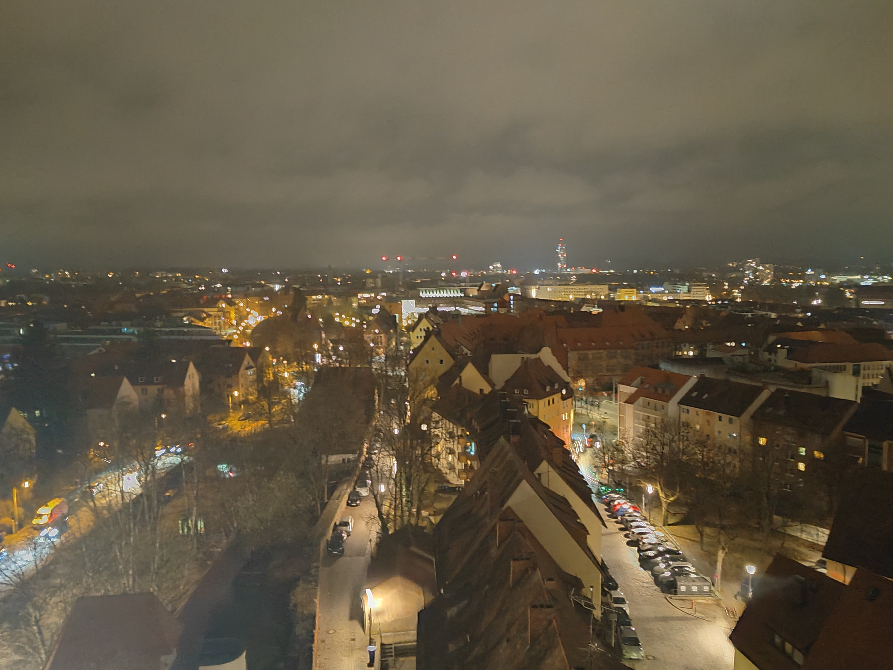

## Kalandok egy italdiszkont nyomában

Mint kiderült, nem volt lehetősége mindenkinek saját terv szerint pakolnia, együtt kellett elhagynunk a szállást. Őszintén, én azt terveztem utolsó napra, hogy kb. 10-ig alszom, hogy jó éberen meg tudjam írni ezt a bejegyzést a vonaton, de ez a terv így elúszott. Heves pakolás után elhagytuk a szállást, és mindenki ment amerre akart, megbeszélve, hogy a pályaudvaron találkozzunk fél órával a vonat indulása előtt.

Mi egy másik Andrással (de nem a másik *Papp* Andrással, hanem egy harmadik Andrással) kitalátuk, hogy elmegyünk keresni füstsört hazavinni. Egy a probléma: mint kiderült, a helyi közérteket csontszárazra fosztogatták már a korábbi napokon a többiek. Akármerre mentünk, sehol nem volt *Rauchbier*.

Ezért úgy döntöttünk, elmegyünk valamiféle italdiszkontba. Lófráltunk egy kicsit, aztán Google-ön találtunk is egyet egy 20 perc sétára, ami fél óra múlva nyílt a térkép szerint. Mondanám, hogy nagy örömmel kezdtünk el afelé baktatni, de hazudnék. Ugyanis ezen a ponton a bokám még mindig nem volt 100%-os, de ami még rosszabb, a talpam teljesen tropa volt a 3 nap folyamatos séta és limitált alvás miatt. De nem baj, szuvenírt azt azért mégiscsak kell vinni. Erre odaérünk, és nyilván zárva vannak a héten. Csak ezt elfelejtették a Google térképen rögzíteni. Nahát ennek nagyon nem örültünk, de oké, nem baj, akkor keresünk másikat. Kis töprengés után találtunk egy helyet, eléggé a külvárosban, és céltudatosan megindultunk afelé.

A villamoshoz sétálva hallottunk elég nagy fennforgást. Megafonokon ordibálás, sok rendőr kinn, tömeg kiabálás. Nem segített az se, hogy bombariadó volt a belvárosban, úgyhogy mindenhol szóltak a kürtök, és a tűzoltók is szirénázva siettek ide-oda. Mint utólag kiderült, gyakorlat volt, szóval minden tudomásommal teljesen véletlen volt az kettő egybeesése. Erről akkor viszont még nem tudva az volt a fejemben, hogy az egyetlenek akik képesek lennének városszerte bombariadót gerjeszteni, és nincs jobb dolguk csütörtök reggel, mint köztéren ordibálni, azok az AfD vagy valami másik náci lúzer brigád. Hallottam pletykát róla többiekről, hogy lesz aznap gyűlésük, plusz a bombariadó és megafonon torzított hangú haragos német ordibálás elég erősen a vicces bajszú fazon képét idézte meg a mi fejünkben. De amikor odaérkeztünk kukucskálni, kiderült, hogy tanártüntetés volt éppen soron. Szóval pozitívan csalódtam.

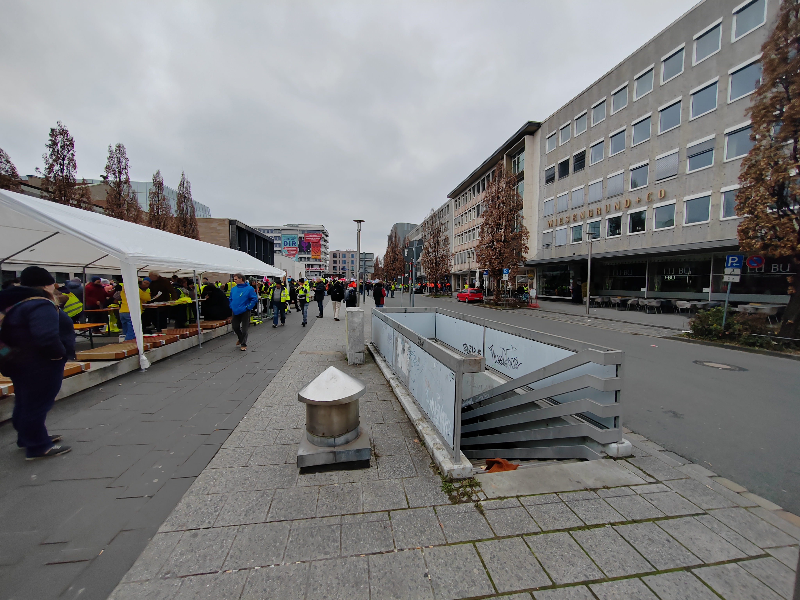

Mentünk is tovább az italdiszkontba. Kiderült, hogy Andrással mi már ismertük egymást, mert ő is oktatott egy rövid ideig a kispesti Logiscoolban, és vállalati bulin már futottunk össze. Igazándiból nem ismertem nagyon a többieket a túrán, mert egyrészt diplomásként idősebb is voltam, másrészt ők a Villamosmérnőki Karról jöttek javarészt. De nem mintha nagy akadály lett volna, két sör után már a mérnök az mérnök az mérnök. Viszont azért mégis meglepett, hogy milyen kicsi a világ, hogy ennyire véletlen helyen egy ex-kollégába belefussak. Egyre többször fedezem fel, hogy a hasonló emberek mennyire könnyen egymás vonzáskörzetébe tudnak esni tudtuk nélkül. Remélem ez a tendencia követni fog még egy darabig, mert jó hasznát venném.

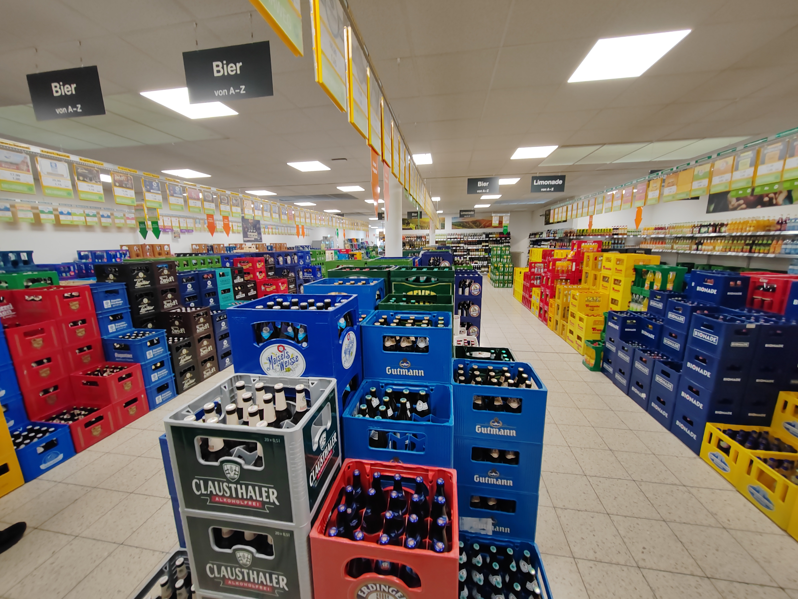

Begyűjtöttük a söreinket, és szépen megindultunk az állomásra. Mit sem tudva arról, mi vár ránk.

## A DB nem okoz csalódást

A vonatunk fél óra késéssel csusszan be a vágányra, úgyhogy a kalaúz nagyon sürget minket, hogy pattanjunk fel. Volt vagy két percünk a peronon a kb. 50 embernek beszállni. Így viszont nem tudtam megkeresni azt a kocsit, amiben a foglalt helyem volt. Nem baj, gondoltam, majd átvándorlok, csak egy kocsin kell átvágnom. Erre felszálltam, és megtapasztaltam a DB ismételt csodatételét. Lefújtak egy korábbi vonatot, és most az eleve forgalmas járaton két teli vonatnyi ember lett bepréselve. Ültek az ajtóban, a széksorok között a semmibe kapaszkodva álltak az emberek... Én meg ott tehetetlenkedtem a böszme nagy poggyászommal. Csak a vécéajtó előtt volt hely, ahová én be tudtam magam ékelni. Az egyetlen baj a forgalom volt, ami miatt rendszeresen emelgetnem kellett a bőröndömet. De azon a tömegen én nem fogom tudni átnyomni magam. Na nem baj, gondoltam. Majd következő állomáson átszaladok a másik kocsiba. Neten megnéztem, hogy mikor is érünk Regensburgba. __1 óra 4 perc.__ Mert hiába csak 100 kilométer a két város, ha a lassú, óriási szakadékokat áthágó vékony hidakon átkelő, abszolút nem expresszpályának kiépített sínekre kell terelni a szerencsétlen vonatot. Egészen Regensburgig állhattam ott a vécéfülkéhez szorítva, 8 üveg sörrel a hátamon, miközben a talpam már így is egész nap merényletet tervezett a testem többi része ellen, amiért kitették annak, aminek. Szóval az kegyetlen volt, nem fogok hazudni.

De túléltem ezt is, Regensburgban olyan tempóval szaladtam át a kocsimba, mint a Tátra téren reggel 6-kor a nyugdíjasok a piacra, amikor akciós a csirkefarhát. Kipateroltam azt, aki befoglalta a helyem, és onnantól már laza út volt Bécsig. Ott átszálltunk egy MÁV-os EuroCity-re, ami pedig a nap második nagy pozitív csalódása volt. Az eddigi vonatok közül messze a klasszikus 6 fős kabinban volt a legtöbb hely, és a legjobban elhelyezett asztal. A diszpécser rendszerek is itt voltak a legérthetőbb minőségűek, és még a vonatvezető is tudott angolul annyira, hogy tudjon helyzetet jelenteni. A németeknél olyan volt a vezető angolját próbálni megérteni, mint egy orvos aláírását megpróbálni kiolvasni. Még ha ugyan semmi más nem is működött a kabinban, legalább azért egy kis tiszteletet most kiérdemelt tőlem a MÁV. Szerencséje, hogy nem Svájcba mentünk, mert akkor nem hiszem, hogy ilyen kedvesen értékelném. Beértünk a Keletibe, még egyszer lepacsiztunk a srácokkal, végül pedig mindenki szépen hazament.

## Konklúzió

Sok hasznosat láttam a kiállításon, és alig várom, hogy ki tudjam próbálni a cuccokat, amiket nyertem. Nürnberg gyönyörű város, még ha a sok macskaköves emelkedő nem is adja a legjobb élményt sétálgatáshoz. A Deutsche Bahn állapota viszont valami gyalázatos. Sok rossz szót mondtam róla, és ahogy hallom, nem egyedi eset a dolog. De ha rendberaknák, akkor az valószínű ártana az autóiparnak, szóval várhatóan ez így is fog maradni.

Bedobtam még pár képet a városról, remélem tetszeni fognak. Mindaddig pedig:

*Dzsaa, mata ne!*

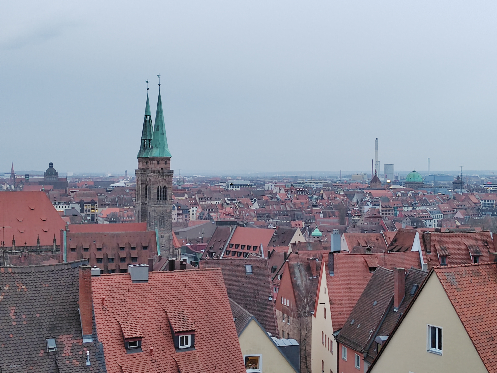 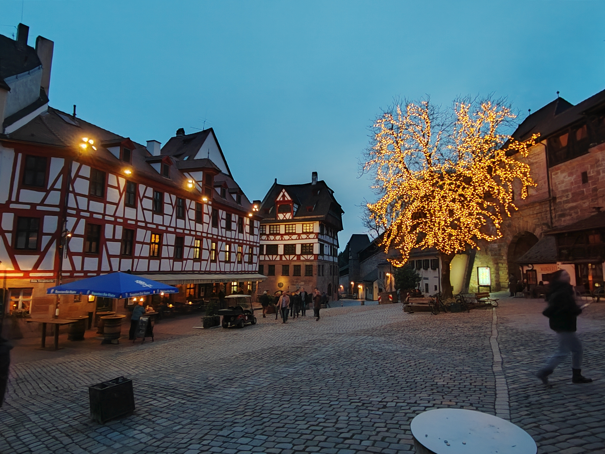

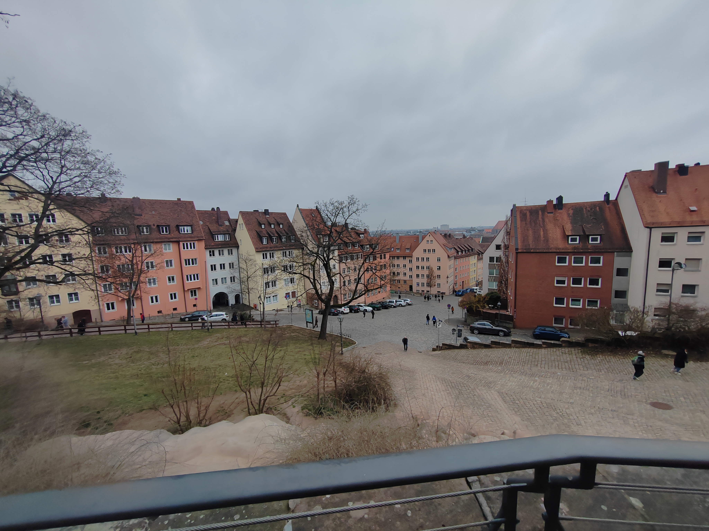 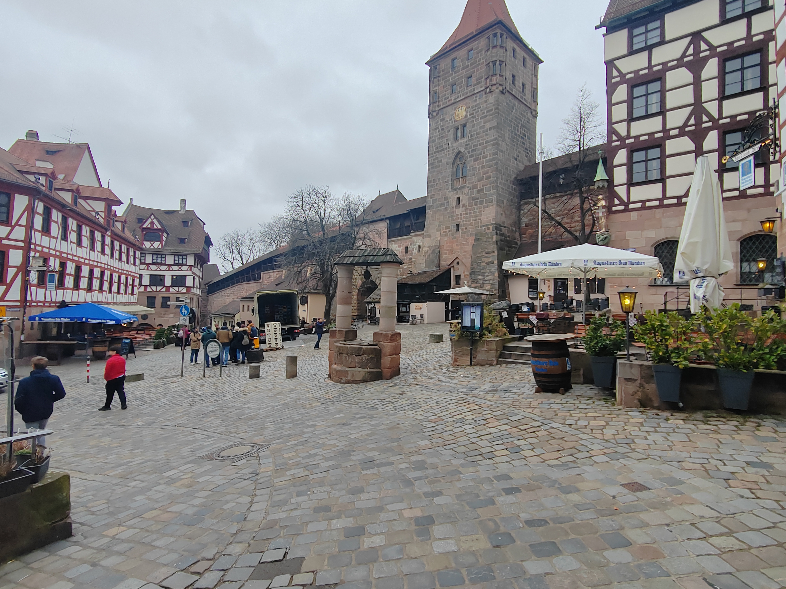 

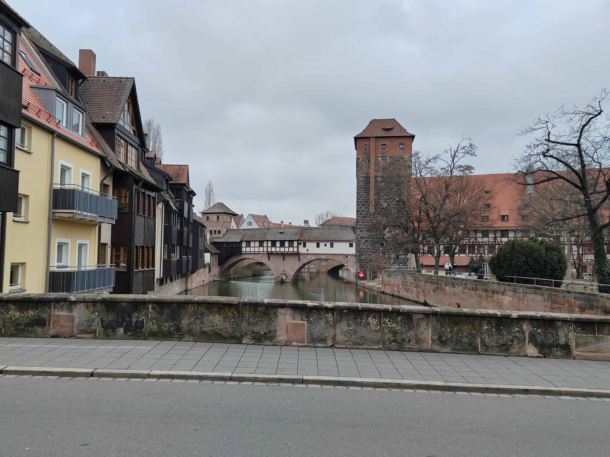 
