## Él még ez a gyerek?

Hoppá, már másfél hónapja nem jelentkeztem 😅 Ideje leporolni ezt a blogot. Szóval, ha valaki esetleg bármi kontextus nélkül futott volna bele ebbe az irományba: Kiköltözzem Japánba. Egészen konkrétan Mijagi prefektúra Szendai nevű csendes kis városába. Hogy meddig, azt nincs az az orákulum aki megjósolja, de egyelőre stabil pályán vagyok, hogy több éves nagyságrendről legyen szó. Természetesen egy ilyen ilyen kimozdulásnak megvannak a maga körülményei. Április 2-án érkeztem, és csak most kezd úgy rendesen összeállni az új életem. De ne szaladjunk annyira előre. Van bőven miről beszélni – olyan szinten, hogy fel kellett az elmúlt hónap beszámolóját bontanom három részre, hogy ne legyen órás nagyságrendű olvasmány. Az ezalkalmi előre szólok, kicsit nyafogós lesz. De ne aggódjatok, azt letudom még itt. Kezdjük ott, amikor hazaértem Nürnbergből.

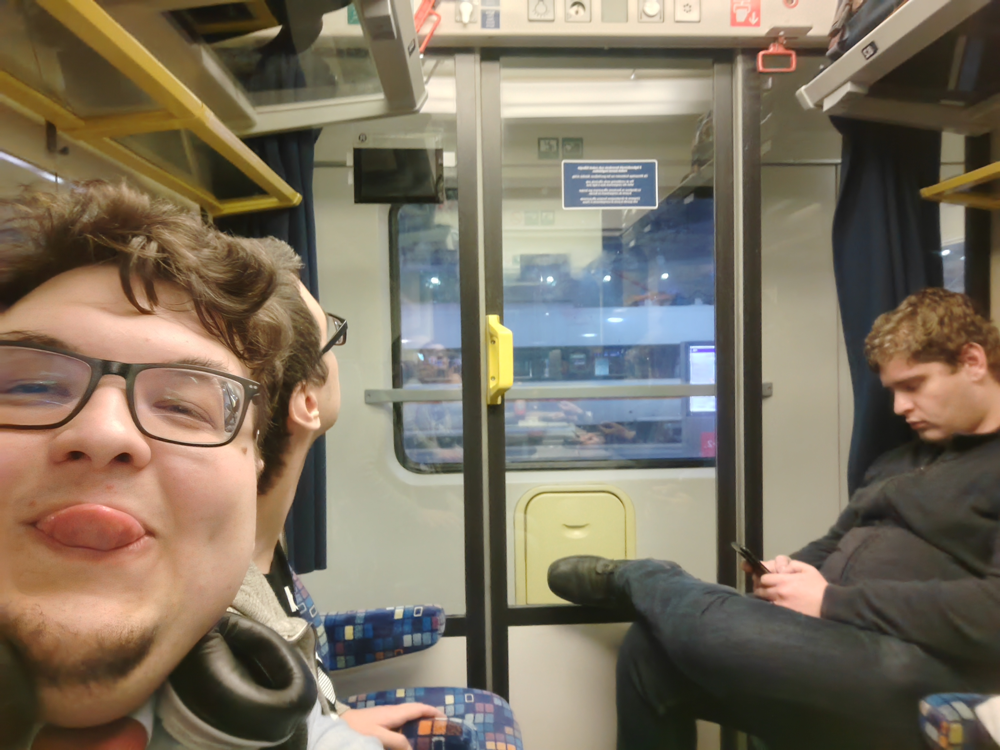

Ezen a ponton mindenki tudta, hogy van három hét amíg még tudunk együtt lenni a közeljövőben. Ezért aztán ahány társaságom, annyifelé kellett megjelennem elbúcsúzkodni. Félre ne értsetek, minden alkalmat élveztem, és hihetetlen jól esett mindenkivel találkozni. Engem lepett meg a legjobban, hogy mennyi ember törődik velem. Valahogy nem regisztrált a fejemben soha. Meg hát hazudnék, ha azt mondanám, hogy kicsit sem élveztem a fontosságérzetet amit egy ilyen bulik sorozata nyújt, még ha néhány ponton eléggé le is blokkoltam, gondolván: "Nem sok azért ez egy kicsit? Csak rólam van szó...". De ha mást nem, azt legalább így rövid időn belül látva ennyi szerettemet felfogatta velem, hogy tartozom a saját épségemért felelősséggel mindannyiuknak. Mindannyiótoknak. Szóval igyekszem nem csinálni semmi elvetemedett állatságot. Ha ez azt jelenti, hogy le kell mondanom a BMX-szel kötélugrásról bele egy cunami közepébe, hát legyen. Néha nekem is kell áldozatot hoznom. _Francba._

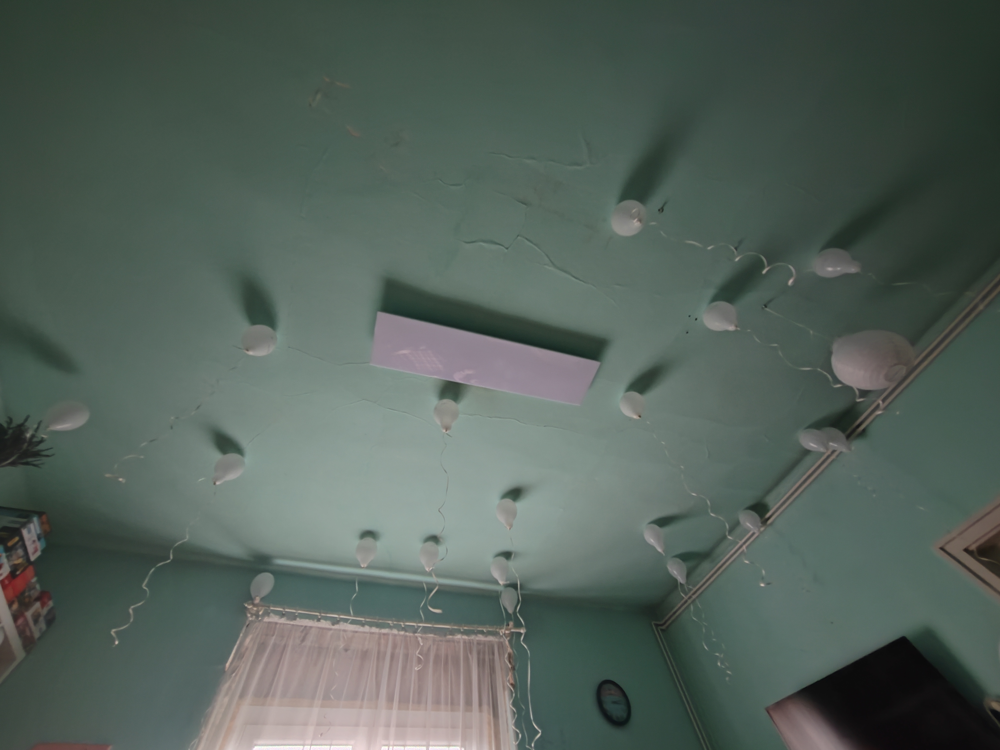
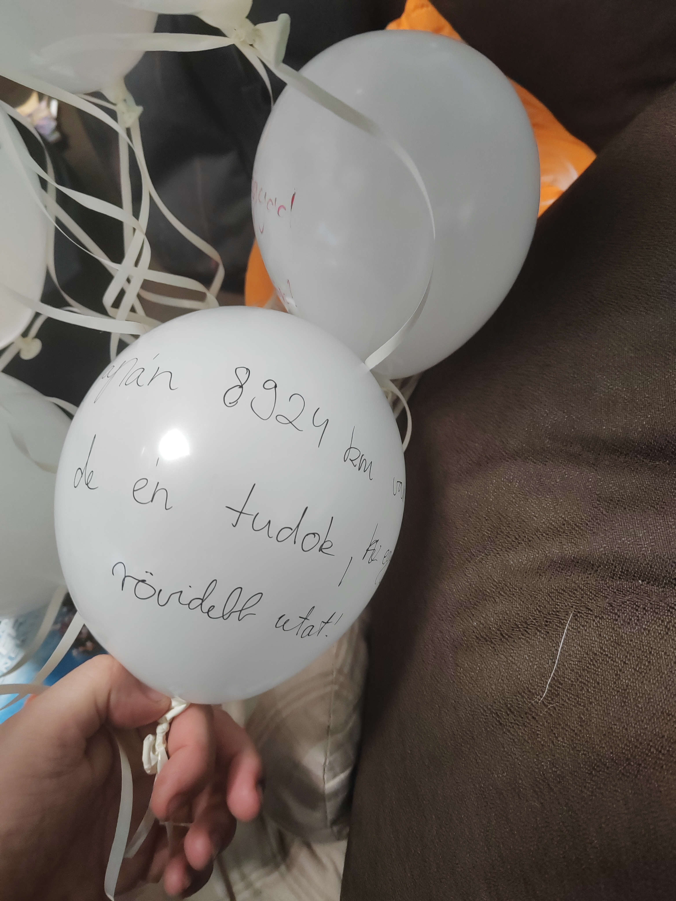 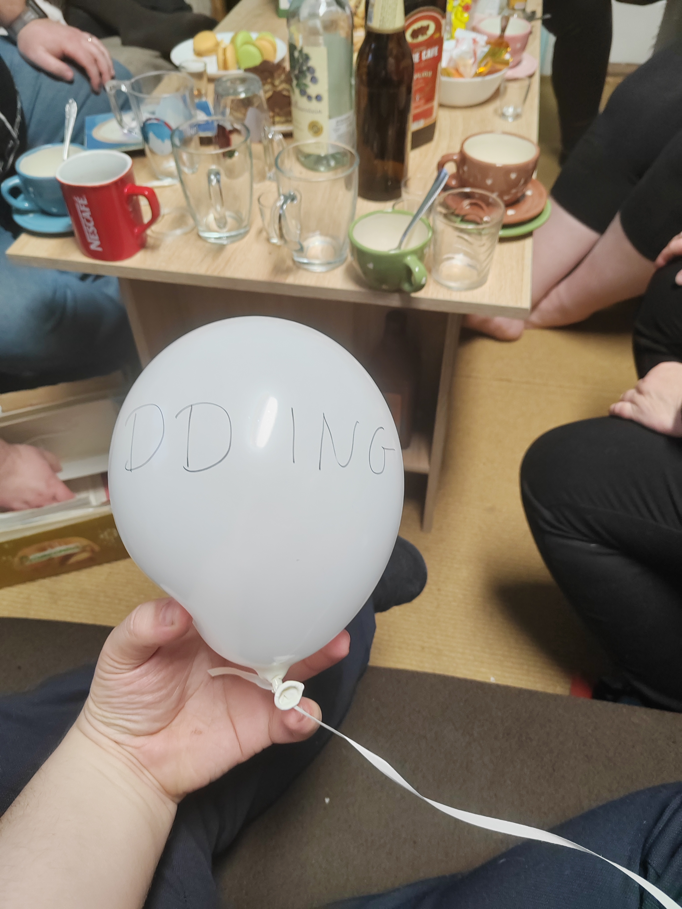

Szerencsére Japán nem teszi túl nehézzé a biztonságos életet. De basszus, már megint előre szaladtam... Már nagyon írnék róla, hogy milyen idekinn, de nem úgy megy az. Fel kell építeni. Könyörgöm, még vízumom sincs ezen a ponton az idővonalon!

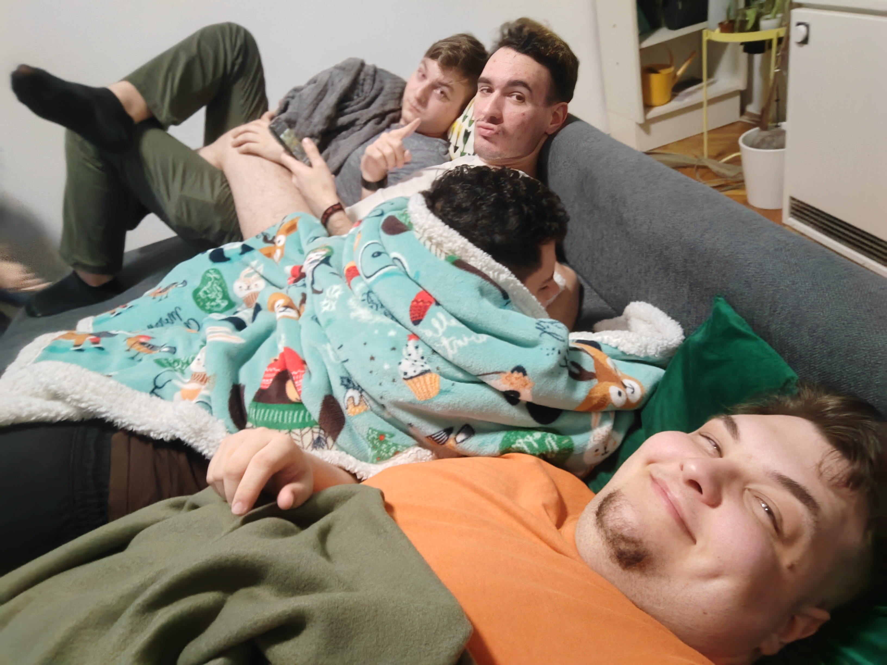

## Vízumozás

Vízumot még sose csináltattam ezelőtt, de Schengeni zónán kívüli országokban hosszú távú tartózkodáshoz szükséges. Szerencsére az az ösztöndíjprogram, amit megnyertem eléggé hülyebiztos ahhoz, hogy még én se tudjam elszúrni. Bementem időpontra a nagykövetségre, és mondták, hogy egy, az útlevél azonosító lapjához hasonló dizájnú matricát tesznek fel annak az egyik hátsó lapjára. Eltart a kiállítani egy hétig, úgyhogy ott is hagytam. Addig is gondoltam elkezdem összepakolni a cuccaim. Aztán ebből nem lett semmi, mert aznap éjjel valami igazán embertelen mandulagyulladásos mizéria az ágyhoz vágott a hétre.

## A kiesett hét és következményei

Emlékeztek, hogy mondtam, hogy három hetem volt mindenkivel még egyet lepacsizni? Na hát abból így csak kettő maradt. De az még egy dolog, hogy otthon kell maradnom, de ez a "felkelni se bírok" típusú nyavaja volt. Magyarul még pakolni se tudtam nekiállni. Legalább arra még volt energiám, hogy elkezdjem maratonozni az Avatár – Aang legendája három évadát. Mert ha már mozdulni nem tudok, akár újra is nézhetem a valaha készült legjobb rajzfilmsorozatot. Miután úgy kábé rendbejöttem, elkezdtem pakolni is. Na, anyám tanúskodhat róla, hogy mennyire szétstresszeltem magam azon. Már az elején be kellett látnom, hogy az elmúlt pár év alatt összegyűjtött elektronikai kütyüimet Magyarországon kell hagynom. Na ez már eleve eléggé elkeserített, de nem katasztrófa.

Összeraktam a nagyobbik bőröndöt. Csodával határos módon mind a $6*10^23$ ingem is befért. Lemérem, fél kilóval több, mint a 23 kilós maximum. Ez se tett épp boldoggá, de nem katasztrófa. Fogcsikorgatva kiszelektáltam pár inget. Lemérem megint a bőröndöt: **24 kiló**. A matekos orientáltságúak köztetek láthatják a problémát. Azt hittem felrobbanok. Kiszedek még néhány pólót (_az ingeim **NEM** adom!_), lemérem megint. **24 és fél kiló**. Már alig tudok mitől megválni. Szinte érzem ahogy a felforrt agyvizem nagy nyomással fúvódik ki a füleimen, mint a régi rajzfilmekben. Lemérem megint. **Majdnem 25 kiló**.

Az adattudományban van egy mondásunk váratlan megfigyelésekkel kapcsolatban: Egy alkalom _sansz_. Két alkalom _véletlen egybeesés_. Három alkalom viszont már _minta_. Nekem viszont nem volt kapacitásom mintát keresni, úgyhogy csak kifeküdtem egy napra. Az Avatár nem nézi meg magát. Aztán időben sikerült realizálnom, hogy lehet nem parkettán kéne mérni a szerencsétlent, és akkor konzisztens lenne. Ezt tudatosítva sikerült kb. az utolsó egy-két nap végére rendesen összepakolnom a 2 bőröndöm. Nagyrészt ki is használtam a két feladott poggyászt és hátizsákot. Volt vagy 45 kiló a három együtt.

## Mellékküldetés: Mássz fel a Sri Lankára curryt főzni

Még februárban volt egy olyan zseniális ötletem, hogy foglalok egy főzőiskolában egy _workshop_ alkalomra egy helyet megismerni a sri lankai kaját. 4 nappal az indulásom előtt. Nem mintha lenne jobb dolgom. Ez úgy nézett ki, hogy az oktatónk, egy fiatalabb magyar-sri lankai hölgy, elmondta a receptet, hol lehet kapni az összetevőket, mire lehet cserélni őket, közben meg mi szépen előkészítettük az alapanyagokat. Felvagdostuk a zöldségeket, kiolvasztottuk a spenótot, hidratáltuk a kókuszreszeléket, összekutyultuk a tamarindpasztát, megropogtattuk a pandanlevelet... Csak a szokásos mindennapi lépések.

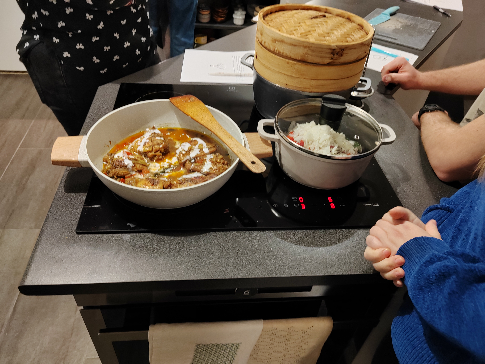 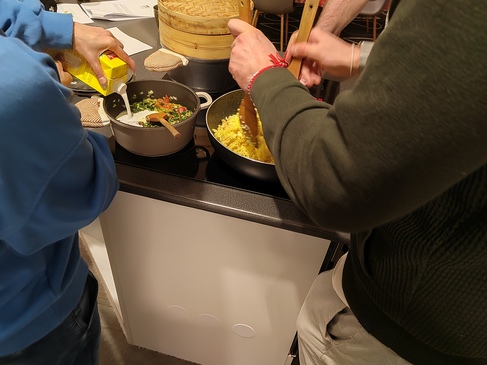

Meg is kaptuk a receptet, amit aztán sikerült valahol otthon hagynom. _Ügyes vagy, Andris, ügyes vagy._ Mindenesetre a kedvencem ezek közül a kókuszos répa~~saláta~~ _sambol_, és a spenót curry volt. A közös pont a kettőben az, hogy mindkettő esetén csak behajígálod egy-egy edénybe az összetevőket, és az előbbi esetén összekevered és vársz hogy megszívja magát a kókuszreszelék a nedűvel, az utóbbi esetén meg főzöd 20 percig közép lángon. Szóval elég szépen szinergizálnak is, amíg pihen a _sambol_, addig összefőzöd a spenótot. Amint találok itt Szendaiban egy délkelet-ázsiai boltot, fixen összerakok egy hasonló vacsit valamikor.

## A nagy nap: Kiutazás

Apámékkal kimentünk a reptérre, és ott meglepően simán mentek a dolgok. Nem volt gond se a csomag méretével, se a tömegével (igen masszív megynyugvásomra), megkaptam a beszállókártyákat is, és igazából készen is volt a dolog. Lepacsiztam Márk és Anna barátaimmal, a családdal még beugrottunk egyet kávézni (finom volt a cappuccino, Viki! 😊), könnyes búcsú (na jó, azért nem), és már úton is voltam. Így visszagondolva lehet, kicsit túl könnyelműen lendültem neki az útnak. Beleélhettem volna magam jobban, hogy effektíve eltűnök mindenkinek az életéből, aki kiment elbúcsúzni. De ezen a ponton leginkább csak arra tudtam gondolni, hogy mekkora út áll előttem. Szóval térjünk is rá arra szerintem.

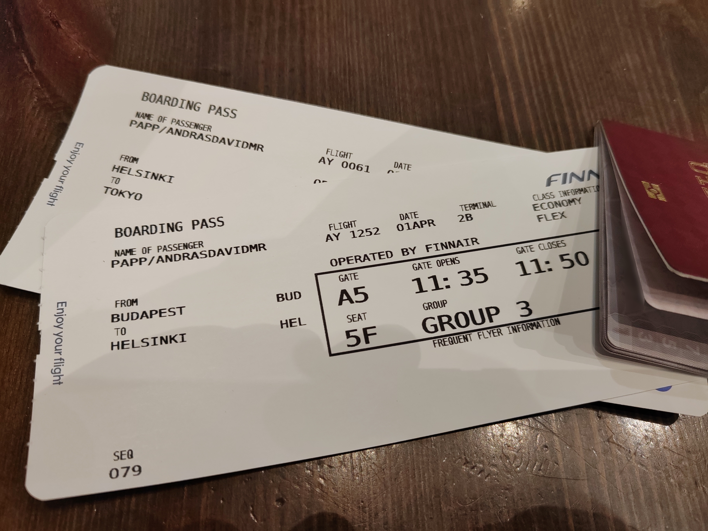

## Először is, irány Helsinki

A _Finnair_-rel repültem. Hármat találhattok, melyik országnak lehet a légitársasága. Egy két és fél órás úttal nyitottam Helsinkibe, ahonnan pedig 3 óra várakozás után indult a gépem Tokióba. Egészen korrekt rendszert használtak a beszállásra. Először az ablak menti oszlopokat töltötték meg, aztán szépen kifele a középső és belső oszlopokat. Ez azt jelentette, hogy volt ideje mindenkinek kényelmesen elhelyezkedni az üléssorban. Viszont a jövőbeli kényelmetlenségek első jelei már itt is megvoltak. Nem volt kifejezetten kényelmes az ülés, de legalább ablaknál ültem, szóval az teljesen tolerálható volt. Ami már nagyobb pech volt, az az hogy nem volt konnektor a járaton. Ezt még elfogadtam egy kisebb kényelmetlenségnek, gondolván, hogy végülis ez egy rövidtávú repülőgép, szóval nem csoda, hogy nem kapunk konnektort. Különben is, simán kibírja a laptopom Helsinkiig az utat, a Tokiói járaton meg majd felrakom töltőre. A torontói utamon is volt konnektor a gépen, egy tizenakárhány órás járaton azért ez mégiscsak a minimum.


Az előrevetítés egy irodalmi eszköz, amelyben az író előre utal arra, hogy mi fog később történni a történetben.


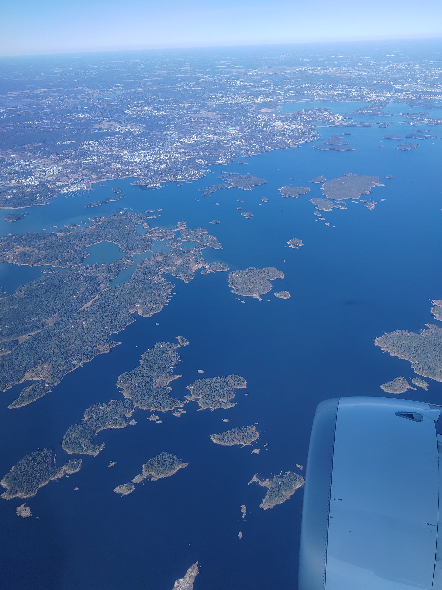

Addig is néztem tovább az Avatárt, és gyorsan el is repült az a két és fél óra. Magáról a repülőtérről sokat nem tudok kommentelni. Tiszta volt, de kicsit macerás volt átnavigálni. És természetesen volt egy _Múmin_-bolt. Ha rágugliztok, azt fogja minden valamire való forrás mondani, hogy Finnország nemzeti állata a barnamedve. Azonban ez nem lehetne távolabb a valóságtól. A _woke_ média által generált hazugság, amivel a laikusok agyát mossák. Ugyanis Finnország valódi nemzeti állata a _Múmin_.

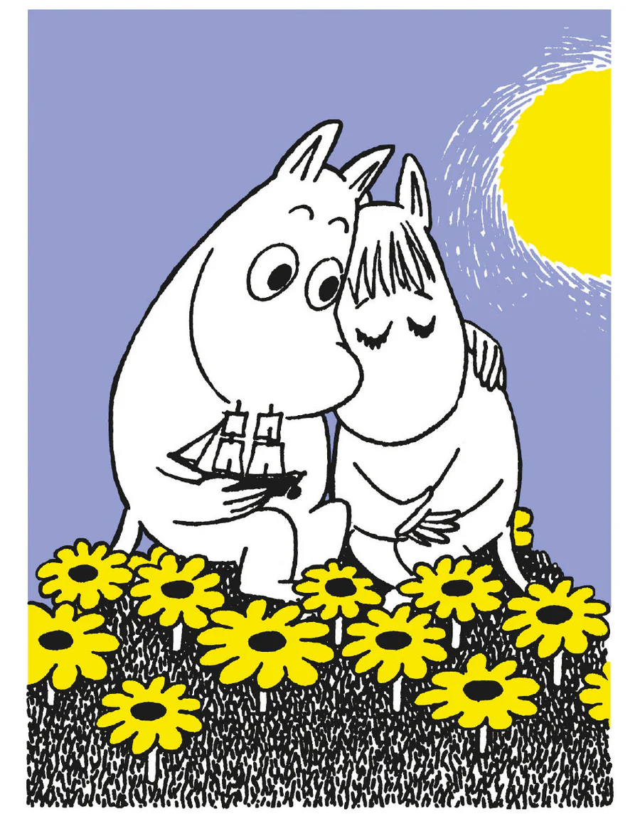 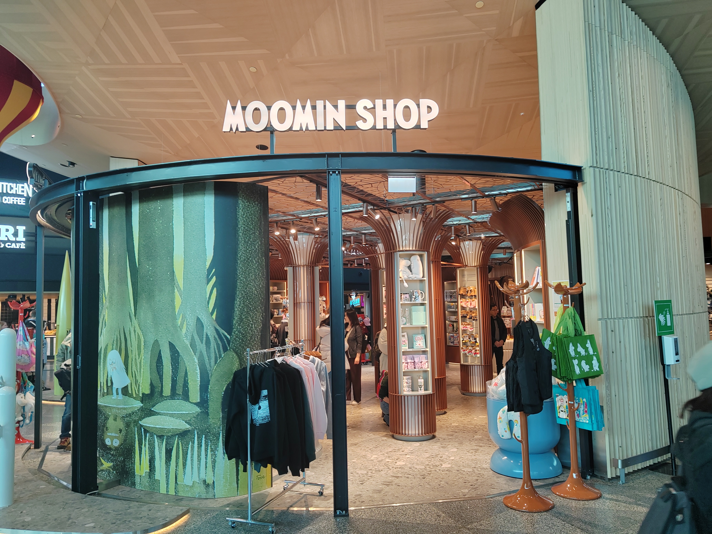

A _Múminok_ ilyen cuki tengeri tehén-izék egy 40-es évekbeli finn gyerekkönyv-sorozatból. Aztán ezt a gyerekkönyvet nagyon felkapták valamiért világszerte. Csináltak belőle bábszínházat a nyugat-németek, kosztümös élőszereplős mesét a svédek, _stop motion_-animációt a lengyelek és külön a szovietek, és mostanában végre a finnek is adaptálták egy 3D rajzfilm formájában. De a legjobban a kora 70-es évekbeli japán _anime_ adaptáció vált elterjedté. Valamikor az elmúlt 10 évben az internet kollektíven felfedezte azt, és annyira berobbant a köztudatba a széria, hogy még hozzám is eljutott. Pedig én egy kő alatt élek popkultúra szempontból. Belenéztem picit, cukinak tűnik. Kábé mint a Hupikék Törpikék. Őszintén, valószínű mindenki a főszereplő ember srác hangjába zúgott bele. Szóval ezen a ponton Finnország legnagyobb kultúrexportja ezek a cuki kis állatkák. Vagyis hát... állatok ezek egyáltalán? Ránéztem, és elvileg hivatalosan trollok. _A trollok állatoknak számítanak?_

Ahogy ez a nagyon produktív kérdés átfutott az agyamon, egy még azt is lebíró inger állított meg az ezen az exisztenciális krízisen való töprengésen: Kéne valamit enni. Szerencsére még épp volt nálam egy kajálásra elég euró a nürnbergi útról, úgyhogy felkerestem a reptéri Burger Kinget, és megettem életem legrosszabb hambiját. De így komolyan, a zöldségek olyan vízízűek voltak, mintha valaki 3D nyomtatta volna őket nyers cellulózból. Még csak förtelmesnek se tudtam őket mondani, mert nem volt min undorodni. Talán helyi termesztésűek voltak, és alig kaptak napfényt, nem tudom. De én éhes voltam, ez pedig messze a legjobb kalória-euró árat biztosította, szóval... _Hami hami_. Kábé épp elég időm volt megkajolni, mielőtt kezdődött a beszállás, úgyhogy neki is lódultam a kapunak, és megkezdődött a 13 órás személyes purgatóriumom.

## AY0061, a 2300 eurós fapados

Felszállok a gépre. Ez már egy jóval masszívabb gép volt, több mint 300 hellyel. Viszont már a helyemre verekedni magam egy kihívás volt. Nem tudom felfogni miért, de erre a gépre dobták ki a kukába az oszloponkénti beszállást, és teljesen véletlenszerűen érkeztek az utasok. Ezen pedig nem segített a túristaosztály elképesztő zsúfoltsága. Három darab három székből álló sor volt, és jó szorosak voltak köztük az átjárók. Ezen a járaton épp az átjáró mellett ültem, amit először sajnáltam, mert azért az ablak melletti ülés mégis nagy dobás, ha valaki olyan ritkán repül, mint én. Később viszont elmondhatatlanul hálás voltam ezért a tényért. Kivettem későbbre a laptopomat, felpakoltam a táskámat, és még az ingyenes EU roaming utolsó szikráit kihasználva írtam mindenkinek egyet, hogy indul a mandula. Ahogy meglendültünk, a képernyőn lehetett nézni a gépre szerelt kamerákon a felszállást, ami kifejezetten kreatív ötlet, és előtte még nem találkoztam vele.

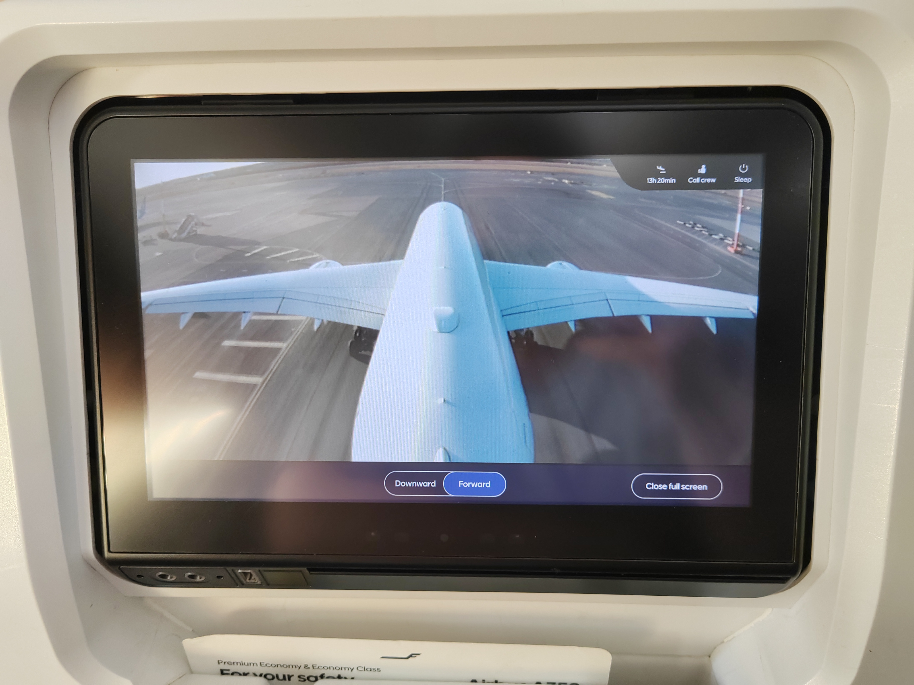

De a felszállás élménye gyorsan leapadt, úgyhogy elővettem a laptopom. Még volt benne egy 20% töltés, plusz eléggé ficánkoltak a szomszédaim, ráadásul éppen a _Sorsok keresztútján_, azaz a Föld könyve évadzárója volt a következő Avatár epizód. Ez mindhármótoknak aki ezt olvassa és látta a sorozatot, megmagyarázza hogy miért voltam olyan nyughatatlan megnézni. Úgyhogy pontosan ezt is tettem. Micsoda finálé. Elképesztő, hogy 2006-ban mennyit ki tudtak hozni egy rajzfilmből. Bele is akartam élből csapni a következő részbe, de már jelzett a gép, hogy nagyon merülőben van. Szóval elkeztdtem keresni a konnektort. Előttem lévő ülésen nem volt. Fura. Megnézem magam alatt. Hát ott se. Talán az ülések között? Nem. Fej felett, valamilyen absztakt lóbálós módon. Nuku. Mint kiderült, a túristaosztályon nincsen konnektor, csak egy kis USB lyuk, amibe egy telefonkábelt be tudsz dugni. Még indulás előtt jó pár héttel megnéztem, mennyibe kerülne ez a járat, ha magam vennék rá jegyet túristaosztályon, és 2300 valamennyi eurót írt az oldal. Szóval mertem feltételezni, hogy azért egy 13 órás repülőúton csak fogom tudni a laptopom használni. Hát, mint kiderült ez egy túlzottan optimista becslés volt. Gyorsan levettem a laptop fényerejét minimumra, és elkezdtem annyi Avatár részt átmásolni telefonra, amennyit csak bírtam. A 21-ből sikerült hetet időben áttennem, mielőtt végleg megadta magát az útra az öreg harcos. Ergo volt körülbelül két és fél óra szórakoztatásom. _A hátralévő 12 és fél órából_. Pöpec.

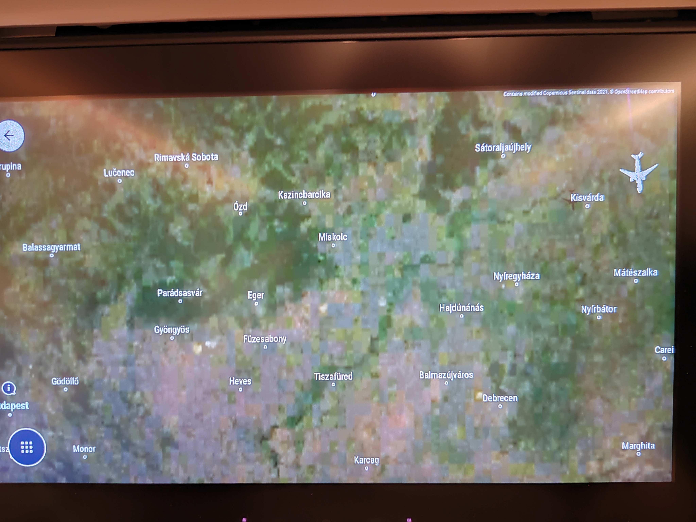 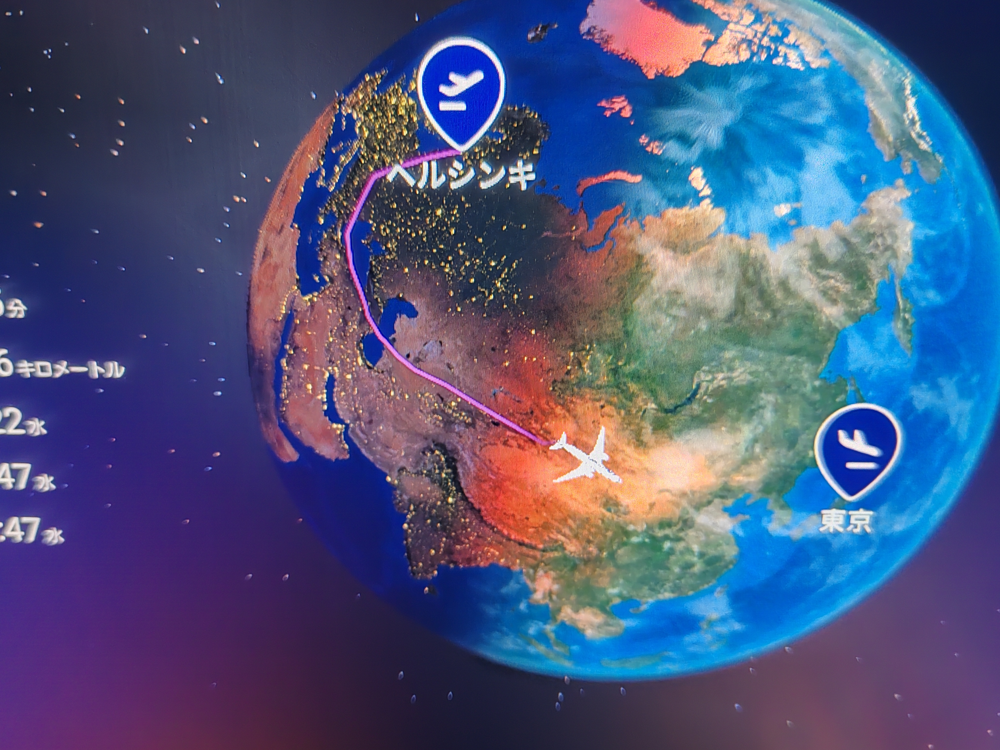

Kaptunk egy vacsorát és egy reggelit, amik egész korrektek voltak repülős kajához képest. Az egyetlen baj az volt, hogy ezek voltak az egyetlen alkalmak, amikor lehetett kérni bármit inni. Na, hát az a hideg és száraz levegő, amit nyomattak az előttem meg mögöttem ülők, igencsak kikészített így. Hozni hoztam egy fél liter vizet, de az nagyon gyorsan elfogyott ilyen körülmények között. Na mindegy, gondoltam. Átalszom az utat, aztán majdcsak jön a reggeli. Aha. Nem. Először is, a szék pont annyira dőlt hátra, hogy még ne számítson fekvésnek a póz. Tehát a lehető legrosszabb beállítás nekem alváshoz. Konkrétan előregörnyedve több szerencsém lett volna. De aztán áttették a világítást éjszakai módba. Nos. Amelyik komplett idiótának az Airbusnál az az ötlete támadt, hogy éjszakai világításnak kék fényt kapcsoljanak, annak kérem legyen szíves valaki mihamarabb belefacsarni egy lédús, már-már túlcsorduló citromot a szemébe. Kontextus kedvéért, én még nap közben is kékfényszűrten használom a kijelzőt, mert egyszerűen jobban esik. Biztos van mögötte valami fiziológiai ok, nem értek eléggé hozzá hogy megmondjam mi. De nem volt kellemes az a 8 óra. Itt voltam hálás, hogy legalább fel tudtam állni járkálni kicsit az utastérben. Informatikus létemre a hátsómon maradás nem épp az erősségem, úgy tűnik.

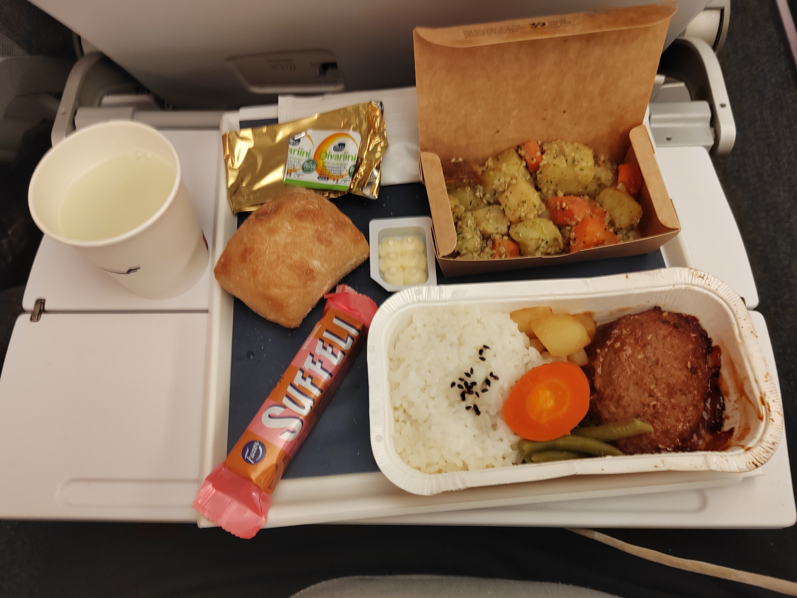 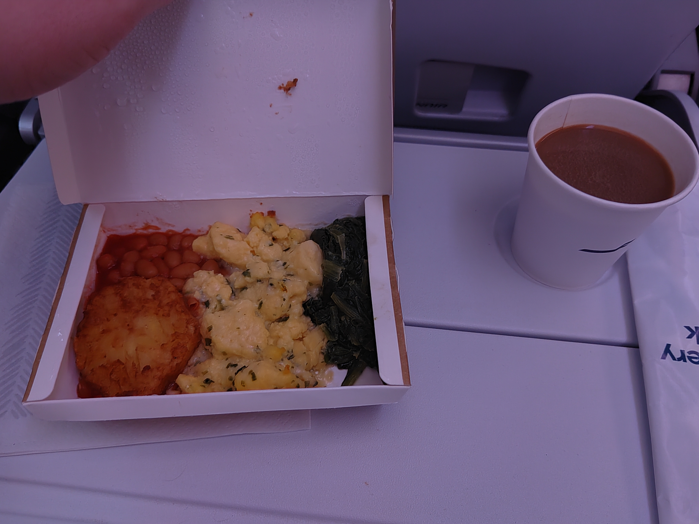

Ez a reggeliig így ment. Aludni azt egyáltalán nem tudtam, Avatárból pedig igen gyorsan kifogytam. A reggeli is elérkezett, kértem 3 pohár vizet élből. A megváltás szó enyhe kifejezés arra, amit akkor éreztem. Onnantól pedig már sokkal tolerálhatóbb volt az a maradék egy-másfél óra Tokióig. És végül, nagy sokára oda is megérkeztünk.

## A 4D labirintus

Az a lendület, amivel én kipattantam a gépből, valószínűleg megsértette a newtoni fizikamodellt. _Kvantum-haraggal szálltam le_. Hát halljátok, a Haneda repülőtér egészen más nagyságrenden üzemel, mint a Ferihegy. Be kellett csekkolni a bevándorlásnál, és ott konkrétan egy egész csarnok volt csak ennek szentelve, 30 kapuval. Eléggé nyúzottan, de beálltam szépen a sorba. Tartott vagy egy fél óráig, mire a közelébe jutottam egyáltalán a kapuknak, ahol is rá kellett jönnöm, hogy nekem a legutolsó kapuhoz kellett volna külön mennem eleve, mert ott tudják csak kiállítani az új személyimet. Kicsit frusztrált, de meg is örültem, hogy kiállhatok a sorból. Meg is céloztam a kaput. Szerencsére a legtöbb kérdésre ami ilyenkor lezajlana, már otthon előre kitöltöttem a válaszokat, és elég volt egy QR-kódot beszkennelnem. Azért a szokásos ellenőrzések lementek a határőrrel. Miért jöttem? _Kutatni._ Hová megyek? _Szendaiba._ Meddig maradok? _Öregem, ha én azt tudnám..._ Az állapotomhoz képest amúgy egész jól vakeráltam japánul, szóval az a kis önbizalomlöket adott egy pici extra energiát. Kábé 10 perc beszélgetés után megkaptam a kártyámat, mehettem átvenni a feladott poggyászaimat. Hát itt se siették el a dolgot, ez is tartott egy fél-háromnegyed óráig. De itt már volt reptér-wifi, úgyhogy legalább tudtam életjelet adni a családnak ismét.

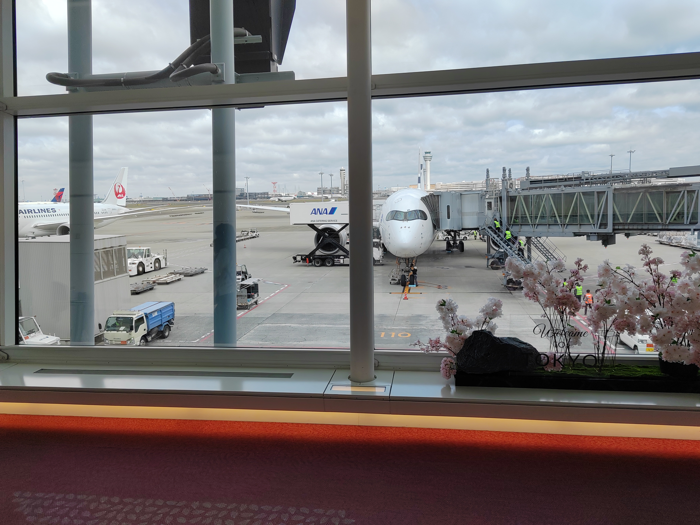

Miután túljutottam a vámon, kezdődhetett az újabb kaland: Átnavigálni Tokión, és valahogy eljutni Szendaiba. Mobilnet nélkül. Két mákom volt: Először is, hogy tudom olvasni a japán ízesítésű holdrúnákat. Másodszor pedig, hogy előre megnéztem, milyen állomásokon át tudok Szendaiba jutni. Mehetett a menet. Először a _Tokyo Monorail_-lel, azaz a tokiói egysínű vasúttal kellett bemennem a városba. Megvettem a papír jegyet, majd az automata melletti kapu jegyérvényesítőjébe bedugtam. Ez nem tetszett valamiért neki, és elnyelte a szerencsétlent. Ki kellett a karbantartóknak jönni kibányászni a jegyet onnan. Nem igazán értem, mit csináltam rosszul, és már nagyon rutinosan csinálták a dolgot, szóval biztos nem én voltam az első túrista aki ezt benézte. De átmentem, felpattantam az egysínűre, és végre tudtam kicsit gyönyörködni Tokión. Vagyishát gyönyörködtem volna, ha nem lett volna épp ilyen szutyok szürke nyálkás vacak idő. Szóval leginkább csak szusszantam egyet, miközben elhaladt a Haneda repteret körülvevő ipari öböl látványa.

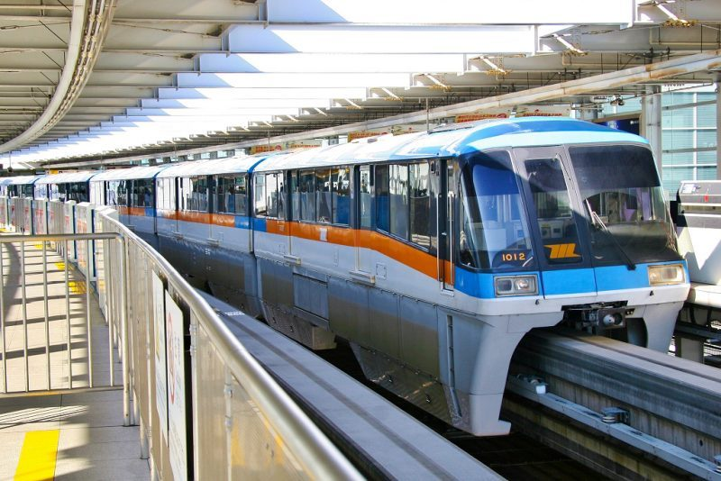

Viszont a _Monorail_ nem élből a közonti állomásra vitt, ahol át tudtam volna a japán gyorsvasútra, a _Sinkanszenre_ szállni. Nem, az túl egyszerű lett volna. Helyette először egy _Hamamacu-csó_ nevű állomásra kellett mennem, ahonnan valamelyik vonatra átszállva továb tudtam haladni Tokió vasútállomásra. Nos, nem központi létére már ez az állomás is igen elborult volt. Három emelet, mindegyiken legalább 5 peron, amelynek mindnek a két oldalán áll meg az idő függvényében több különböző járat. Szóval 4 tengely mentén tudtam eltévedni. Egy 4D labirintusba csöppentem. Szerencsére a jegyvásárlás távolság szerint történt, nem pedig konkrét járatra, szóval legalább amiatt nem kellett aggódnom, hogy lekésem a konkrét vonatom. Viszont megtalálni, hogy a sok tucat közül melyik visz oda ahova kell, már trükkösebb volt. Valamirevaló menetrendet nem találtam, mobilnet nuku, az állomás wifi pedig használhatatlan lassú volt. Volt egy kijelző, amin másodpercenként felvillant egy-egy állomásnév. Na ezen a ponton ha nem tudok krikszkrakszul olvasni, kivéreztem volna. De tudtam, mert én egy ilyen okos gyerek vagyok, és találtam egy járatot ami stimmelt. Meg is találtam a peront időben, és szerencsém is volt, mivel mint ott láttam, a következő alkalmas járat a hírhedt Jamanote vonal volt. Megvannak azok a videók, ahol peronőrök nyomják be az embereket a vonatba, mint valami hurkatöltő? Na, az a Jamanote vonal. Szóval kicsit megnyugodtam, hogy legalább azt sikerült elkerülnöm a 2 bőröndömmel és enyhe lappangó hipochondriámmal.

Relatív gyorsan odaértünk, és kezdődhetett ismét a Szimultán 3D Lokalizáció és Feltérképezés. Legalább megtapasztalhattam a saját bőrömön, mit éreznek majd a robotok amiket készíteni fogunk. Letéve egy ismeretlen, komplikált helyen, és csak az érzékszervekre hagyatkozva végrehajtani a küldetést. Annyi szerencsém legalább volt, hogy még ha mást nem is, a _Sinkanszent_ jó alaposan kitáblázták mindenhova. Még egy háromnegyed óra várakozás után pedig megérkezett a híres-neves bestia: a _Hajabusza Sinkanszen_. A neve azt jelenti, hogy sólyom, és nem véletlen a választás. Ő a leggyorsabb vasúti járat egész Japánban a 320 kilométer/órájával. Korábban a világ összes vonatát verte, de azóta a Kínaiak sokszorosan beelőzték olyan maglev technológiával, ami a 400-at is megüti. Illetve papíron a német ICE is veri 350-nel, de mint azt Nürnbergben volt szerencsém megtapasztalni, ahhoz hogy ezt ténylegesen teljesítse, szükséges tudni úgy szervezni a vonatot, hogy ne gyök kettővel kullogjon egy teherjárat mögött. A _Sinkanszen_ teljesen saját, emelt vágányon közlekedik, úgyhogy az ténylegesen, stabilan hozza a 320-at. Úgyhogy a szívemben még így is második. De amúgy is a japánok a világvezetők az 500-at meghaladó maglev technológiakutatásban, szóval lesz ez még így se. Ja, és amúgy amikor beérkezik a végállomásra, automatikusan megfordulnak az ülések, hogy mindenki menetirányba nézzen.

<!-- markdownlint-disable MD033 -->
<iframe width="100%" height="450" src="https://www.youtube.com/embed/i2yaWnjlJ-M?si=xMpOBCxiP4yHPwmV" title="YouTube video player" frameborder="0" allow="accelerometer; autoplay; clipboard-write; encrypted-media; gyroscope; picture-in-picture; web-share" referrerpolicy="strict-origin-when-cross-origin" allowfullscreen></iframe>

Magáról a _Sinkanszenen_ utazás élményéről sokat nem tudok mondani. _Egyszerűen csak működik._ Sima a menet, nem zötyög, nem dőlöngél, és állati gyors. De nem igazán érzel belőle sokat. Annyi érdekesség van azért, és ez amblokk igaz Japánban a tömegközlekedésre, hogy masszív illetlenség az utastérben telefonálni. Beszélgetni is kicsit bunkóság, de azért ezt megszegik időnként, bár akkor is halkan. Ha viszont hívnak, akkor az a szabály, hogy megmondod hogy épp járaton vagy, és hogy majd visszahívod az illetőt. _Sinkanszenen_ azért hosszú az út, úgyhogy ott ki van táblázva, hogy ha mégiscsak muszáj, akkor fáradj ki az ajtótérbe és ott intézd, hogy ne zavard az utasokat. Ezt alapvetően itt még a buszokon is tartják, szóval baromi kellemes a tömegközlekedés. Egészen addig, amíg nincs eső, mert akkor mindenki buszozik, sétálás vagy bringázás helyett, és úgy be kell oda préselődni, mint a szardíniák a konzervdobozban.

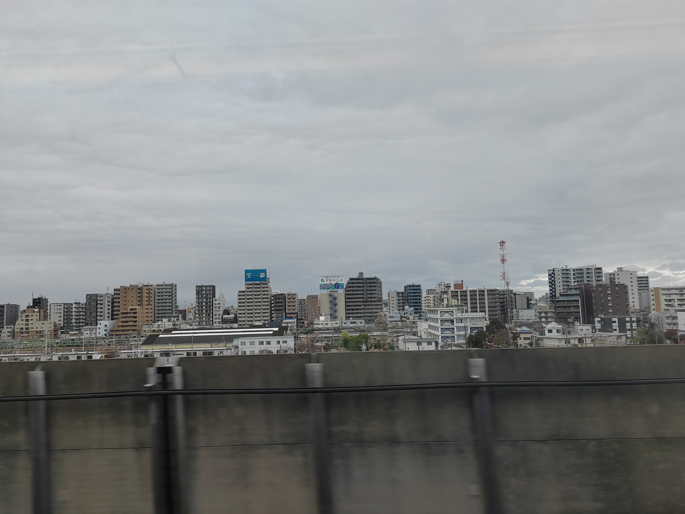

## Érkezés a koliba

A tervezett menetrendhez képest kábé egy órával késve érkeztem meg Szendaiba. A vonaton volt internet, úgyhogy sikerült jelezni a koli felé, hogy csak este érek be, szóval legalább amiatt nem kellett aggódni, lesz ki beengedjen. Már csak valahogy el kellett jutni oda. Még jó előre megnéztem, melyik busz visz arra, és le is töltöttem Szendai térképét a Google Maps-en. A buszt megtalálni egész trükkös volt, Szendai vasútállomáson is van elég sok lejárat, ahol mindegyik öt-hat különböző peronhoz vezet.

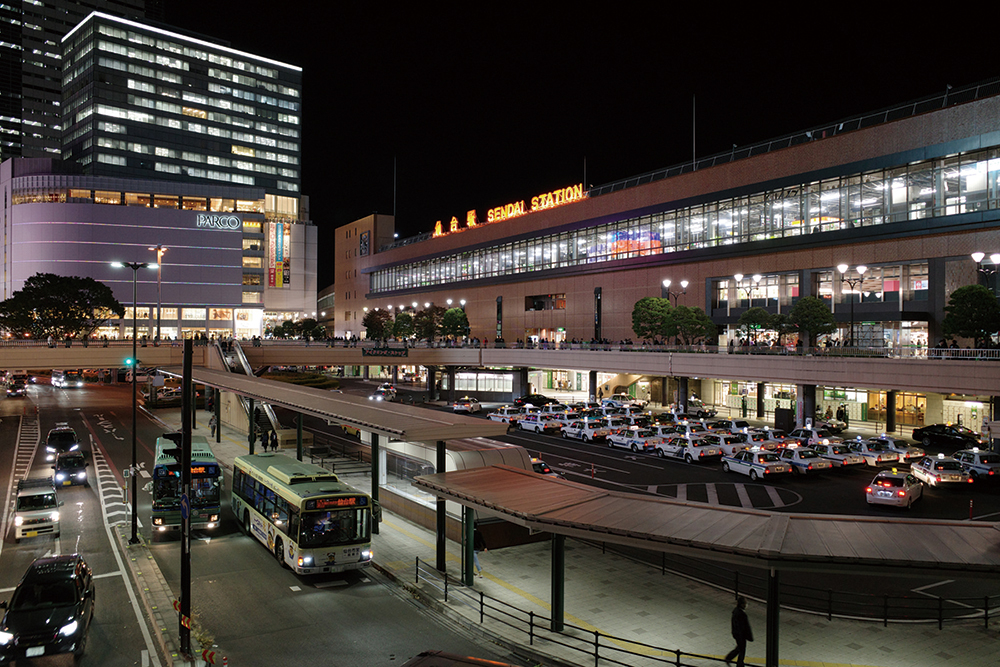

Kis próba-cseresznye alapon csak sikerült megtalálnom a 899-es buszt. Egész érdekes a jegyvásárlás menete. A hátsó ajtón kell felszállni, ahol van egy gép amiből lóg ki egy sorszámozott jegy. Amikor pedig leszállsz, előre kell menned az első ajtóhoz, ahol be kell a jegyet etetned egy másik gépbe, amibe aztán be kell dobálnod az aprót. Ha pedig nincs apród, tudsz bankjegyeket felváltani elöl egy harmadik gépen. Csodával határos módon erre sikerült rájönnöm, annak ellenére hogy 30 órája nem aludtam. Felszálltam, elvettem a jegyet... Viszont odakint pedig esett az eső. Úgyhogy az első buszutam volt a legfájdalmasabb is eddig. 45 kiló csomag a nedves padlózaton, igen kanyargós, emelkedős úton, beszorítva emberek közé, akik szerencsére jól be is lihegték az egész járatot. Bár a lihegéshez én is markánsan hozzájárultam. _Nagyon ki voltam fáradva._ Amikor jött a leszállás ideje, és el kellett kezdenem az aprót bekészíteni, már nagyon arra ösztökélt az agyam hogy csak csapjam le az egyik tizesemet a sofőrnek, hogy engedjen utamra. De összeszedtem még azt a maradék két csepp türelmet amire futotta, felváltottam a bankjegyet, szépen kibogarásztam az összeget, és bepotyogtattam a masinába. A mögöttem lévő japánok baromi türelmesek voltak. Úgy eleve, nagyon türelmesek tömegközlekedésen. Például szabály az is itt, hogy az ülőhelyből csak akkor állj fel, ha már beállt a busz a megállóba. Akkor pedig szépen felsorakoznak a leszállók, majd pedig kinyílik a hátsó ajtó és felszállnak szépen az emberek, akik közben beálltak sorba az állomáson. És ehhez ténylegesen tartják is magukat, az a hihetetlen. Magyarországon ezt el nem tudom képzelni, hogy működne.

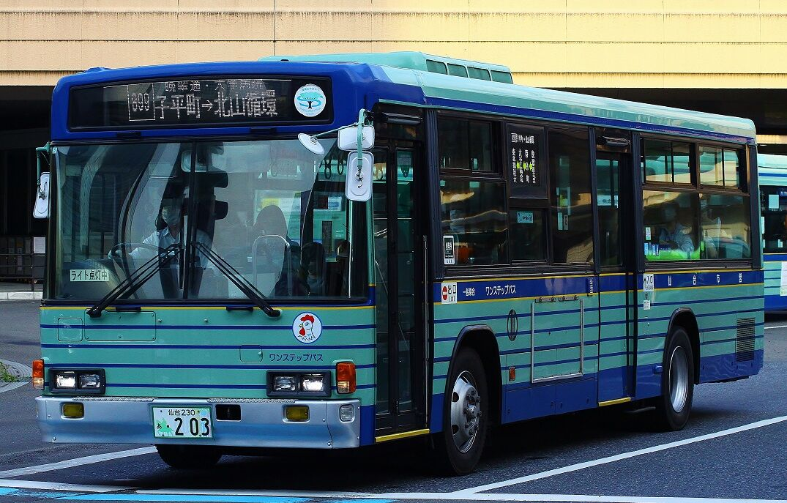

Leszállás után, a Google Térkép kegyes segítségével megtaláltam a kollégiumot, ahol a biztonsági irodában becsekkolva megkaptam a belépőkártyát a szobámba, plusz egy nagy kötet olvasnivaló útmutatót. Fellifteztem, az átázott cipőmet behajítottam az előszobában a tartóba, véletlen kölcsönvettem egyik kolitársam papucsát, azt hívén, hogy az a vendégpapucs (_upsz_) és megkerestem a szobám. Beágyaztam, lefürödtem, bekapcsoltam a légkondit fűteni, és végre el tudtam kezdeni bárányokat számlálni. Egyig jutottam.

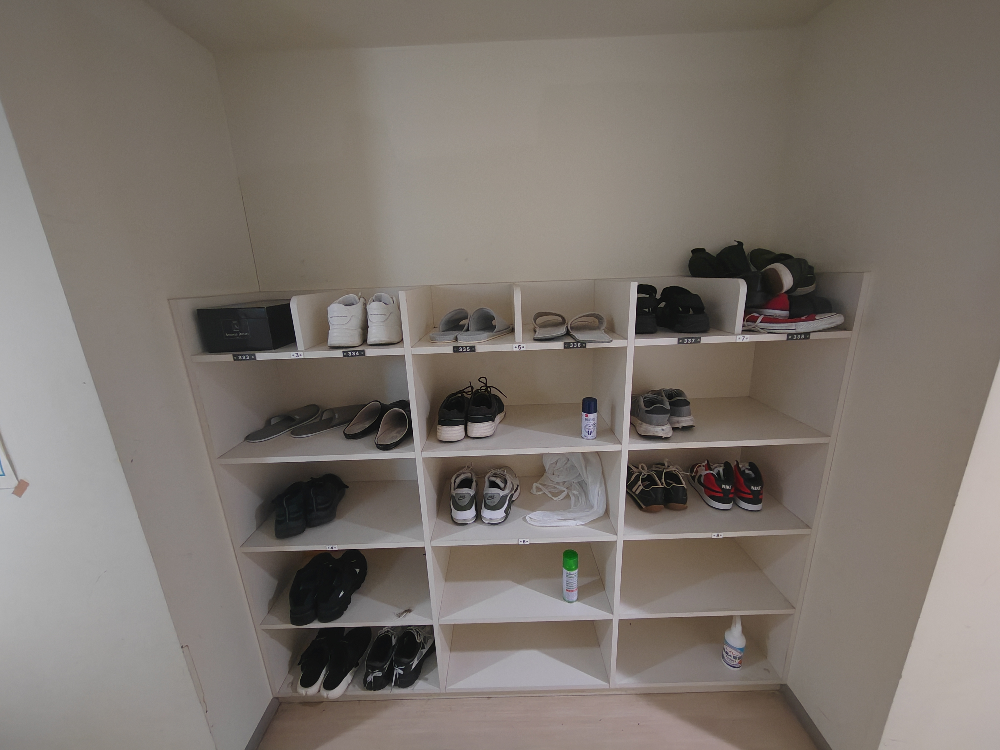 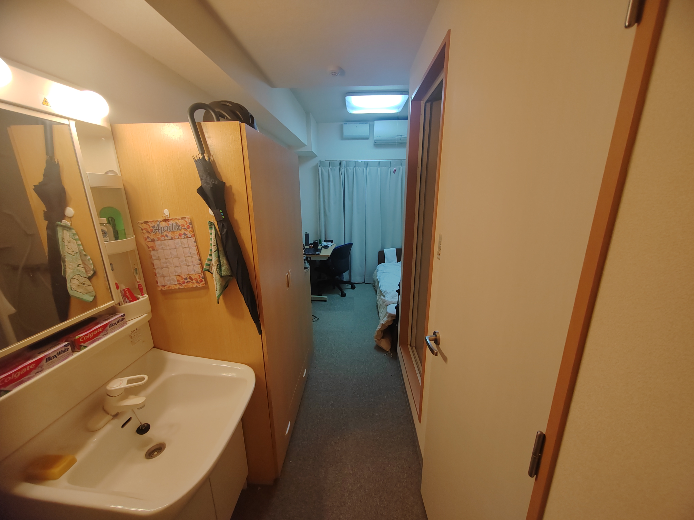

_Folyt. köv._
