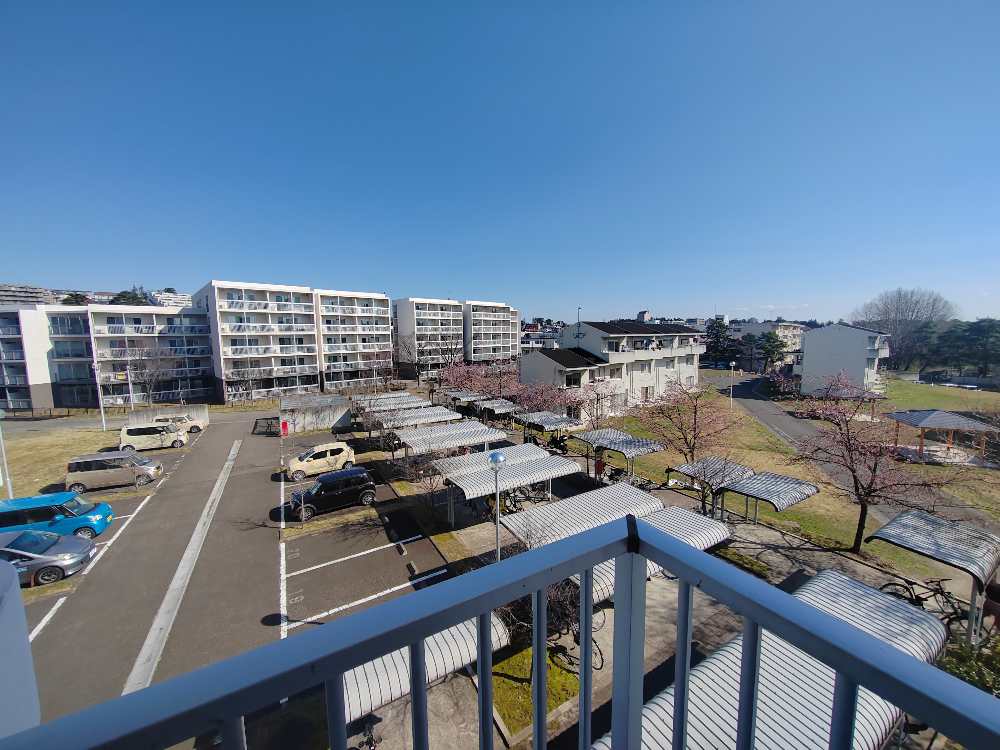
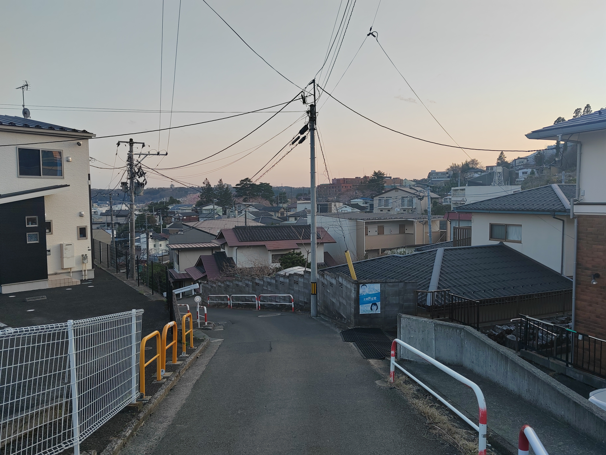
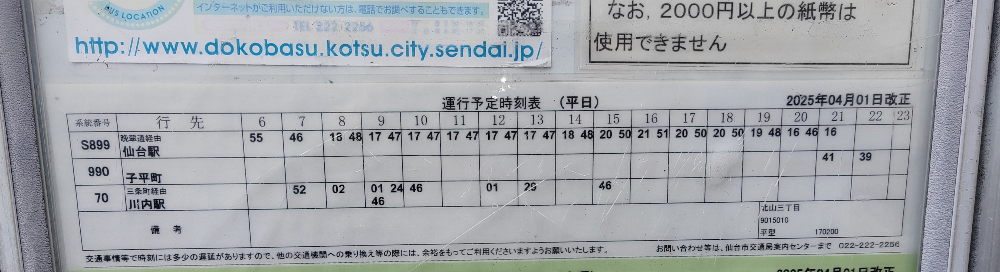
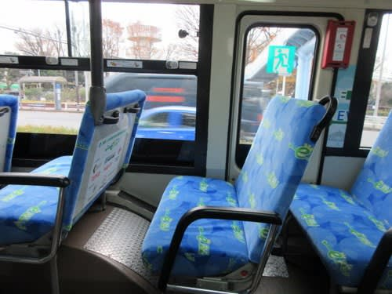
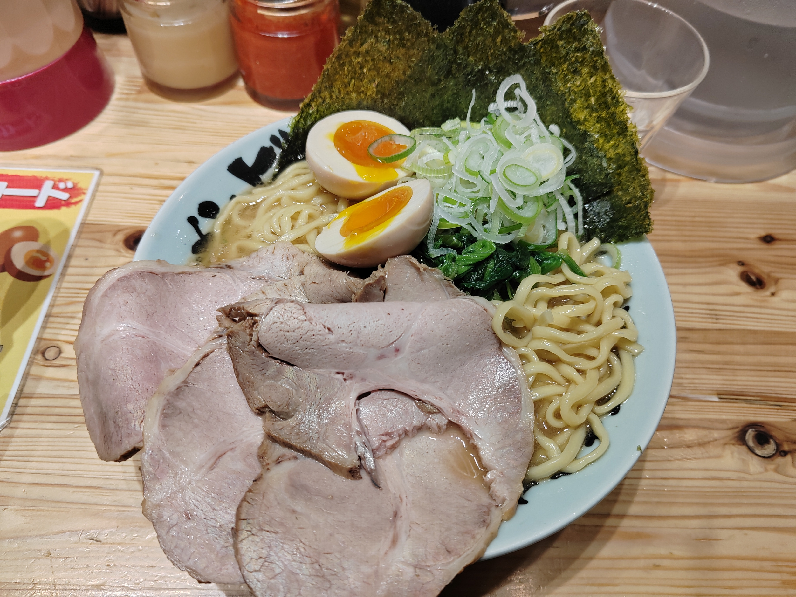
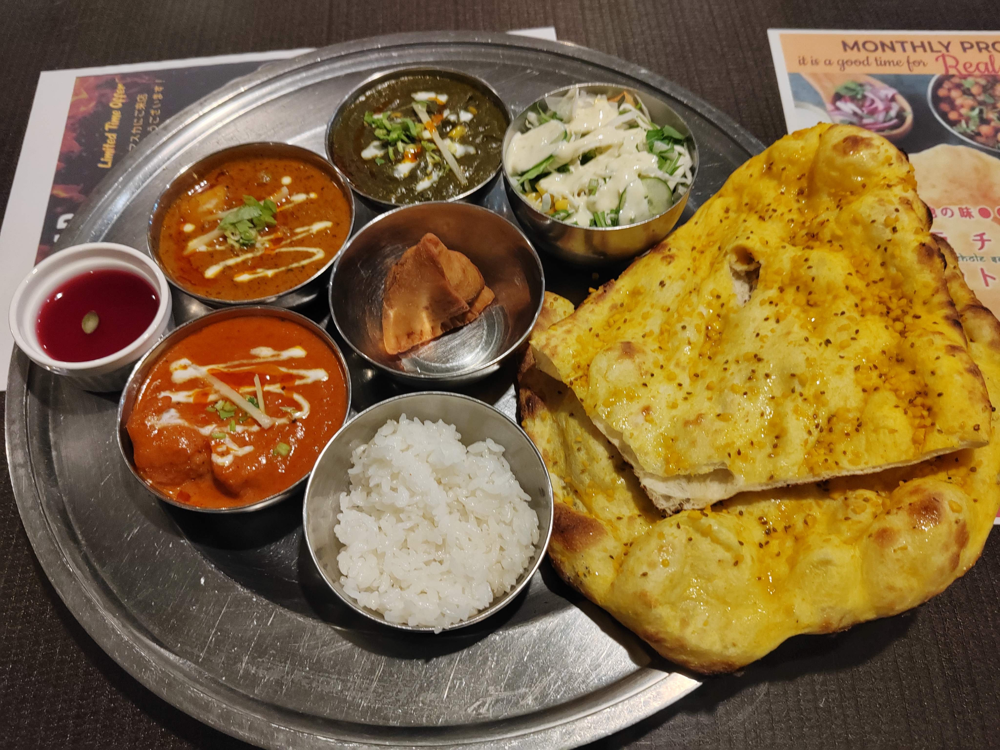
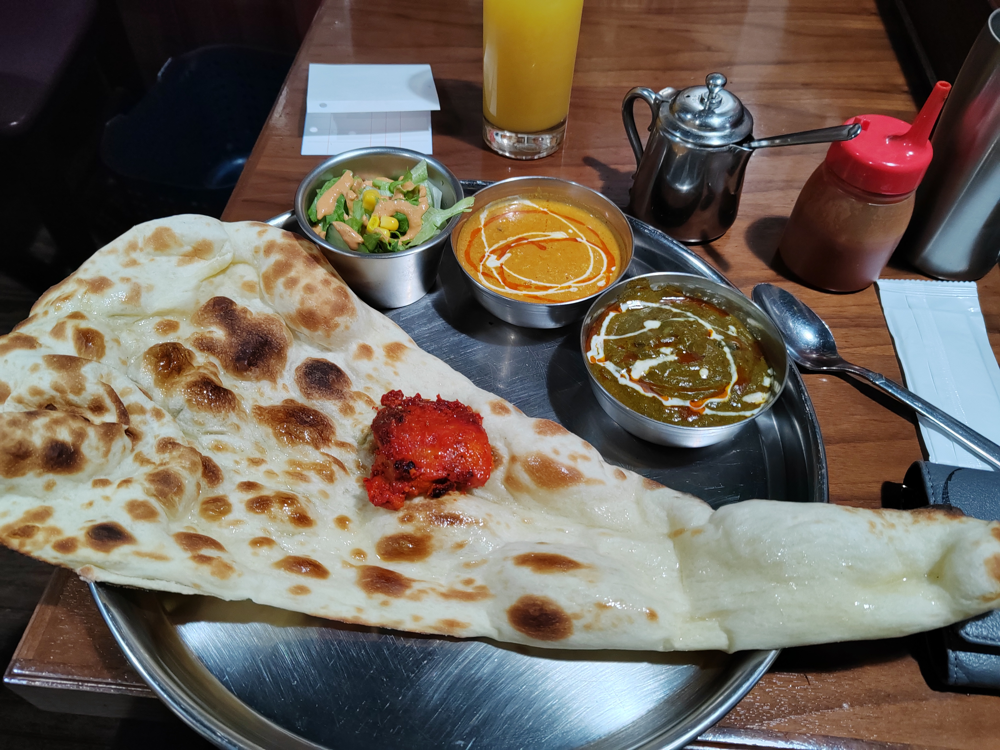
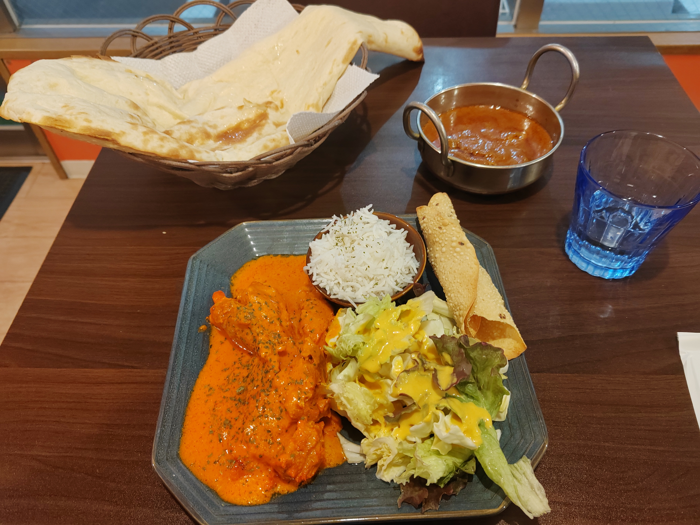
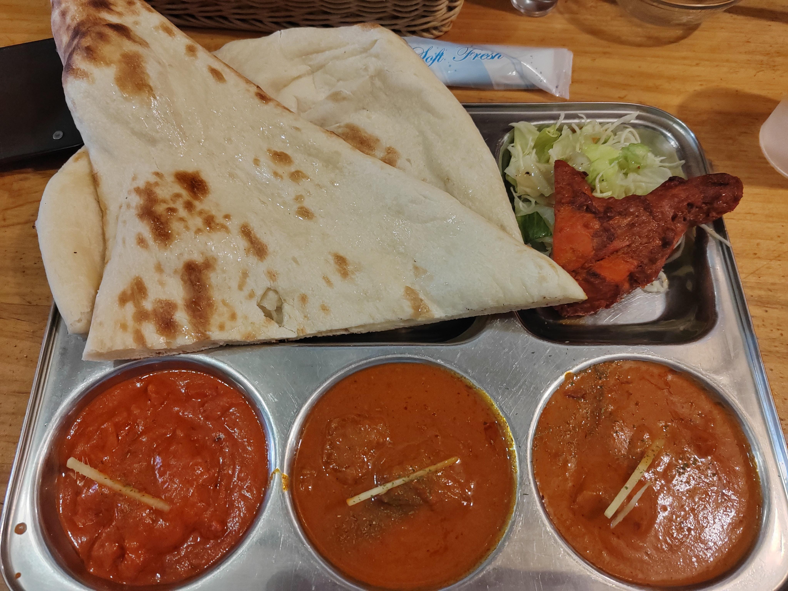
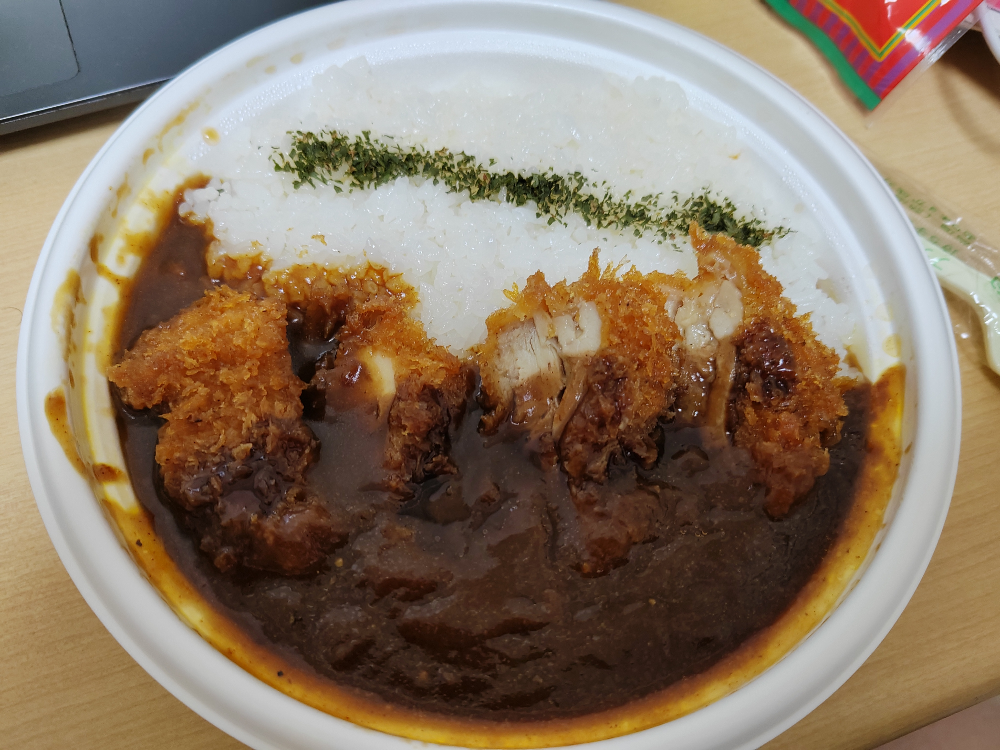

## Orientáció

Felkeltem reggel 8-kor. Érdekes mód az időeltolódás nem ütött meg. Aznap még. Kellett egy bő 10-20 perc amíg felfogtam a helyzetem. _Totó, azt hiszem, már nem Kőbányán vagyunk._ Előbányásztam a bőröndből a kedvenc szettem, felöltöztem, majd lementem először is a karbantartói irodába. Tudniillik, a kollégiumban nincs nyílt wifi, hanem lehet bérelni routert. A baj csak az, hogy előző nap amikor érkeztem már rég besötétedett, és a karbantartók hazamentek. Csak egy biztonsági őr volt benn, aki oda tudta adni a belépőkártyát. Ergo, egy bő fél napja nem volt lehetőségem életjelet adni. Megkaptuk az előadást a kolis életről: Szemétkezelés, szabályok, szükséges regisztrációk, levelek és csomagok kezelése, mi hol van a környéken, mivel van felszerelve a lakás, ilyesmik. Én meg egy francia srác kaptuk az eligazítást, nekem a hölgy japánul mondta, a kollégának meg... hát angolul próbálta mondani, de nem ment túlzottan jól. De megoldottuk azé'.

## UH Szandzsó: Az új otthonom

Először is, bemutatom a helyet, ahol szeptemberig élni fogok. Cél szerint. Technikailag maradhatnék jövő márciusig, de ha csak lehet, inkább a kellemes utó-nyári időben költöznék ki, mint abban a szutyok, vacak, ócska, latyakfedte undormány hóolvadmányban, amit márciusnak hívnak. Mehettem volna a jó melegbe Fukuokába vagy Kagosimába, vagy legalább Hirosimába... De nem, nekem olyan helyre kellett költöznöm, aminek echte ugyanolyan az klímája, mint Pesté. Csak 3-szor annyi esővel. _Szép munka._ Megint elkalandoztam.

 

Van saját szobám, amihez tartozik saját vécé, fürdőkabin, ágy, sőt még erkély is. A konyha viszont közös a többiekkel, a hűtőt is beleértve. Mosógépből van kettő is, viszont az itteni mosógépek csak hideg vízzel mosnak. Ennek előnye, hogy nem kell nagyon figyelni, hogy egyszerre fehéreket vagy sötéteket moss, mert nem elég erős a víz, hogy kiszedjen bármi festékanyagot. A hátránya viszont az, hogy ha lecurryzed magad, mint ahogy én rendszeresen szoktam, akkor be kell mosás előtt dörzsölni az érintett részt folteltávolítóval, különben az soha nem jön ki többet.

 

A szobatársaimmal időnként dumálgatunk picit amikor épp a konyhában tevékenykedünk, de azt leszámítva leginkább csak próbáljuk nem zavarni egymást. Azon túl nem tűnik úgy, mintha lenne egy nagyobb, összetartó kolis közösség. Vannak időnként helyi események amikre elugrok azért, hátha sikerül kicsit ismerkednem. Eddig igazából egy brazil sráccal, Ailtonnal és egy ELTÉs úriemberrel az egyik másik épületből (Szia, Péter! 😁) tartom relatív rendszeresebben a kapcsolatot. Talán nyárra kicsit felélénkül a hangulat, és akkor több emberrel tudok találkozni. De igazából egyelőre a fő közösségem amúgy is a labor, ahova járok. _Róluk később._

## Minden BKK elleni panaszom azonnali hatályú visszavonása

A környék maga kicsit kétélű kard. Egyrészt, síri csend van éjszaka. Leginkább azért, mert minden oldalról temetőkkel vagyunk körülvéve. Viszont épp ezért a tömegközlekedés az minden, csak nem jó. Három busz jár. A 899-es olyan, mint Pesten a 148-as. Nem rossz az összeköttetés, de mindenhova bekanyarodik és megáll minden második villanypóznánál. És mivel az útiköltség a leutazott megállók száma szerint nő, ez nem éppen szerencsés. Ezzel szemben a 999-es olyan későn jár, hogy még élőben nem is láttam. De a legrosszabb a 70-es. Az a busz csak az útvonalát tekintve valami mesés lenne. Konkrétan annak a mentén járok be máig is az egyetemre. De olyan szinten véletlenszerűen jár, hogy azt halandó emberként nem bírtam kiismerni.

De még ha meg is tanulnám konzisztensen elérni, akkor is kéne egy darab megállót metróznom utána. Ez egy irányba 200 jen. Hát kérlek szépen benneteket, ez az írás idején havi 20 ezer Jó Magyar Forint havonta. És mivel a busz is kábé ennyi, mehet is rá a kettes szorzó. És ez csak az egyetemre bejárás költsége. Persze nyilván nem vesz az ember Pesten se minden egyes buszra jegyet, bérletet kell szerezni azt csókolom. Na, hát az a helyzet, hogy lehet szerezni relatív olcsón csak busz, vagy csak metró bérletet. De az én kampuszomra bejáráshoz keverni kell a kettőt, így az egyetlen értelmes bérlet az havi 30 ezer forintra jönne ki. Meg eleve, a buszok elég rosszul vannak megtervezve. A kerekek feletti üléseken például csak nemes egyszerűséggel nincs helye a lábadnak. Konkrétan ölelned kell a térdedet, hogy beférj. Ja, és éjszakai busz se nagyon van, szóval ha kinn maradok véletlen _karaokézni_ hajnalig, akkor sétálhatok haza, jó messze. Ebből nagyon gyorsan elegem lett, úgyhogy mihamarabb tenni akartam ellene.

 

Egyik kolis összejövetelen kaptam egy javaslatot egy helyi sráctól, hogy nézzek el az egyik közeli használteszköz-boltba, ha kell valami elektronika. Nahát, én úgy döntöttem, hogy kell egy elektromos bringa. Akik voltak szerencsések megtapasztalni a korábbi próbálkozásaim e-bringán, azok emlékezhetnek, hogy egy hasmenéses, pánikrohamos rinocérosz kecsességével vezettem őket. Szóval nem mondom, hogy nem volt aggodalmam a dolog iránt, de reméltem hátha sikerül egy _pedelec_ modellt kifognom. Annyit érdemes tudni, hogy vannak a kézileg szabályozott hajtású e-bringák, és vannak a pedálnyomaték-érzékelős, vagyis _pedelec_ típusok. Na, nekem korábban inkább az előbbihez volt szerencsém, és azokkal dzsúdóbírákat lenyűgöző eséseket sikerült produkálnom. De jobb alternatívám egyelőre nem volt, szóval elmentem a használteszköz-boltba. Egy helyi nagymama vezette, kábé egy lakás nappalija lett kialakítva boltnak. Volt mindenféle kütyü, rizsfőző, mosógép, tévé... Egy szimpatikus pénztárcát vettem is, mert az addigi kompakt típusomban a japán papír pénzjegyek visszafordíthatatlanul behajtogatódnak. De e-bringa épp nem volt. Az utolsót az azelőtti héten vitték el. De annyi öröm volt az ürömben, hogy mint kiderült, Japánban _de facto_ csak _pedelec_ típusú e-bringák vannak. Technikailag lehetséges lenne kézi szabályozásút importálni, de az már moped-jogosítványt igényelne. Plusz, baromi drága is lenne importálni, a japán gyártók meg már csak nyomatékszenzorosat gyártanak. Úgyhogy legalább eggyel kevesebb dolog, amin gondolkodni kell. Megkértem a nénit, hogy küldjön egy üzenetet a Messenger helyi megfelelőjén, a _LINE_-on, ha esetleg érkezik e-bicó, és mentem tovább a városba nézelődni.

Újonnan 100 ezer jennél (250 ezer forint) indultak az e-bringák, de inkább a 120 környéke volt a jellemző. Még így is úgy számoltam, hogy egy év alatt kényelmesen visszahozzák az árukat. Neten is néztem újakat is, használtakat is. De minden esetben vagy aránytalanul drágák, vagy túl messze voltak. Már egészen kész voltam lenyelni egy újnak az árat, amikor egyik reggel kaptam egy nagyon örömteli értesítést. Jött be egy új e-bicaj. Na, hát nem fogok hazudni, fél órával kelés után már ott is voltam az üzlet előtt megnézni a csodát. És amit láttam, abban a legkevésbé se csalódtam.

Mint láthatjátok, nem egy mai darab a bestia. Pár helyen picit rozsdás is. Meg úgy általában, a színpalettája a legjobban úgy írható le, hogy egy szocreál idősek otthonának a vécéje. De. DE. **DE.** Ne csapjon be a látvány. Egyrészt, az akksija 2 éve volt cserélve. Nem zsírúj, de még egy 3-4 évet simán kihúz. De még ha cserélni is kell, ez nem egy sehonnani bitang márka, hanem Panasonic. Ennek a konkrét modellnek máig is gyártják az új generációit, aminek az akksijai visszafele kompatibilisek ennek a foglalatával. Meg úgy eleve, azért magabiztosabban ül fel valaki egy Panasonicra, mint egy random egyszerűsített kínai írásjelekből összelegózott márkájú gépre, na. Plusz ez az a típus, amit a hollandok _omafiets_-nek, azaz nagymama-bringának hívnak. Alacsonyított acélváz, sárvédők mindenhol, emelt és hátracsapott kormány, és kosarak mindenhol. Kábé olyan aerodinamikus, mint egy kinyitott esernyő. Cserébe viszont állati megbízható és praktikus, nekem pedig pontosan arra volt szükségem. És magyarként azért megtaláltam az előnyét is annak, hogy ennyire nyuggerbicónak néz ki. Ez effektíve beépített lopásgátló. Komolyan, ebben a városban 3-ból 2 bringa elektromos, mert sok az emelkedő. Viszont a japán szülők meg tudják fizetni az újat a gyereknek, aki meg nyilván egy menőbb modellt fog kérni. És senki nem zárja le őket kábé sehol. Ergo még ha csodával határos módon valaki tolvajlásra is kerekedne itt, garantáltan nem az én csotrogányomat fogja elmarni.

De persze mindez semmit nem jelentett a legnagyobb előnyéhöz képest minden más lehetőségemmel szemben. 29 ezer jenért adta a néni. Ez 72 ezer forint. Az még fukar magyarként is veszett jó ár. Megnéztem elég alaposan. A kerekek nyílegyenesen pörögtek, a küllők épek és feszesek voltak, horpadások nem voltak. A hátsó féken kellett egy elég nagyot húzni utólag, de az abszolút részletkérdés. Meg is vettem ott helyben. Bármi gond nélkül hozzá is szoktam, kábé kizárólag azzal járok mindenhova ezen a ponton. Praktikus is, kényelmes is, és július közepére vissza is hozza az árát. Azt azért kicsit sajnáltam, hogy nem dobfékes. Tipikus városi bringára abszolút nem létszükség, viszont itt rengeteget esik az eső, és van jópár kegyetlen meredek lejtő is. Na, ezeken folyamatosan félig-háromnegyedig be van húzva a két fék, hogy csak harminccal menjek, ne pedig a hatvanat csiklandozva a szerpentineken. Kevés dolog gyorsul úgy, mint egy kövér ember lejtőn keréken. Talán a lóvasút. Vagy a részecskék a _CERN_ Nagy Hadronütköztetőjében. _Vagy a lóvasút._

## Az erdők fővárosában

## Naoszt, mit eszik odakinn Japánban ez a kölök?

Curryt. Igazából kábé be is fejezhetném itt ezt a szekciót. Ha étterembe megyek, akkor a sok tucat indiai hely egyikét választom, és a 3 különböző currys menüt kérem. Ha az egyetemi menzán eszek, akkor japán curryt veszek. Ha magamra főzök, akkor thai curryt csinálok. Ezen a ponton a diétámnak körülbelül a 70-80%-a curry. Szóval mi is az a curry úgy igazából?


Az indiai curryt, a thaiföldi curryt, a levesesebb curryt, a ragusabb curryt, a sötétszínű curryt, a világos curryt, a zöldséges curryt, a tépett húsos curryt, a babos curryt, a tejszínes curryt, a kis tál curryt, a nagy bödön curryt, rizzsel a curryt, tésztával a curryt, a frissen főtt curryt, a fagyasztott curryt, és minden olyan curryt, amit csak készítenek a világon!


A curry, ahogy én definiálom, az valamiféle fűszergazdag krémes folyadék, amibe belefőznek zöldségeket és/vagy húst. Az állaga lehet közel szilárdtól a leves-szerűig bármi, de a legtöbb valahol a kettő között van. Tálalható rizzsel, tésztával, vagy _naan_ lepénykenyérrel. Az indiai curry jellemzően extrém intenzív ízvilágú. Dominál benne a kasmíri csilipaprika, kardamom, édeskömény, és a vaj. Ezt jellegzetesen leturmixolják, hogy egy nagyon selymes szósz legyen belőle, amit fel lehet szépen tunkolni a _naan_-nal. Nekem ez a kedvencem, de vissza kell vele fognom magam, mert jelenleg ez a fajta curry a legnagyobb veszély a pénztárcámra – vagy ami lehet fontosabb, az artériáimra. Elég liberálisan bánnak az indiaiak a vajjal, tejszínnel és húslevesalappal, amik miatt különösen testesre sikerülnek ezek.

 
 

Amikor épp a kampuszom menzáján eszek, akkor japán stílusú curryt kérek. Ez sokkal enyhébb ízű, édesebb, és zöldségorientáltabb. Lényegében egy főzelék. Csak nem komplettan undorító, érted. Édesebb mint a thai fajta, és kicsit karácsonyi íze van. Enyhén ugyan, de érződik benne a fahéj, szegfűszeg, gyömbér, sőt még akár szerecsendió is. Ja, és szeretnek rá rántotthúst, vagyis _kacu_-t vagdalni, és megfröcskölni azt egy kis barbecue szósszal. Érdekes módon amikor kinn voltunk 2023-ban Hannoverben, akkor ettem egy bajor _Schnitzel_-t ami egész hasonló volt. Csak ott aztán tényleg megküldték a karácsonyi ízeket. Konkrétan, ha jól emlékszem, _Spekulatius_ keksszel sűrítették a szószt. Szóval nem kell botránkozni a japán konyha állatságain, van épp elég furcsaság a szomszédságban is.

 

Amikor viszont magamra főzök, thai curryt csinálok. A thai curryknek kókusztej adja az alapját, és tipikusan savanykásabb irányba megy el. Lime-levél, citromfű, és koriander a domináló fűszerek. Plusz egy fermentált halszósz, a _nam pla_. Elég undin hangzik, és a szaga se jobb. De tényleg nagyot dob ízre a többi fűszerrel kombinálva. A thai currykben tipikusan magasabb a zöldségek aránya a húshoz és zsíradékhoz képest. Ezt leginkább rizzsel eszem, de néha megkívánok _udont_, ami egy ilyen jó vastag, csancsos fajta tészta. Thai curryből rengeteg féle van, de mindegyik igényel egy sajátos pasztát alapnak. Ezek a paszták tartalmazzák az amúgy elég nehezen beszerezhető fűszereket és sűrítőanyagokat, magyarul egy igen drága és több óráig tartó receptet leegyszerűsítenek egy relatíve olcsó, fél órás műveletre. Annyira trivializálja a thai curryket, hogy még a Youtube-os thaiföldi hölgyek is azzal főznek. Szóval nem nagy csalás használni, na. Japánban eddig három fajta pasztát találtam: zöldet, sárgát és pirosat. El is készítettem mindhármat. Igen, most jön az a szekció, ahol Andrisnak elkezd hiányozni az oktatás, és elkezd órát tartani valami random dologról. Nürnbergben a sör volt, most a curry következik. _Én blogom, én szabályaim._

Először egy zöld curryt csináltam. Abban az az érdekes, hogy padlizsán adja az alapot. Érdekességképp megjegyezném, hogy életemben először ettem padlizsánt ezzel az étellel. Vagyis hát ez nem teljesen igaz. Volt egy eset, amikor anyám rántott ki mindenféle zöldséget – lehettem vagy 12 éves ezen a ponton – én viszont nem voltam hajlandó zöldséget enni, kivéve a hagymakarikát. Na, hát anyám azt mondá 12 éves Andrisnak, hogy az a rántott padlizsán az valójában hagymakarika. Amikor viszont 12 éves Andris beleharapott, nagyon gyorsan feltűnt neki, hogy nem az. És ezután évekig nem bízott az anyjának a főztjében. Szóval esetleges friss szülőknek azt javasolnám, hogy az ilyen trükköket inkább kerüljétek el, mert a gyerek nem fogja tőle a zöldséget megszeretni, de még a bizalma bennetek is megsérül.

Ja, igen. A zöld curry. Finom volt, de nem függtem rá. Már hálaégnek a padlizsános traumám elmúlt, de a pasztában a fűszerkombináció kicsit enyhe volt az én ízlésemnek. Hiányzott belőle valami. Végül vettem egy helyi importboltban egy zacskó szárított paradicsomot, és belefőztem azt, ami dobott rajta egy hatalmasat. Előbb-utóbb fogok megint csinálni, és akkor majd kikísérletezem, mi kell még bele. A sárga curry már egy fokkal könnyebben ment. Azt jellegzetesen kicsit levesesebben készítik el, nincs benne olyan zöldség ami szétmállna besűríteni. Ebbe főleg krumpli és répa megy, a fehérjét meg hagyományosan garnélarák adja. Én viszont a garnélával még nem nagyon tudok bánni, eléggé macerás kis dög. Eddig életemben egyszer próbáltam készíteni, és olyan állaga lett mint a gumiabroncsnak. Úgyhogy egyelőre csirkecombot használok. Általában a kókusztejből a dobozban kiválik a zsíradék. Na, azt a zsírt szeretem picit megpirítani, majd azon aranybarnára sütni a felkockázott combot. Ezt a technikát még akár curryzésen kívül is tudom javasolni, egészen jól el tudok képzelni valamilyen pácolt csirkét így kisütve. A zöldségeket meg lehet egy 20-30 percig főzni utána a hátramaradt kókuszvízben.

De ami mindent visz, az a piros curry. Az egy ilyen jó csilis-kókuszos-limeos keverék, tipikusan kaliforniai paprikával, hagymával és zöldbabbal. Na, az az a kaja amit tudnék minden nap enni. Lefőztem egy bő 3 műanyag dobozzal, kettőt bedobtam a fagyasztóba, és szép lassan elcsipegetem az utolsót uzsonnaként. Főzök le hozzá vagy rizst, vagy _udont_, és a laborban megeszem ebédre. Még Pesten ettem egy nagyon hasonló ízű thai levest. Ha véletlen épp Netpincéren kaptok kupont thai étterembe, nagyon tudom javasolni a piros kókuszos-limeos dolgokat, mert szinte biztos ugyanezt a fajta pasztát használják alapnak.

## Andris invarianciája a Lapras-transzformáció alatt

Az előző posztot amikor kiraktam, megváltoztattam az indexképet is. Az új képen épp nagyon vigyorgok egy plüssel a kezemben. Az a plüss kérlek szépen benneteket egy _Lapras_, ami egy bizonyos fajta _Pokemon_. Ez a legtöbbőtöknek teljesen, vagy legalább nagy vonalakban tiszta, mit jelent. Viszont mivel a nagymamáim is olvassák ezeket az írományokat, ezért érdemel a dolog egy kis magyarázatot. Plusz ad nekem is egy lehetőséget kifejteni, én speciel mit eszek annyira ezekben az izékben.

### A rész, ahol elmagyarázom mi az a Pokemon. Mi az isten ez a blog?

Nagyon, nagyon, _nagyon_ lerövidítve, a _Pokemon_ egy japán multimédia-márka. Készült belőle mindenféle fizikai- és videojáték, filmek, képregények, satöbbi. Arról szól, hogy van mindenféle fura mágikus állat a világon, amiket egy kisgyerek a saját cuki állatkájával útra kel elkapni, labdába zárni, és kakasviadal-szerűen egymásnak ereszteni. Oké, ez elég borzalmasan hangzik így leírva, de esküszöm teljesen cuki és gyerekbarát a dolog. Ezek a _Pokemonok_ jellegzetesen valós állatokat vesznek alapul, és adnak nekik valamiféle (legtöbbször japán) mitológiai fűszerezést. És ez valahogy annyira sikeres lett, hogy ma már a világ legnagyobb médiamárkája, évi 100 milliárd dollár bevétellel, aminek a döntő többsége plüssökből és egyéb fizikai termékekből jön. Nemzetközileg a kártyajáték talán a leghíresebb, mert nagyon ritka lapokért több ezer dollártól képesek megválni gyűjtők. Veszedelmes egy dolog.

Magyar viszonylatban a kora 2000-esekben volt nagyobb visszhangja a _Pokemonnak_. Voltak chipses zacskókban ilyen _tazo_ nevű műanyag valamik, amiket lehetett gyűjteni (és elvileg játszani is velük, de senki nem tudta, hogyan), és sugározták az _anime_ rajzfilmsorozatot az RTL-en, aztán a Jetixen, aztán az Animaxon, meg tudja a fene még hol. Én ezekről 2000-es születésűként jobbára lemaradtam, de máig is ha megkérdezel egy '85 és '95 között született srácot, hogy mi a kedvenc _Pokemonja_, egész jó eséllyel fogsz választ kapni.

### Gyerek-Andris Pokemon-kalandjai

Nekem a sztorim a _Pokemonnal_ nem túl hosszú történet. Nem játszottam a játékokkal, mert nem volt soha konzolom – életfogytiglani PC gamer vagyok ezen a ponton. A chipses zacskókban pedig a mi generációnk mindenféle sárkányos kártyát gyűjtött _Dracomania_ néven. Plüssökből is az egy darab Boldizsár nevű szürke-fehér kutyámmal is meg voltam elégedve. De a rajzfilmeket azokat kegyetlen mennyiségben zabáltam. Volt a Lilo és Stitch nevű Disney-filmnek egy sorozat-adaptációja, például, ami végig fenn volt a Youtube-on. Minden epizód 3-4 darabba felvagdalva, jó kis 360p minőségben. Teljesen angolul. Így utólag visszagondolva elég valószínű, hogy a sehonnani eredetűnek tűnő angoltudásom egyik fő forrása szinte biztosan az volt.

Maga a sorozat arról szólt hogy van mindenféle fura mágikus állat a világon, amiket egy kisgyerek a saját cuki állatkájával útra kel elkapni, labdába zárni... vagy időnként a helyi közösségben hasznosítani az egyedi mágikus képességeiket. Szóval igen, ez felületesen egy igen pofátlan _Pokemon_-koppintás. Még a komplett inkompetens ellenfelek, a _Rakéta-csapat_ megfelelője is megvolt _Gantu kapitány_ személyében, akihez a sorozat elején hozzácsapódik az egyetlen olyan mágikus állatka aki tud beszélni. Mint _Meowth_ a _Pokemonban_. Hogy a halálba nem perelte atommá a Nintendo a Disneyt? Nem mintha nem az lenne a kedvenc hobbijuk.

Nem mintha túl sokáig tartott volna a széria. 3 év alatt le is ment az egész. Viszont kifejezetten dícséretre méltó produkció volt. Egy 2003-as filmmel nyitott, rá egy hónappal már ment a rajzfilm a tévében 3 évig, nagyrészt epizódikus struktúrával, majd az utolsó leadott rész után a moziban ki is jött a 2006-os finálé film, ami egy csomót kötött az egészre. Ez nem hangozhat akkora ördöngösségnek, de manapság már kész csoda, ha egy ilyen kaliberű animáció megél nemcsak több évadot, hanem egy kompromisszumok nélküli animációs filmet, hogy lezárhassák a narratívát. Ezen a ponton az a szerencse, ha kap a rendező 3 epizódot, hogy elvarrja a több évadnyi lógó szálat.

Mindenesetre ami volt belőle azt jó párszor végignéztem. Előbb-utóbb viszont elkezdtem keresgélni más néznivalót, és nem tartott sokáig, míg belefutottam a _Pokemon_ mesébe. Nahát, arról a rajzfilmről annyit kell tudni, hogy valami mocsok gagyi. De még így rajzfilm szinten is, katasztrofálisan rossz. Komplett egyértelműen arra volt kitalálva, hogy a gyerekek meglássák az állatkákat, megtetsszen nekik valamelyik menő kinézetű dög, és megvásároljanak bármit, amin rajta van a kedvencük. És tényleg, a világon mindenre ráteszik ezeket a dögöket. Kulacsok, LEGO, plüssök, műanyag figurák, éjjeli lámpák, rollerek, rajzoló táblák, és ezek csak az első oldalon a 10-ből. Az, hogy maga a mese milyen minőség, az teljes mértékben másodlagos volt. Ahogy 17 éve egy élő legenda egykoron mondá:


Hát, mindenesetre tényleg nem tudok sok mondanivalót kihozni abból, hogy: "Pikachu, Villámcsapás-támadás!".


Ennek ellenére viszont én nagyon bírtam, úgyhogy levadásztam az epizódokat amerre csak tudtam. Vicces mód egyszer anyám rajtakapott, miközben néztem. Tudniillik, édesanyám ebben az időszakban nagyon gyűlölte a japán krikszkraksz meséket, avagy ahogy ő hívta őket, a "mangákat". A jegyzőkönyv kedvéért megjegyezném hogy a mangák azok a japán képregények, nem pedig a rajzfilmek. De ja, mielőtt még be tudtam zárni anyám látta a weblapot ahol néztem. De valahogy sikerült behazudnom, hogy nem az volt odaírva hogy _Pokemon_, hanem az hogy _Poker_. Igen, kevésbé lett volna gáz ha hazárdjátékozáson kap rajta, mintha azon hogy "mangát nézek". Titokban azért néztem a sok _Pokemonos_ videót a neten továbbra is, annak ellenére hogy máig nem játszottam egy játékkal se. Viszont így legalább nem tudott az előbb említett marketingstratégia 12 éves Andrisra.

**24 éves Andrisra már annál inkább.**

### Egy infantilis hobbi messze túlgondolt pszichoanalízise

De ha soha az életben nem nyúltam a játékokhoz, nem is néztem a mesét túlzottan, nem volt gyerekkorban ilyen játékom, és még csak nem is annyira az én generációm függése a dolog, akkor mégis mi a vonzereje a 

## Kis utómegjegyzés gigakockáknak

Ebből a cikkből, és a továbbiakból egy darab szót nem írtak generatív MI modellek. Időnként használok elnyújtott gondolatjeleket (_en dash_ a tipográfia-élvezőknek), amik erős árulkodó jelei az MI-generált tartalomnak. Ennek az oka az, hogy túlhasználom a vesszőket, és kell valami, ami helyettesíti őket néha, hogy ne legyen ritmikailag katasztrofális az iromány. Vagyis hogy ne legyen olyan az egész szöveg, mint az előző mondat. Na, tud az MI ilyen önreflektív lenni? _Ehh. Talán._
