## Hol? Miért? He?

[Tasirodzsimán](https://hu.wikipedia.org/wiki/Tasirodzsima). Ha épp nincs kedvetek Wikipédiát bújni (nem tudok ezzel azonosulni), akkor röviden annyi a lényeg, hogy vannak Japánban hellyel-közzel szigetek, amik tele vannak macskákkal. Na, hozzám a legközelebbi ilyen az ez a bizonyos Tasirodzsima. Amikor pedig azt mondom közel, az azt jelenti, 3 óra út. És nem éppen gyakori járatokon, mint ahogy azt volt szerencsém megtapasztalni.

<!-- markdownlint-disable MD033 -->
<iframe src="https://www.google.com/maps/embed?pb=!1m18!1m12!1m3!1d23157.631691028415!2d141.39732524577602!3d38.2986633488781!2m3!1f0!2f0!3f0!3m2!1i1024!2i768!4f13.1!3m3!1m2!1s0x5f89c00d07d663e7%3A0xd985f22a28c60972!2sTashirojima!5e1!3m2!1sen!2sjp!4v1751552431246!5m2!1sen!2sjp" width="100%" height="450" style="border:0;" allowfullscreen="" loading="lazy" referrerpolicy="no-referrer-when-downgrade"></iframe>

Aki esetleg nem tudná, otthon van két nagyon tündéri macskánk. A fekete, Sir Mauck, rendszeresen felmászott mellém az ablakpárkányra, vagy időközzel a billentyűzetem elé miközben dolgoztam a gépen. A fehérünk, Havas, pedig ilyenkor rendszeresen követte őt, egyenesen az ölembe. Hát, most perpillanat több időt töltök egy átlag nap a gép előtt mint valaha, de a laborunknak sajnos nincs cicája. Lehet jobb is, mert rendszeresen grilleznek húst srácok. A robotika laborban. Igen, van pár furcsaság itt, amit még nekem is fel kell valahogy dolgoznom. De egy macska egész biztos nem lenne kompatibilis a dologgal.

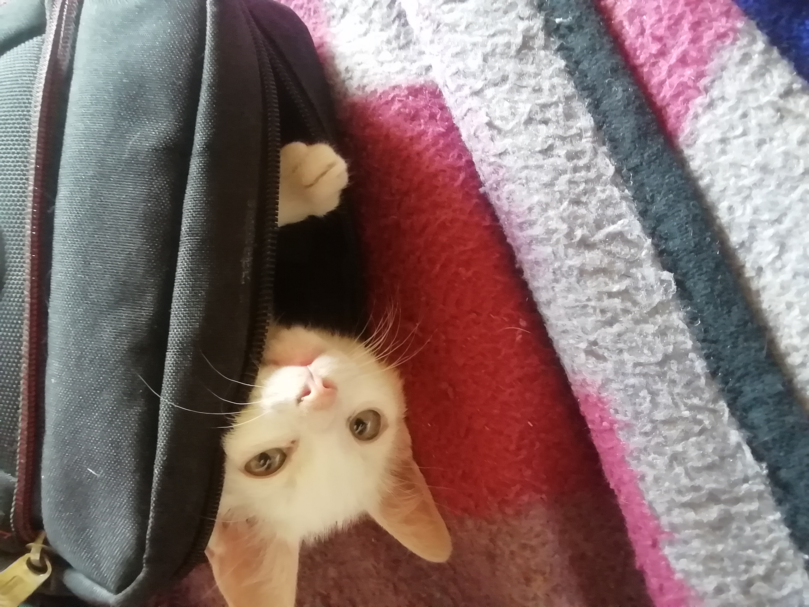 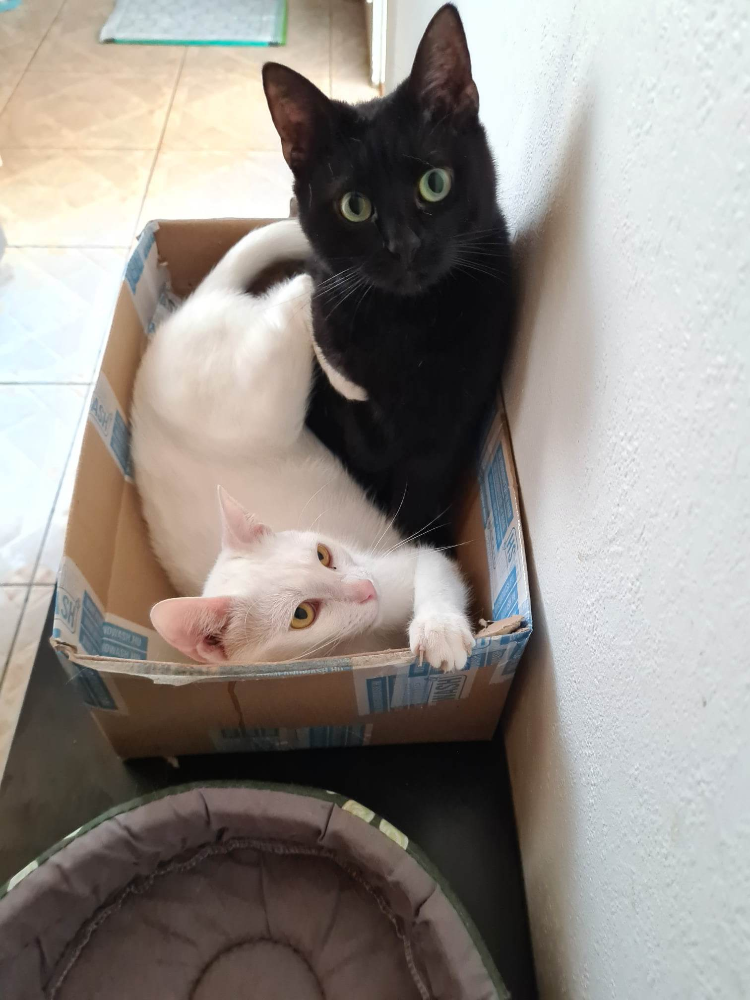

Mindenesetre már nagyon szükségem volt egy kis cica-energia újratöltésre. Vannak ugyan a városban macskás kávézók, de elég sok negatívat olvastam az utóbbi időben arról, hogyan bánnak az ilyen helyek az állatokkal. Szóval úgy döntöttem inkább nem élek az ilyesmivel, főleg ha már van relatíve közel egy eleve macskaturizmusra kialakított hely. Különben is, kaptam egy kihívást unokatesóimtól, hogy utazzak egyet. Szóval semmi kifogásom nem volt.

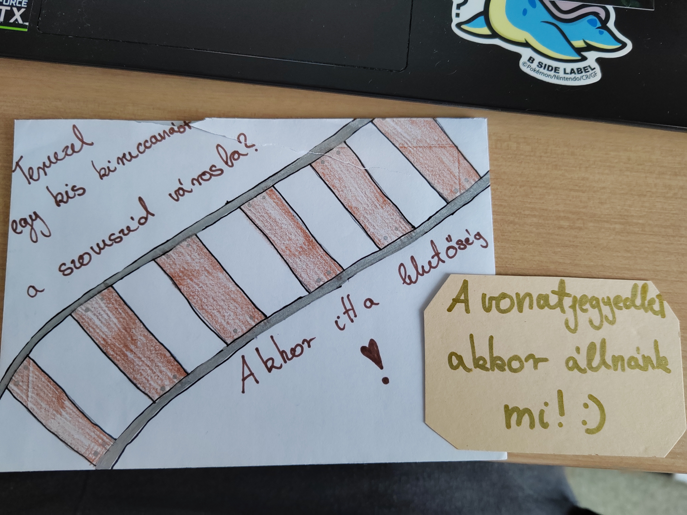

## Kellemetlen korán kelés

Itt Japánban a tömegközlekedés erősen kétélű kard. Látványosan sok pénzt fektetnek a minőségbe és a fedettségbe, cserébe viszont magyar viszonylatban ritkán mennek a járatok. Legalábbis itt vidéken. Ennek a kiruccanásnak a szűk keresztmetszete az Adzsisima komp volt, ami az Isinomaki-i kikötőt köti össze a közeli szigetekkel. Na, ez a komp potom napi három alkalommal indul mindkét irányba. Ezek közül az első 9:30-kor, az azt követő pedig 12:30-kor indul Isinomakiból, visszafele a legkésőbbi pedig 15:12-kor indul a szigetről vissza Isinomakiba. Az eredeti tervem az volt, hogy a 9:30-as járatot érem el. Ergo hajnal 6-kor el kellett otthonról indulnom. Na, ezt valami csodával határos módom még össze is hoztam, és pöccre épp időben ott voltam az állomáson.

Itt történt a nap első közlekedés-malőrje, ugyanis nagy sietségemben sikerült az ellenkező irányba menő vonatra felpattannom. Mert persze, hogy mindkettő épp benn volt a vágányon. Elindultunk dél felé, és ezzel romba is dőltek a szépen kitalált terveim. Érted, amióta itt vagyok először felkelek hajnalban, erre még annak se volt értelme.

Mivel a következő komp 12:30-kor ment volna, és az út a oda egy óra, tudtam volna ténylegesen a macskaszigeten másfél órát tölteni. Na hát annyi idő az pont nem elég még azt a pici szigetet se bejárni, főleg hogy ott terveztem ebédelni. Leszálltam a vonatról, és persze semmi nem volt nyitva, úgyhogy szomorúan visszametróztam a központi vasútállomásra. Beültem egy kávéra, és megpróbáltam összeszedni magam.

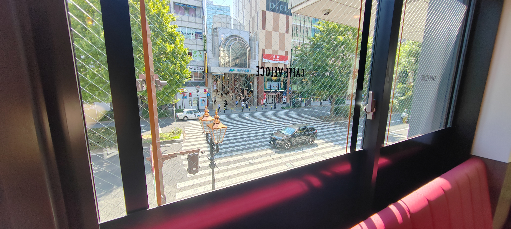

Beültem egy kávézóba, bambulni kicsit a beinduló reggeli Szendai-i forgalmat. Ahogy gondolkoztam a menetrenden, valamin megakadt a figyelmem. Isinomakiba ugyan 15:12-kor indul vissza a komp, de a másik végállomás, Ajukava irányába még van egy, 16:14-kor. És még jár is onnan busz Isinomakiba, egy kifejezetten szépnek tűnő útvonalon, végig a tengerparton, dombos szerpentineken. *Hoppá.* Hirtelen visszatért az izgatottságom. Van az angoloknak a mondása az ilyen helyzetekre.


Ha az élet citromot oszt le, készíts belőle limonádét!


Ami magyarán azt jelenti, hogy még ha egy alapból kellemetlen helyzetben találod is magad, kis kreativitással lehet ki tudsz belőle egy jó végkimenetet facsarni. Amolyan "öröm az ürömben" dolog. Itt pedig úgy tűnt, van bőven mit facsarni.

## Feszültség a levegőben

A következő vonatot már gond nélkül elkaptam, és meg is érkeztem Isinomakiba. Elég semmilyen kis halászvároska, de nem utolsó látvány, ahogy a domborzat találkozik az óceánnal. Már ahol kilátszik a védművek mögül. Igen, erről is kell egy kicsit beszélnünk. Eddig többé-kevésbé kerültem a témát, mert tudom, hogy nem azért jöttök ide, hogy természeti katasztrófákról olvassatok. De ez még elő fog nem egyszer kerülni, úgyhogy összefoglalom nagyon röviden a helyzetet.

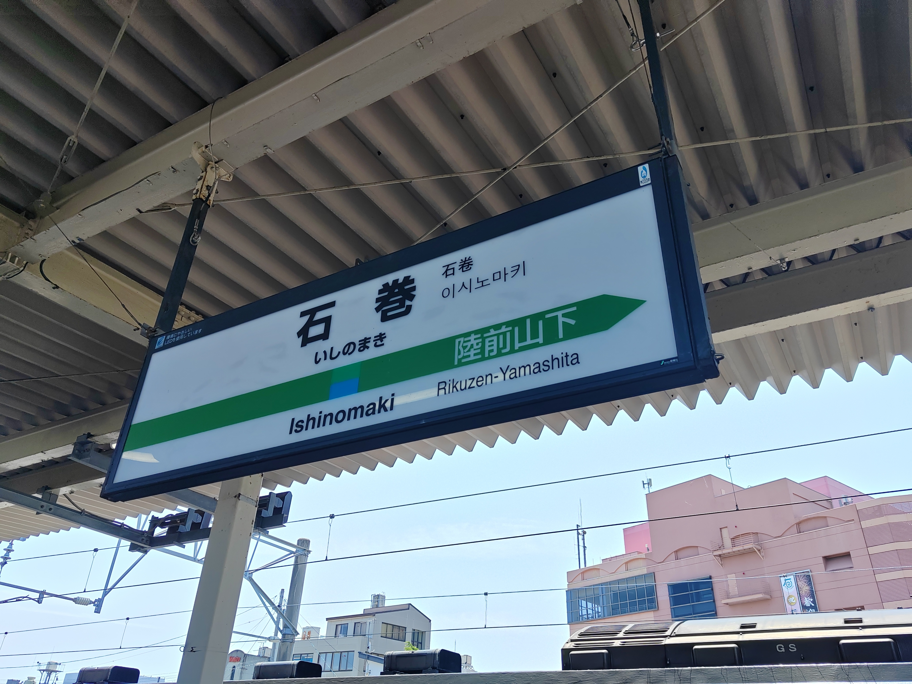 

 

2011 márciusban egy magyar viszonylatban igazából felfoghatatlan mértékű földrengés érte a Tóhoku régiót, ahol most élek. Nálunk a hírekben leginkább a Fukusimai atomkatasztrófa volt jelentve, de itt az egy relatíve apró szelete a tragédiának. Szendai-t például több tucat méter magas, 700 kilométer/órás cunami sújtotta a földrengést követően. 20 000 halott, 146 **billió** Forint értékű kár. A partvidék azóta is több kilométeren át gátak, rizsföldek és romok egyvelege. Egy másik országban ezek lennének a legdrágább birtokok, de itt aki csak tehette, visszavonult a dombtérségbe. Kegyetlen irónia, hogy maga a Szendai mint tulajdonnév is azt jelenti, hogy "Remete-fennsík". Nem hiszek a nominatív determinizmusban, de ez egy erős példa lenne rá, ha érvelni akarnám.

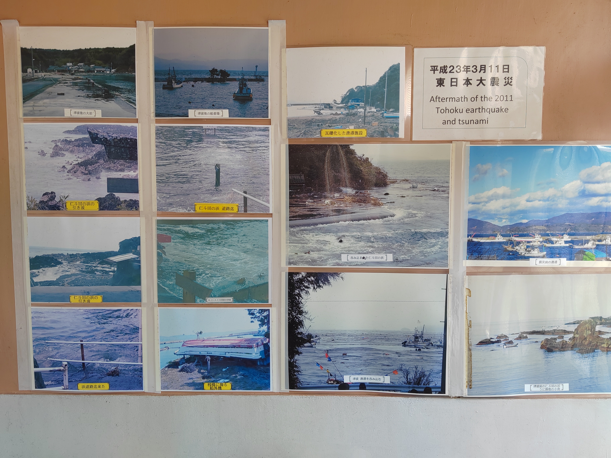

Mindenesetre itt Tóhokun a tengerpart nem éppen egy Miami Beach. Tizen-plusz méteres hullámtörő falak dominálják a látványt, és hekkes büfébe se botlasz nagyon. Egy barátommal már tervezünk egy kiruccanást egy szigeti strandra, ami talán megtöri ezt a mintát, remélhetőleg az majd segít kicsit kihozni az óceán vonzerejét. De amikor legközelebb Magyarországon vagyok, egy balatoni nyaralást azt kötelező jelleggel meg fogok ejteni. Bár az elszállt lángos-árak biztosan le fognak fordított kultúrsokkolni.

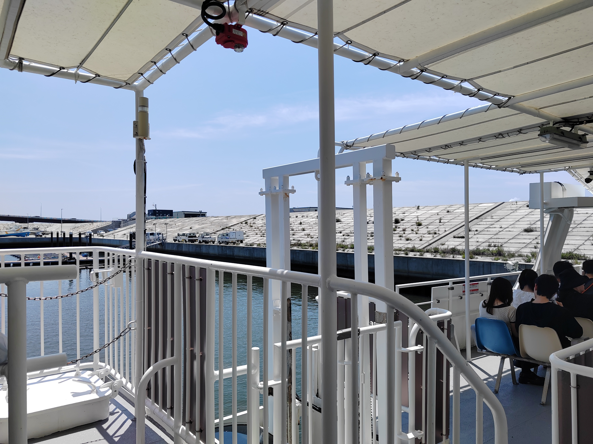 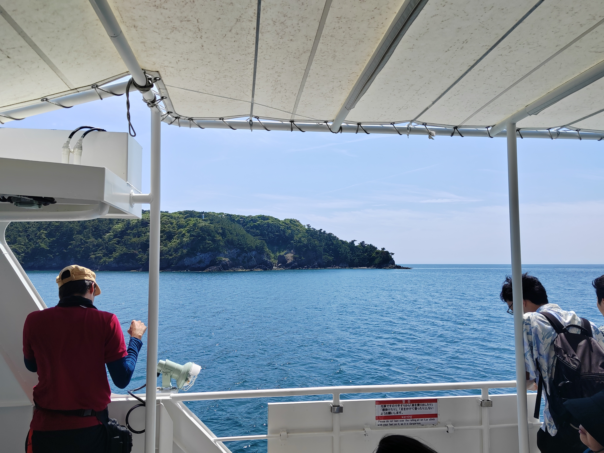

## A macskaszigeten

A jegyirodában az egyik matróz árulta a jegyeket és rögzítette az utasinformációkat. Kicsit csodálkoztak, hogy nem oda Isinomakiba akarok visszatérni, hanem tovább Ajukavára a semmi közepére. De olyan magabiztosan mondtam a magamét, hogy feltételezem úgy gondolta, csak tudom mit csinálok. Cserébe viszont engem is meglepett, hogy másnak nem jutott eszébe egy ilyen útvonalterv. A matróz kifuvarozott engem, meg még két várakozó vendéget a jegyirodából a kikötőhöz, és kis várakozás után meg is indultunk. Szerencsémre úgy tűnik, nem vagyok akut mód fogékony a tengeribetegségre, szóval megkönnyebbülten tudtam az elhaladó szigetek látványát befogadni.

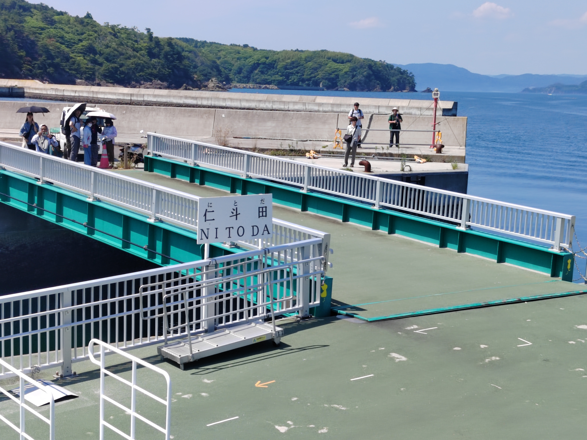

Egy óra hajókázás után pedig megérkeztünk Nitodába, a sziget fő kikötőjébe. Már az első pillanattól amit csak lehetett, macskásítottak. Tudtam szerencsére komfortosan lőni jópár képet, elvégre a zseniális utazási trükkömnek köszönhetően nyertem egy extra órát a szigeten. Hagyom is a képeket magukért beszélni.

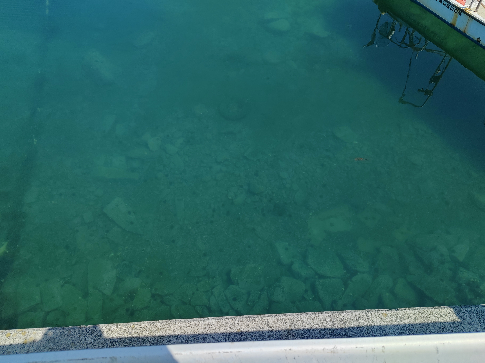 

 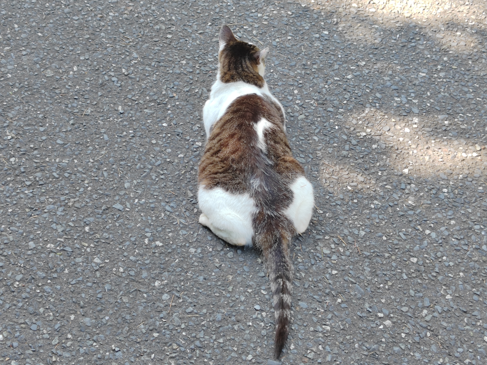 

 

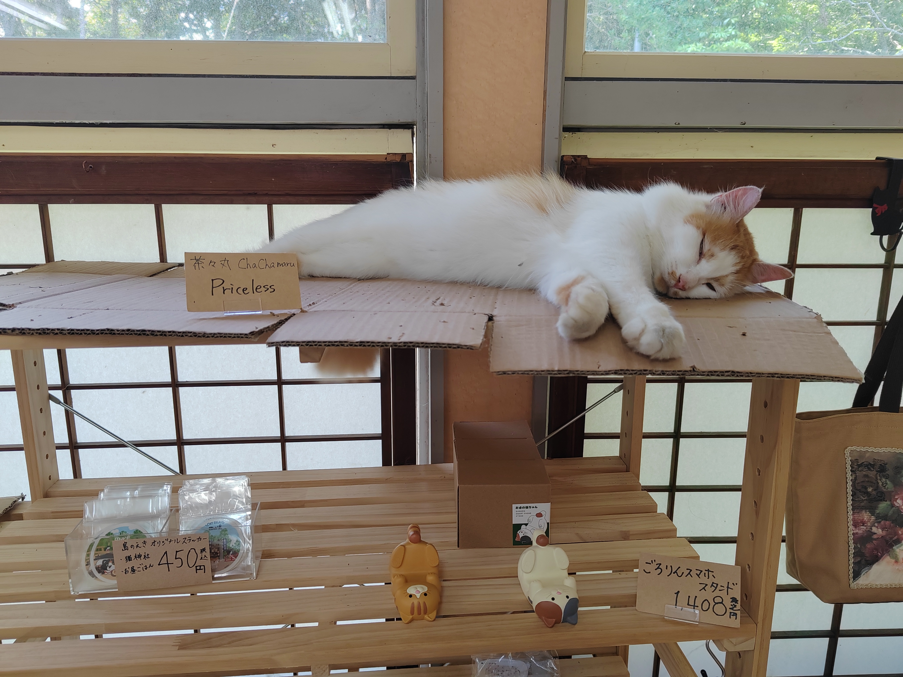

 

 

 

  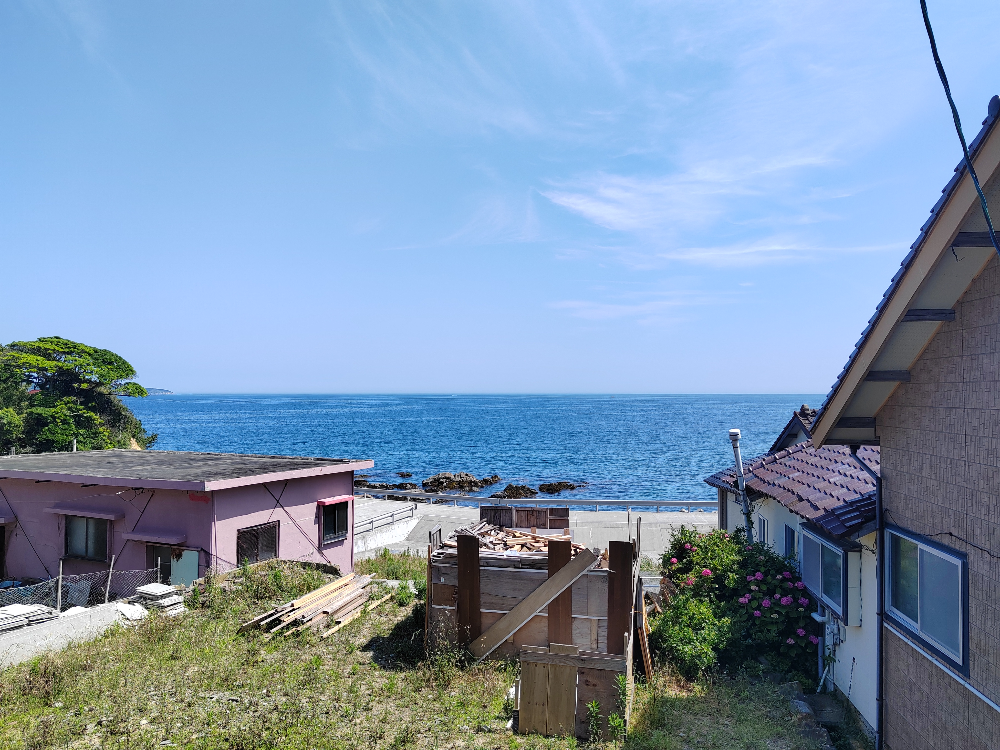

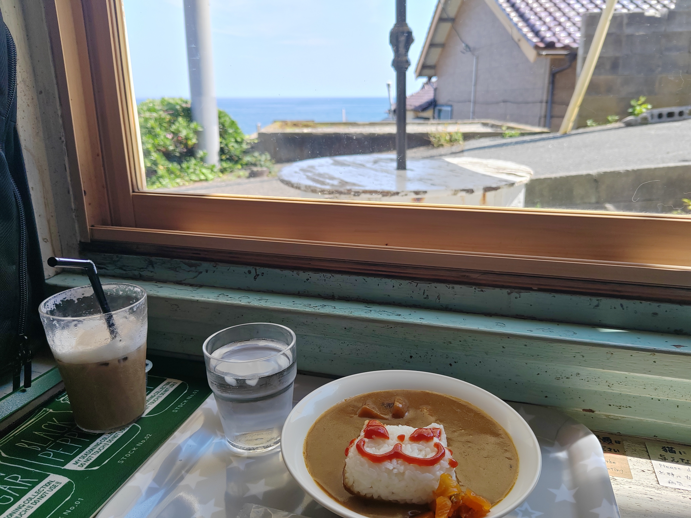  

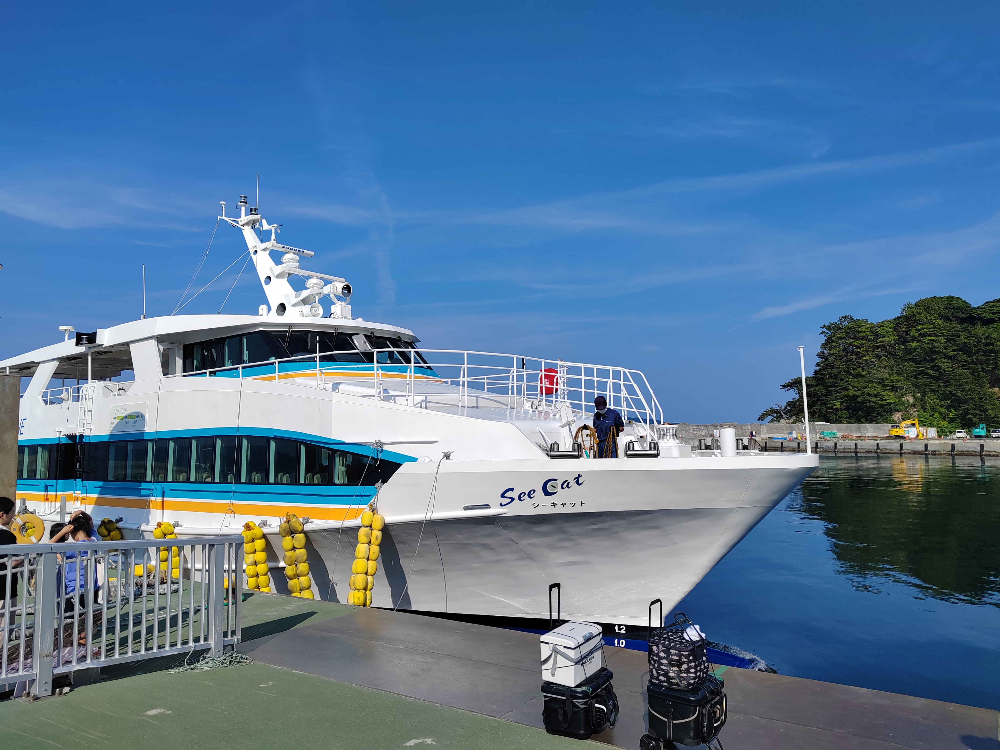

## "Hazaút"

Nitodában felszálltam a hajóra, és megindultunk Ajukava felé. A sziget dimbes-dombos táján a fülledt levegőben bóklászás végül azért kicsit csak kifárasztott, szóval jól esett csak kibámulni a tengerre és a többi közeli szigetre ahogy elhaladtak. Akartam pár képet lőni, de eléggé haldoklófélben volt már a telefonom akksija, ezért úgy döntöttem, tartogatom a töltést a buszos szerpentinekre. Magára a kompra rajtam kívül csak pár horász szállt fel, mind japánok. Kicsit azért megmosolyogtam magamban, hogy nem a kitaposott ösvényt járom, *azokkal a tipikus fehéremberekkel ellentétben*. Végül kábé 5 perc késéssel értünk be Ajukavára, de még így is volt bő fél órám a buszig, úgyhogy komótos tempóban megindultam a megálló felé.

Maga Ajukava egy elképesztően csendes kis kikötőfalu. Az egész placc cirka 600-as népessége elférne abban a bitangnagy kiállítási bálnászhajóban ami maga a település látványát messze ledominálta. Érdekes mód ami a legjobban megmaradt, az a hely szaga volt. A kikötő betonútjain ember magasságú bálákban szárították a hínárt. És ennek persze megvan a maga bukéja. Engem szerencsére pont nem csapott túl vészesen meg, és az óceáni sós szél is segített valamelyest felhígítani és elterelni, de bárhova mentél a faluban, jelen volt valamelyest a tengeri herkentyűk aromája.

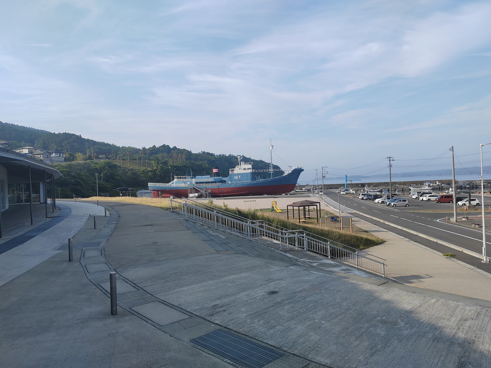

Megérkeztem a buszmegállóhoz, amit a Google Térkép mutatott. A biztonság kedvéért megnéztem a menetrendet, és stimmelt is, 15 perc múlva jön is a busz. *Pöpec*. Mégis volt egy kis fura érzésem a dologgal kapcsolatban, de nem igazán értettem, mi. Gondoltam biztos egy enyhe napszúrás, megesik. Vasárnap alkonyatkor egy lélek nem volt még a közelben sem. A falu néma csendes. A matrózok a kikötőben már mind vagy otthon, vagy a kabinjaikban pihentek. Nézem az utat várva a buszt, de csak egy autó a távolban. Egyre közeledik felém, aztán szépen elsuhan az én oldalamon. Be a faluba. *Az ellenkező irányba Isinomakihoz képest*.

Alattomos egy bestia a Google Térkép. Amikor útvonalat tervezel, mind a kiinduló, mind a célállomásnak ugyanaz a fehér kör a szimbóluma. Persze felül a szövegdobozokban a felső a kiindulópont, az alsó pedig a célállomás. De reggel Andris épp túlzottan el volt foglalva a kávészürcsöléssel, és a saját zsenialitásán való csodálkozással, hogy feltűnjön neki, hogy sikerült Isinomaki és Ajukava holdrúnáit megcserélnie az útvonaltervezőben. Persze ezt egy gombnyomással lehetett vissza lehet fordítani, és alkonyati Andris pontosan így tett. *Következő indulás: Hétfő 6 óra*.

## Pánik

Hadd írjam le a körülményeim ezen a ponton. Volt nálam egy egyszámjegyű töltöttségű telefon. Talán ha gyors vagyok, tudok egy taxit hívni Isinomakiba. A baj csak az, hogy fogalmam se volt, milyen taxivállalat szolgál itt. Valamint az se segített, hogy a taxik készpénzen üzemelnek, nálam meg volt potom 5000 jen. Hát egy másfél-két órás autóútra ez egész biztosan nem lesz elég. Úgyhogy először egy ATM-et kellett keresnem. De természetesen az egyetlen bank a faluban bezárt 5 perccel a kompom érkezése után.

Jobb híján elkezdtem visszakullogni a kikötő felé. Leginkább azt reméltem, hátha belefutok egy vándor taxiba. Szendaiban 10 percet nem tudsz létezni úttest közelében anélkül hogy ne menjen el egy melletted. Ajukavában viszont úgy tűnik nem volt elég élet, hogy megindokoljon nem hogy ilyen mértékű, de látszólag akár a minimális taxiforgalmat sem. Egyre inkább úgy tűnt, hogy itt kell töltenem az éjszakát.

## Minami-szó

Na ha valamikor, itt aztán nagyon kapóra jött a japántudás. Először is, volt szerencsém a távolban megpillantani néhány házon kiírást a **荘** írásjellel. Itt Japánban a világszinten egyedi mód katyvasz postai címezés miatt elég bevett, hogy az épületekre ki van írva a nevük. Ez a *szó* olvasatú írásjegy viszont a szállóknak a jelölője, úgyhogy meg is indultam feléjük, reménykedve hogy be tudom magam könyörögni valamelyikbe egy éjszakára. Ahogy elhaladtam az egyik mellett, épp egy hölgy és egy úriember egy apró hordozható grillen sütögettek halat. Természetesen meg lettem bámulva nem kicsit. Képzeljétek el milyen lenne Mucsaröcsögpusztaváradújhelyegyházi lakosként egyszercsak meglátni egy látványosan afrikai származású, roppantmód leterhelt állapotú turistát, akivel amikor találkozik a tekinteted, megszólít egész érthető magyarsággal. Nem tudom hogy vagytok vele, de én fixen rövidzárlatot kapnék egy pillanatra.

Szerencsére a hölgy, aki mint kiderült a Minami-szó szálloda tulaja, elképesztően segítőkész volt. Amikor elmagyaráztam a helyzetem, elmondta hogy épp be van készítve egy szoba amit lemondtak aznap. Nagy bocsánatkérés közepette pedig azt is mondta, hogy sajnos vacsoráztatáshoz épp nem szerezte be az összetevőket. Hát engem ezen a ponton csak az érdekelt, hogy legyen egy tető a fejem felett éjszakára (itt északon sok a medve a vidéken), és fel tudjam a telefonom tölteni. Ja meg egy fürdés se ártott volna, merthogy ezen a ponton már fél literes PET-palackok nagyságrendjén lehetett volna a ruháimból verejtéket kifacsarni. Úgyhogy jómagam is japános modorral foglalás híjáért bocsánatkérés mellett kivettem a szobát. Így végül váratlan módon ugyan, de csak sikerült valami extraságot a túrába belefonnom.

Maga a szálló egy eléggé hagyományos kis panzió volt. Mint kiderült, a nyugati stílusú hoteleket leszámítva kétféle tradicionális szálló létezik Japánban: a kisebb, családias *minsuku*-k, és a nagyobb, jellegzetesen hévízzel ellátott *rjokan*-ok. Ezutóbbihoz még nem volt szerencsém, de télen egész biztosan kipróbálok egy olyat is. A Minami-szó persze az előbbi kategóriába tartozik, és azt kell mondjam, ár-érték arányban teljesen pöpec volt. Első dolgom volt egy jó masszív fürdés. Meglepő lehet, de ott ültem először kádba mióta Japánba költöztem, és atya ég. *Atya ég*.

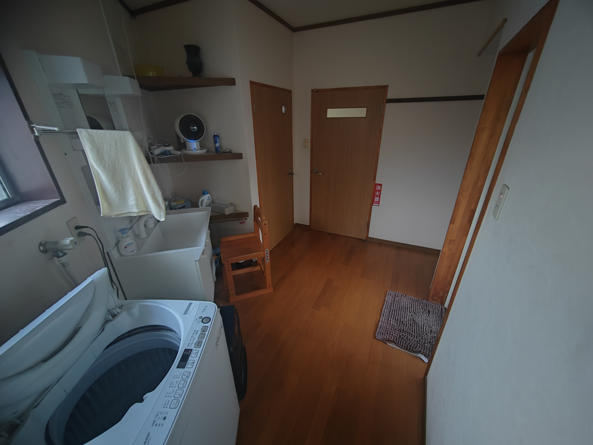

A japán kádak kicsit másak, mint amihez mi vagyunk szokva Európában. Tipikusan rövidebbek, úgyhogy inkább beülsz, mintsem feküdsz bennük. Cserébe viszont közel kétszer olyan mélyek, mint nálunk. Nekem az itteniben például beülve kényelmesen felért a vállamig a víz. Ja, és persze mint a vécék esetén, ez is masszívan fel van technológiával vértezve. Automatikus időzített bekészítés, hőfoktartás, újramelegítés, satöbbi. Nagyon extra. Ja, és érdekes mód itt az a szokás, hogy a kádba beülés előtt alaposan lefürdik az ember. Ebből adódóan a fürdővizet jellegzetesen újrahasználja a család minden tagja. De elsőnek beülni a legjobb, mert olyankor a saját testeden tesztelheted le Arkhimédész törvényét. Lényegében hagyod hogy túlcsorduljon a kádból a víz ahogy beülsz. Mivel a kád mellett van tipikusan a zuhanyzó, és jellegzetesen egybeöntött műanyaggal (vagy a panzió esetén vízhatlanított csempével) van az egész fürdőszoba fedve, ezzel szépen le is takarítod a padlót. Egy szó mint száz, veszett jól esett egy ilyenbe beülni egy hosszú nap után.

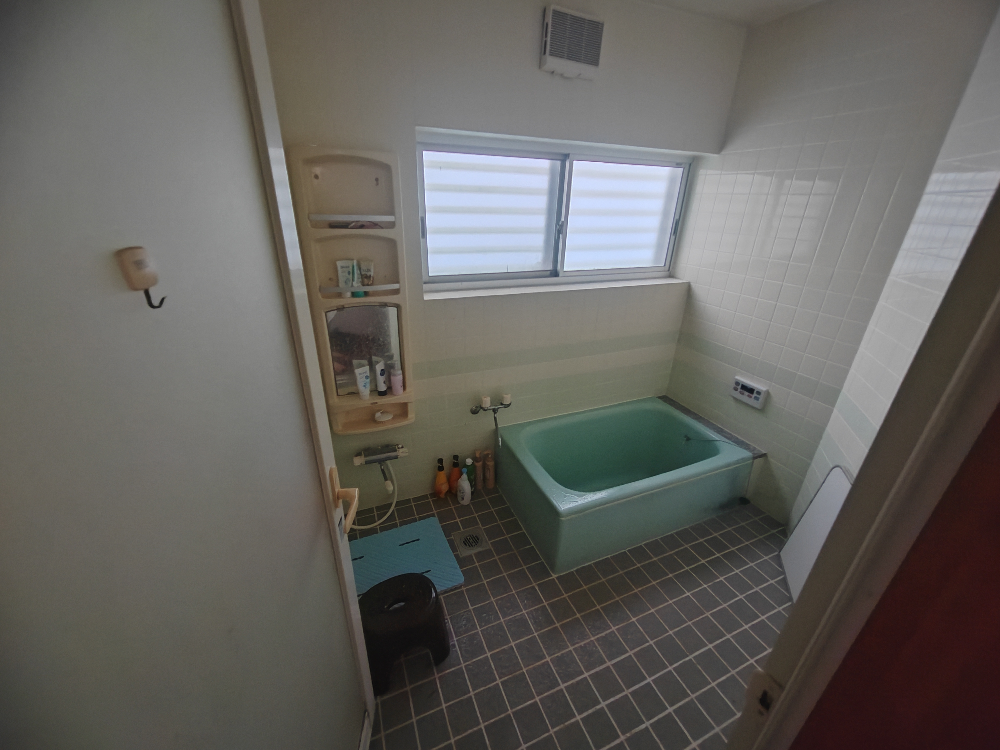 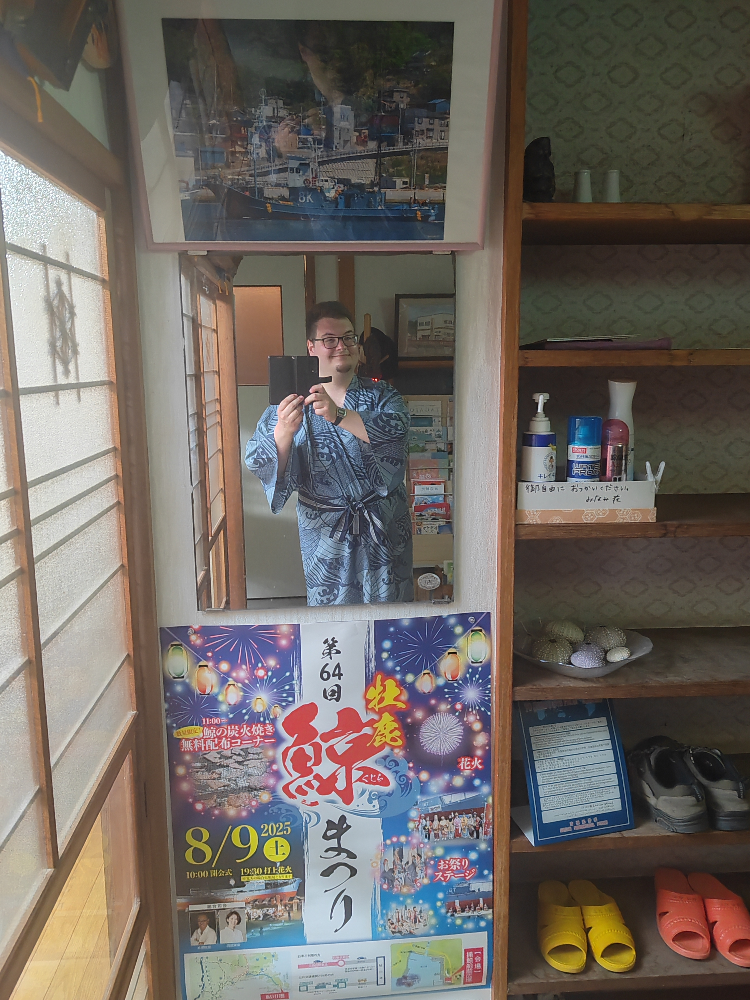

A szobám egy elég tipikus japános kuckó volt. Tolóajtók, tatamis padlózat, futon, komikusan alacsony asztal, plazmatévé, légkondi. Nagyon *földhözragadt* dizájn. Természetesen mezítláb vagy zokniban lehet csak bemenni a szobába. A cipőt eleve a bejáratnál leteszed, és az egész szállóban papucsban járkálsz. A tatamin állni azt kell mondjam, nagyon kellemes. Ezek szabványméretre készített gyékénybe vont forgáccsal vagy szalmával kitömött padlóelemek. Láttam már olyat hogy matracnak hívták magyarul, de ez nem igazán fedi a valóságot. Ha valamit, akkor a parkettát helyettesítik. Persze anyagából eredően érezhetően puhább, cserébe viszont sérülékenyebb. Nagy előnye, hogy segíti az adott szoba hőmérsékletét és páratartalmát stabilizálni, és még az illata is kellemes. Ha néztek képeket japán stílusú szobákról, nem nagyon fogtok nagyméretű bútorokat látni a tatamikon, mivel deformálná őket. Ha egy ilyenben az ember le akar ülni társasággal tévézni, beszélgetni, akármi, akkor kitesz pár lapos párnát közvetlen a tatamira, és kész is. Ha pedig iszogatnátok közben valami jó kis szakét, na azok az alacsony asztalok pont erre vannak kitalálva. A matrac megfelelője a futon. Vékonyabb jóval, mint egy nyugati matrac, viszont tatamira téve teljesen vállalható. Padlón azért eléggé merev magában. De persze nem feltétlen akarod otthagyni a szoba közepén egész nap, mégiscsak kell egy beágyazási rituálé. A futont szépen összehajtogatod, és bepattintod a tolóajtós szekrénybe. És így a szoba mintha teljesen üres lenne. Nagyon minimalista, nagyon praktikus, nagyon szeretem.

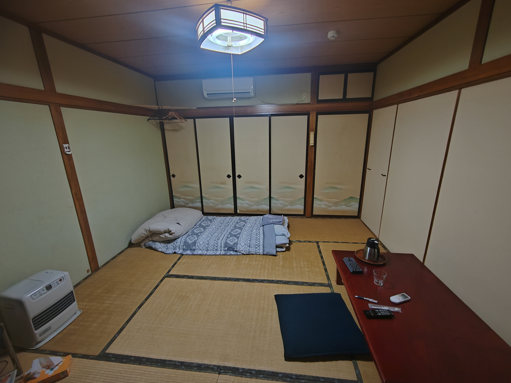 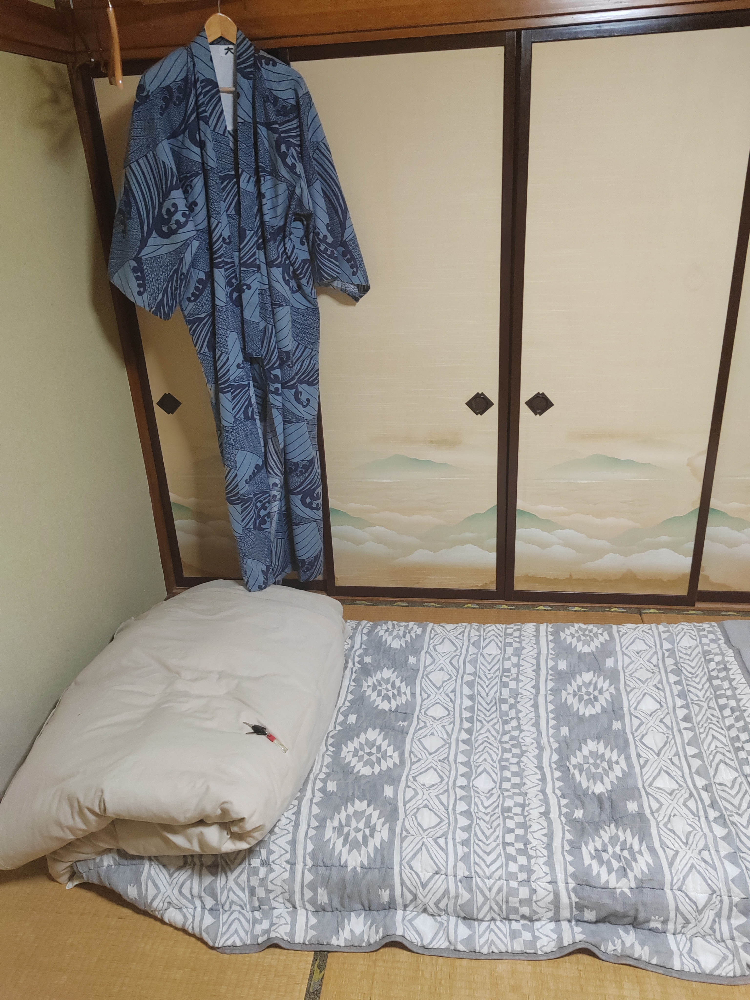

## Hazaút (mostmár tényleg)

Egy igazán fárasztó napot alaposan kipihenve felkeltem, még egyszer nagyon megköszöntem a szállást, és megindultam a busz felé. Ahogy a magyar vidéken a kakasokat hallanád hajnalban, úgy Ajukavában a sirályok adták a háttérzajt. Meglepő mód egy ugyanolyan pici, hátul felszállós, elképesztően ostobán elrendezett busz érkezett, mint amik itt a városban járnak. Arra számítottam, hogy azért valami strapabíróbb dögöt küldenének ki ide, de úgy néz ki nem találták indokoltnak. Szerencsére én voltam az első felszálló, így tudtam egy olyan helyet választani ahol nem kellett a térdeimet a bordáim közé begyömöszölni.

Sajnos végül különösebben szép látványban sem volt részem a hazaúton. Az Osika-félsziget, ahol Ajukava elhelyezkedik, nem véletlenül nem éppen turistaparadicsom. Elszegényedett, elöregedő halászfalvak voltak végig, a már-már megszokott 10 méteres védművekkel körülvéve. Ahogy haladt be a busz Isinomakiba, felvett 4-5 diákot. Könnyű felismerni őket az egyenruhának számító rövidujjú fehér ing és fekete hosszú nadrág párosításról. El nem tudom képzelni, milyen lehet tinédzsernek lenni ilyen helyen. Napi 3-4 busz irányonként, 3 óra út 10000 Forintot közelítő értékben egy irányba, és még azzal is csak Szendaiban vagy benn, ahonnan rendszeresen járnak le a helyi diákok Tokióba, mert túl unalmas. Lehet szidni Budapestet bőven. Én abból mondhatni sportot is űzök. De ilyenkor nagyon hálás vagyok, hogy ott nőttem fel, és nem valami ingertől teljesen megvont vidéken.

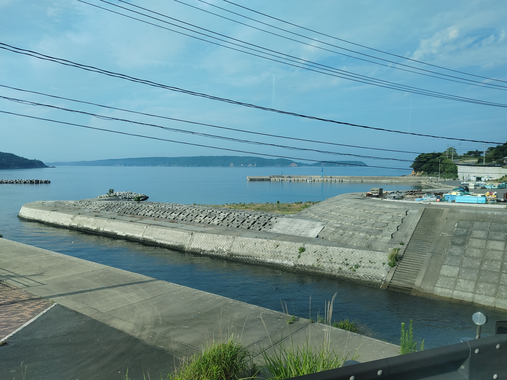 

Isinomakiban a régió összes diákja összegyűlt megindulva Szendai felé, természetesen azon a vonaton amivel én is terveztem menni. Amikor viszont megláttam hogy odáig fajult a dolog, hogy a peronőrök kezdték el betuszkolni az embereket a kocsiba, úgy döntöttem inkább megyek a következő, lassabb járattal. Haladtak sorba el a rizsföldek, engem pedig kezdett rendesen korogni a gyomrom, úgyhogy megérkezve Szendai vasútállomásra első dolgom volt egy kávézóba beugrani, és egy finom sonkás-tükörtojásos-krémsajtos szendvicset benyomni. És az Andris azt mondá: *Ez jó*. Majd, mintha mi se történt volna, megkezdődhetett egy szokásos hétfői nap.

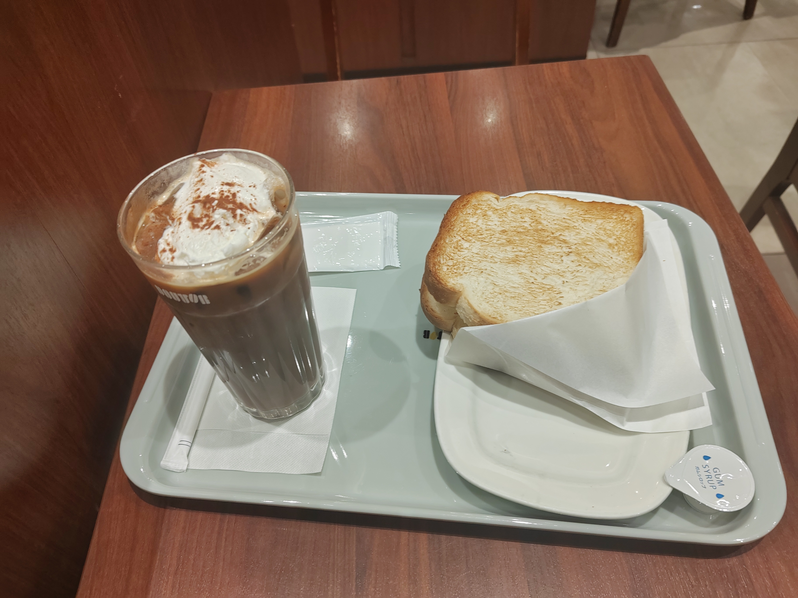