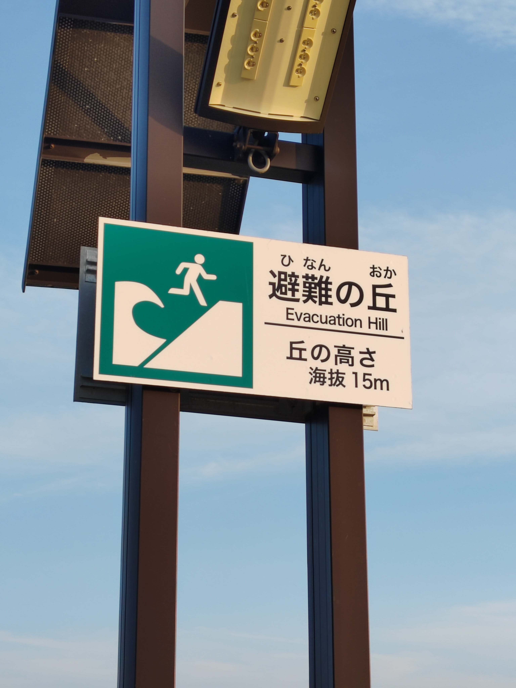

## Helyzetjelentés

Minden oké velem, nem kell aggódni! 😊 Teljesen nyugodt volt a nap, semmi katasztrófa, semmi pánik. Magát a földrengést egyáltalán nem is lehetett itt érezni. Egész konkrétan éppen egy szervezett túrán voltam dél-Mijagiban. Mentem szép helyekre, ismerkedtem, jöttem, láttam, győztem. Cserébe egész nap csipogott a városban mindenkinek a telefonja, hogy tipli a tengerparttól elfele de baromi gyorsan. Na, hát lévén hogy mi egész nap fenn voltunk a hegyekben, abszolút nem érintett a dolog. De amúgy is, a városrész ahol az Aoba kerületben lakom, 14 kilométerre van a parttól, és 70 méterrel a tengerszint felett. Így közvetlenül amúgysem hat rám bármiféle cunami. A közvetett hatásokról írok röviden lentebb.

## Aki esetleg lemaradt

[Ma Japán idő szerint délelőtt fél 10 felé történt egy bitangnagy földrengés a Kamcsatka-félszigeten](https://telex.hu/kulfold/2025/07/30/japan-cunami-foldrenges-oroszorszag). Egész konkrétan egy 8.8-as magnitúdójú rengés volt a Richter-skála szerint. Referenciaképp, ez világszinten a legnagyobb földrengés azóta a 9.1-es óta ami 2011-ben letarolta a Tóhoku-régiót. Szóval papíron ez egy jogosan aggasztó szituáció.

## A Richter-skála problémái és a Sindo-rendszer

Japánban nem a Richter-skála az elsődleges mércéje a rengéseknek. Amit a Richter-skála kategorizál, az egy rengésnek az összenergiája. Azt viszont nem veszi számba, hogy az az energia *hol* szabadult fel. Nem veszi figyelembe az epicentrum mélységét, a parttól való távolságot, így nem túl informatív arról, hogy az adott településen mire lehet számítani. Mindenhol ugyanaz az érték.

Éppen ezért itt az úgynevezett Sindo-skálát használják. Ez 7 szintet különböztet meg, és település-szinten kerül megállapításra. Azt adja meg, hogy te magad ahogy állsz az adott településen, mit fogsz tapasztalni. Jövőbeli referencia kedvéért kábé ilyesmit képzeljetek el:

- **1:** Műszerrel mérhető, amúgy nem feltűnő
- **2:** Beltéren feltűnhet, de abszolút ignorálható
- **3:** Feltűnő eléggé, hogy sétálva is érezheti az ember
- **4:** Ezt már nehéz ignorálni, mindenkit felébreszt, polcról leeshetnek a tárgyak
- **Gyenge 5:** Ami rögzítetlen az jó eséllyel leesik, itt kezd egy-egy ablak betörni, el kell kezdeni kapaszkodni
- **Erős 5:** Rögzítetlen nehéz tárgyak leesnek, itt kell elkezdeni bebújni biztonságba
- **Gyenge 6:** Nehéz állva maradni, kezdenek a falak beomlani, még egy ajtót kinyitni is kihívás
- **Erős 6:** Kúszni talán még tudsz, repülnek a bútorok, és jó eséllyel te magad is
- **7:** Itt van az, hogy minden gyakorlati szempontból csak egy tehetetlen, hatás alatt álló testté válsz. Ha van elég lélekjelenléted imádkozni, akkor annak nekieshetsz, de nem fogsz választ hallani a zuhanó törmelék, beomló falak, betörő ablakok és teher alatt magukat megadó talaj zajától

Na, most hogy jó alaposan megijesztettelek titeket, örömmel jelentem, hogy a mai esemény Szendaiban Sindo 1-es volt. Amióta itt vagyok, 2-esnél nagyobb nem is volt, és én még azt se éreztem.

## Cunamik

Nagyobb, tengeri epicentrumú földrengések okoznak szökőár-hullámokat, azaz cunamit. Ezek a megszokott maximum kb. 20 centiméteres magasságot jelentősen meghaladják. A mai rengés eredményeképp 5 méteres cunamik voltak Kamcsatkán, de Japánban a másfél métert nem haladta meg a mérések szerint. A Szendai-i kikötőben végül 90 centis hullám volt a csúcs. Ezekkel ugyan a védművek még kényelmesen elbánnak, de a rengeteg halászhajót és kompot erősen veszélyeztetné már egy ekkora dög is. És egészen addig amíg huzamosabb ideig le nem csillapodik a dolog, bármikor érkezhet egy váratlan óriáshullám. Így akár tetszik, akár nem, sok százezer embernek kell ilyenkor a part mellől evakuálnia.

  

## Vészjelzés esetén

Ma amikor a cunamijelzés érkezett, épp buszon voltam, és egyszerre mindenkinek a telefonja elkezdett csilingelni. Közösségen belül gyakorlatilag lehetetlen, hogy ne tűnjön fel. Magának az egyetemnek is van rendszere katasztrófák esetén, ami addíg zaklat az egyetemi email-címeden, amíg meg nem erősíted hogy épségben vagy. Ez ma nem lépett életve, mivel a mai cunamira órás nagyságrendű előrejelzést kaptunk a több ezer kilométeres epicentrumtól való távolság miatt. De amúgy csak intézményileg eléggé biztosítva vagyunk mi egyetemisták.

Magáról a rengésről legfeljebb néhány másodperccel előre kapsz értesítést. Nyilván minél közelebb vagy az epicentrumhoz, annál gyorsabban ér el hozzád. Ha eléred, fel kell kapnod a védősisakod (van a kollégiumban és a laborban is), és bebújnod biztonságos helyre, hogy esetleges tetőbeomlás ne nyomjon agyon. A cunamik minimálisan kegyelmesebbek. Minimum néhány percig eltart nekik, mire partot ütnek. Jellegzetesen az érintett partokon vannak kijelölt menekülőzónák, és azokat kell célba venni. Ilyenkor egy rossz döntés, legyen az helyben maradás, vagy megindulás a belföld felé alacsony fekvésű terepen, az ember életébe kerülhet. Mivel eleve a belföldön élek, engem a cunami nem aggaszt túlzottan. Viszont vannak egyéb másodlagos és harmadlagos hatások, amik kevéssé kapnak figyelmet, de épp olyan veszélyesek. Ilyenek a földcsuszamlások, a cunami okozta árvizek, és víz-, gáz- és villanyhálózatokat ért károk okozta kimaradások. Ezek szerencsére sokkal megjósolhatóbbak korábbi események és földmérési tanulmányok alapján, így a város veszélytérképének ismeretében kevésbé halálosak. Feltéve hogy nem pánikol az ember.

Az új lakás, amit augusztus végétől bérlek, szerencsére egy komplettan biztonságos övezetben van az előbbiektől amúgy is, és propángázos a vízfűtés. Ergo még ha a gáz- és villanyhálózat ki is esne a pixisből (*nem fog*), akkor is történelmileg a propánutánpótlás gyorsan visszaáll. Szóval nyugodtan fogok továbbra is aludni, és nektek is ezt javaslom.
