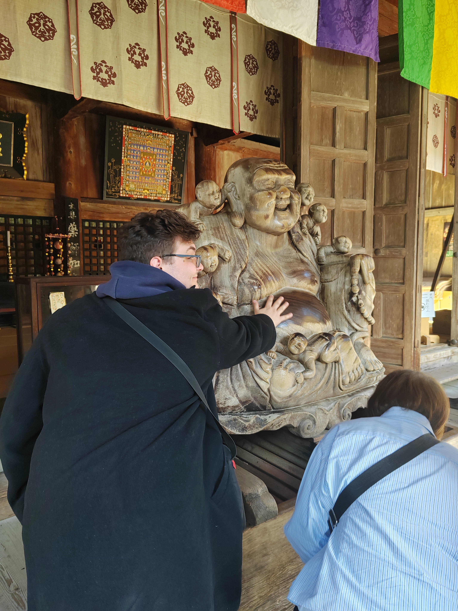
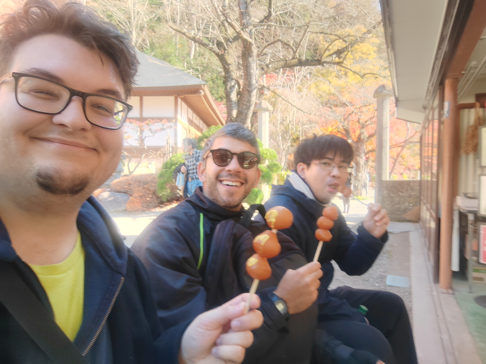
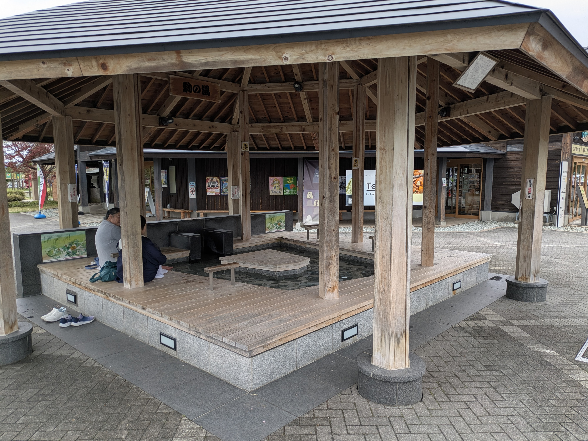
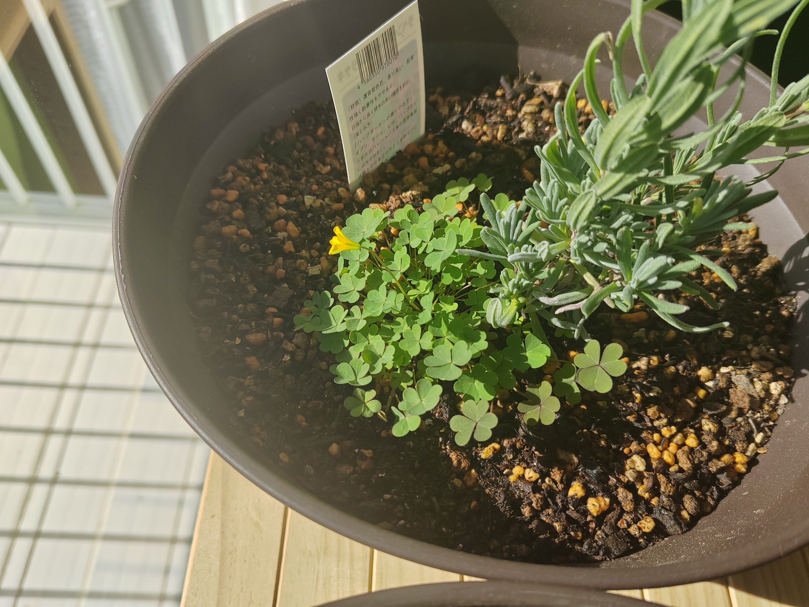

## Először is, hírek

Nincs sok, ezért nem írok nagyon. Továbbra is teljes munkaidőben tanulok a felvételi vizsgára. Igen. Több mint fél éve itt élek, és még mindig nem vagyok ténylegesen benn ezen a nyomorult egyetemen. Egyelőre sokkal inkább a lakás fejlesztésébe igyekszem a pénzt és energiát fektetni, nem szoktam túl messzi menni Szendaitól. Lesz majd időm és fog is kelleni bőven mászkálni, ha már ténylegesen kutatni kezdek.

Egy kivételt azért tettem két cimborámmal viszont nemrég, nem kis részben mivel egyikük volt kedves elfuvarozni minket a kiszemelt helyre. Autóval nagyjából másfél órás útnyira, a nyugat felé szomszédos Jamagata prefektúrában Jamaderát vettük célba.

<!-- markdownlint-disable MD033 -->
<iframe src="https://www.google.com/maps/embed?pb=!1m18!1m12!1m3!1d2576.1807479960216!2d140.43460990935145!3d38.313119289278795!2m3!1f0!2f0!3f0!3m2!1i1024!2i768!4f13.1!3m3!1m2!1s0x5f8bceef83764579%3A0x8e7b44c325b8afc0!2sRisshaku-ji%20Temple%20(Yamadera)!5e1!3m2!1sen!2shu!4v1764088927817!5m2!1sen!2shu" width="100%" height="450" style="border:0;" allowfullscreen="" loading="lazy" referrerpolicy="no-referrer-when-downgrade"></iframe>

## Jamamivan?

A _jama_ szócska azt jelenti, hogy hegy. Jamagata prefektúra (≈megye) a nyugati parttól a belföldi hegyekig húzódik. Említettem már, hogy a nekem otthont adó Mijagi nem épp egy túristacentrum, de Jamagata még annál is nagyságrendekkel kevésbé az. Van néhány elég random dolog, amiről híres a hely. Nagyon finom például az ottani cseresznye. Volt már szerencsém hozzá, amikor egyik titkárunk a laborban hozott ajándékba. Elvileg jó a Jamagatai marha is, de azt még nem tudtam megkóstolni, de a Szendai-inál egész biztos jobb. Esküszöm, még egy annyira középszerű húsra nem vagyok hajlandó elhinni hogy annyira büszke lehet valaki, mint itt a helyi éttermek. Fhuu, mi volt még...? Ja igen! Nagyon szeretik a _sógit_, ami lényegében a sakkjáték japán unokatestvére. Aki esetleg látta a _Hunter x Hunter_-t, ez az a játék amivel Komugi és Meruem 20 részen át verték el az időt Észak-Koreában. Aki meg nem látta, annak javaslom e hiba mihamarabbi rektifikálását.

Nara-szan, aki elfuvarozott minket, elmagyarázta a szabályokat. Megvannak a sakk alapötletei: Két játékos tükrözött alapfelállású térféllel, változatos mozdulatokra képes bábukkal, amikkel sarokba kell szorítani a királyt. De természetesen japán mivoltán fel van tekerve 11-re az állatság. Sokkal hatékonyabban mozognak előre a bábuk mint hátra, mert a harcos útja nem hagy teret a gyávaságnak, vagy mi. De a leglenyűgözőbb dolog a komplett lealázásra való kapacitása ennek a játéknak. Leütöttél egy ellenséges bábut? Gratula, bevetheted a saját oldaladon. Nyitva hagyott egy rést az ellenfeled a csatatéren? A bástyád ugyan csak kettőt tud lépni, de ha épp pozícióban van, akkor elő tudod léptetni sárkánykirállyá. __Sárkány. Királlyá.__ Igen, ezt a játékot ha akarnák, se tudnák letagadni a japánok.

## Jamadera

Na, akkor a _jama_ mostmár tudjuk, micsoda. A második fele a hely nevének a _tera_, azaz szentély szó tőhangváltott alakja. Ez egy 3-400 méter magasra vivő rövid túraút, megrakodva buddhista és sintó szobrokkal, sírokkal, emlékhelyekkel, és a tetején egy gyönyörű kilátást nyújtó szentélycsoportosulással. Volt szerencsénk egy kifejezetten kellemes, 17 fokos novemberi napot elkapni, úgyhogy az őszi színeket volt lehetőségünk napsütéses időben megcsodálni. Innen hagyom, hogy a képek beszéljenek magukért.

 

 

 

Miután kibámészkodtuk magunkat, megindultunk vissza a kocsihoz. Igencsak megéheztünk, úgyhogy be is iktattunk egy kajolást. De a lefelé félúton egy tisztáson volt néhány stand harapnivalókkal, és az egyikükből szivárgó illatnak nem tudtunk ellenállni. Egy _tama-konnjaku_ nevű csoda volt ez. Maga a konnjaku egy speckó fajta krumpliból készült, amolyan szolid de ruganyos, ízetlen étel. A textúrája kábé félúton van a zselatin és a 100 forintos gumilabda között. Sokféleképp használják, ennél a standnál például golyókba formálva nyársra tűzve főzték át egy szójaszószos mártásban, és hajszálvékonyan megkenték japán mustárral. Utóbbival itt találkoztam először, és hát az igen durva élmény volt. Úgy mint az, még semmi nem vágott fül-orr-gégén, brutális egy cucc.

 

## Szobatésztítás Tendóban

A tényleges ebédet a közeli Tendó városban egy Icsian nevű helyen ejtettük meg. Nem, a város nevének nincs köze a Nintendo-hoz. _Arról majd később._ Ez a hely híres a _szobáról_, ami egy relatíve vékonyra nyújtott, hajdinalisztből készült tészta. Legalább is elviekben, mert igazából maga a _szoba_ kifejezés eredetileg úgy amblokk a tésztát jelentette, de manapság a hajdinatésztára hivatkoznak vele, kivéve néhány olyan kaját, mint például az _aburaszoba_, aminek a nevében benne maradt, de amúgy sima búzaliszt-tésztából van... Komplikált a dolog, na. Élő, evolváló dolog ez a nyelv. De a lényeg, hogy mi most tényleg egy nagyon hagyományos hajdinás helyre mentünk.

Ez, amit konkrétan itt ettünk egy _itaszoba_, vagyis deszka-szoba volt. Egy két emeletes deszkadobozban kaptuk meg, egész dicsőséges adag. Kaptunk mellé _tempurában_ kirántott zöldségeket, csirkemellet, garnélát, ami csak jó. Lehetett mindezt mártogatni vagy a húslevesbe, vagy a mellékelt _cuju_ nevű szószba. Ez a cuju egy eléggé intenzív umami ízvilágú hal alapleves-szójaszószos-szakés lötyi, és én még kevertem bele egy kis vaszabit is. Megkaptuk ezen felül még a tészta főzőlevét. Ezzel fel lehet a cujut hígítani, úgy pedig már finoman fel lehet hörpinteni. Kacifántos egy kaja, mi?

## Kis nap végi wellness

Végül pedig, a több órás gyaloglás jutalmául elugrottunk egy közeli lábfürdőbe. Ezek, mint kiderült, hévíztelepülések közelében mindenfelé előfordulnak, és teljesen ingyen be lehet ülni. Hagyományosan a zarándokoknak voltak kialakítva, hogy a hegyi utakon a hosszadalmas fapapucsban mászkálás során meg tudjanak kicsit pihenni. Szóval egészen apropó volt ezzel zárnunk a túrát.

 

A hazaúton beugrottunk egy kertészeti központba, amit az odaúton kiszemeltem. Kis mellékprojektként épp gyűjtöm a kedvenc fűszernövényeimet, és itt volt mákom egy nagyon szép zsályapalántát bezsebelni. Meg hát, ha már épp autóval voltunk, nem tudtam ellenállni a kísértésnek, és bedobtam... Hát, izé... Négy dísznövényt. Egyelőre még tanulgatom az igényeiket, de egyelőre úgy tűnik, nem érzik itt rosszul magukat... 😊

 