<!-- markdownlint-disable MD026 -->
## Upsz, lement több, mint fél év...

Na igen, kicsit megint felgyülemlett a por ezen a csodablogon. Viszont már amúgy is nagyon ideje volt egy ~~tavaszi~~ nyári nagytakarításnak, úgyhogy kezdhetem akár itt is. Gondolom mindenki tűkön ülve várta, hogy miféle kalandokon voltam, hány hegyet másztam meg, hány sárkányt gyilkoltam le. Hát, előbbire azt kell mondjam, egyelőre nem sikerült túl messzi mennem. Utazgattunk ugyan barátokkal közeli helyeken, dombokon, hegyeken, de azokról majd a következő bejegyzésekben számolok be, úgy a Betelgeuse csillag kialvásának ideje felé. Utóbbira a válasz viszont az, hogy **egyet**. De az egy igen gigászi bestia volt. *Kezdem is akkor vele.*

## Felvicus brutalis

E bestia nevének hallatán minden első éves külföldi egyetetmi hallgatónak libabőr fut végig a hátán. Jöttének rémhírét minden márciusban hallani az Aoba-hegyi kampuszon. Asszonyok ifjoncaikat szekrényekbe zárják. A sorozott férfiúk a kardnál ékesebb ceruzát fenve két idegösszeroppanás között várják az elkerülhetetlent. Ez a Tóhoku Egyetem mechanikai mérnöki felvételi vizsgája.

Őszintén, nem is volt olyan vészes egyébként. Legalábbis önmagában. Tény, veszett sok a tananyag. És mint mérnökinformatikus, bő felét életemben nem is tanultam. De ez még áthidalható probléma. Ami igazán aláásott, az a stressz volt. Egyfelől, ez a vizsga úgy van bekalibrálva, hogy esélyed ne legyen az egészet végigcsinálni az adott idő alatt. Nem nagyon tudom jellemezni, hogy miért anélkül, hogy túlzottan belemennék a meglehetősen kocka részletekbe.

<!-- markdownlint-disable MD033 -->

<b>Kattints ide a meglehetősen kocka részletekért</b>

Na, az én esetemben 3 tárgyból kellett vizsgázni, amik emelkedő nehézségi sorrendben Mechanikai rendszerek dinamikája, Irányítástechnika, Matek A (kb. diszkrét matematika, lineáris algebra) és Matek B (kb. analízis). Sorban akkor végig is megyek rajtuk.

<!-- markdownlint-disable MD001 -->
### Mechanikai dinamika

Kb. olyasmi feladatok vannak itt, hogy kapsz egy lerajzolt mechanikai rendszert fix falakkal, vonal mentén mozgó elemekkel, súlyokkal, rugókkal, csillapítókkal, ingákkal, ezeknek a torziós (tengely körül forgó) megfelelőivel, és ezeknek a mindenféle keverékével. Első ránézésre elég parának tűnt, főleg, hogy az általános iskolától kezdve mért fizikatudásomat egy szigorúan monoton exponenciálisan csökkenő időfüggvény írja le (avagy ahogy ezt megtanultam, kizárólag negatív valós sajátértékű rendszer). A nehézség igazából az, hogy hogyan állítod fel a kép alapján a matematikai egyenleteket. Amint az megvan, onnantól már relatív egyszerű levezetni minden mást. De nagyon könnyű hibázni egy-egy rossz irányba vett vektorral, mert ugye a képpel ellentétben a valóságban minden mozog, és fejben szinkronban kell tartani, mi épp merre indul, és az alapján felállítani az egyenleteket. Emiatt aztán az elején háromszor ugyanazt a feladatot megoldva három különböző eredményt kaptam. Viszont miután megnéztem elég Youtube videót a témában, volt szerencsém felfedezni a trükkjét a dolognak. Ez pedig az, hogy nemes egyszerűséggel el kell engedni a középsuliban tanult newtoni megközelítést. Ezutóbbi alapján lényegében mindent irányított erőkre kell visszavezetni. *F=ma*, és társai. Itt ugye mivel minden erő vektor, ezért egy rossz előjel komplettan el tudja az egész számítást barmolni. És amikor a rendszernek három mozgási egyenlete is van, hát akkor nagyon könnyű véletlen egynek becsúsznia. És utána azt kibogarászni abszolút nincs ideje az embernek.

Szerencsére van egy másik megközelítés, ami a rendszerben lévő energiából következteti a mozgási egyenleteket. Ez a lagrange-i mechanika, és nekem egészen konkrétan életmentő volt. A nagy trükk benne az, hogy minden elmozdulás, sebesség és gyorsulás négyzetre van emelve, ami kiiktatja az előjeleket. Ergo csak össze kell adogatni az egyes elemek saját energiakomponenseit, és onnantól egyértelmű a hátralévő folyamat. Az már más kérdés, hogy a hátralévő folyamat az valójában egy rakat parciális differenciálegyenletet takar, de legalább gondolkodás nélkül bedarálható, anélkül, hogy látatlanban egy rendszer mozgását fejben le kelljen követnem. Szóval minden nap minden órájában, Viva Lagrange!

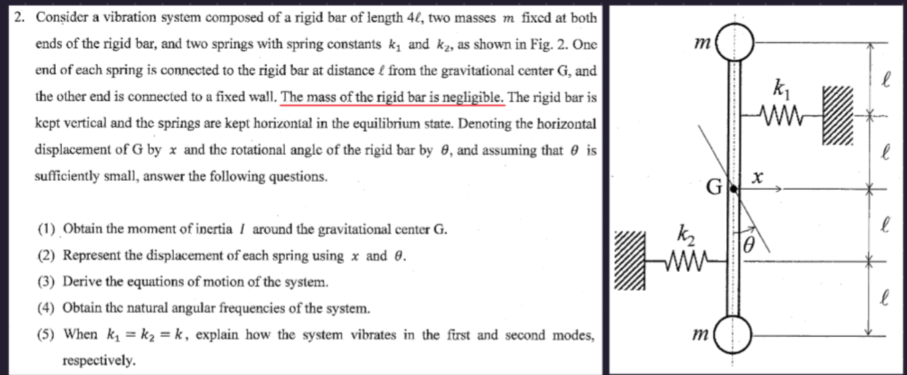 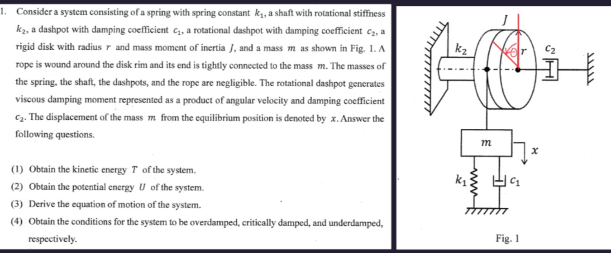

### Irányítástechnika

Ezt a tárgyat már kicsit macerásabb elmagyarázni. Lényegében mindenféle rendszer szabályozásának a módszertana, legyen az egy termosztát, tempomat, presszógép, vagy akár egy bevett gyógyszer felszívódása. A lényeg alapjáraton, hogy van egy "gépünk" ami tud egy értéket szabályozni (szoba hőfoka, autó sebessége, tömörített kávén áz víz nyomása, vérinzulin), tudjuk az aktuális értéket mérni, és van egy célértékünk. Amiről ez a tárgy beszél az az, hogy hogyan érjük el ezt a célértéket valósat minél inkább megközelítő körülmények között.

Ezzel szerencsére már volt valamennyi tapasztalatom, de jobbára csak számítógéppel számoltattam eddig ki a dolgokat, kézzel nem. Így kellett nem kicsit szenvednem megtanulni gráfokat rajzolni és értelmezni, Plusz van nem véletlen bízza ezeket a dolgokat az ember számítógépre, cefet számításigényes tud egy-egy feladat lenni. Ez főleg akkor jönn be a képbe, amikor egy összetettebb rendszerről van szó. Például, egy modern tempomat két értéket befolyásolva szabályozza az aut sebességét: a fojtószelep állásával és a fékhidraulikus nyomás változtatásával. Ezen felül vannak egyéb zavaró bemenetek amikre nincs befolyása a tempomatnak, de figyelembe kell vennie. Ilyenek példáut az út meredeksége, a légellenállás mértéke, a tapadás, satöbbi. Na, ilyen sok, időben változó, egymást befolyásoló függőségekből álló rendszereket mátrixokkal modellezünk. A mátrixokról meg annyit kell tudni, hogy a műveletek velük nagyságrendekkel válnak komplikáltabbá, ahogy nőnek. Egész konkrétan a számítógépek videokártyái épp az ilyenekkel való műveletekre vannak kitalálva. Szóval még ha nem is komplikált egy konkrét feladat, előfordulhat hogy kegyetlen sok időt felemészt itt.

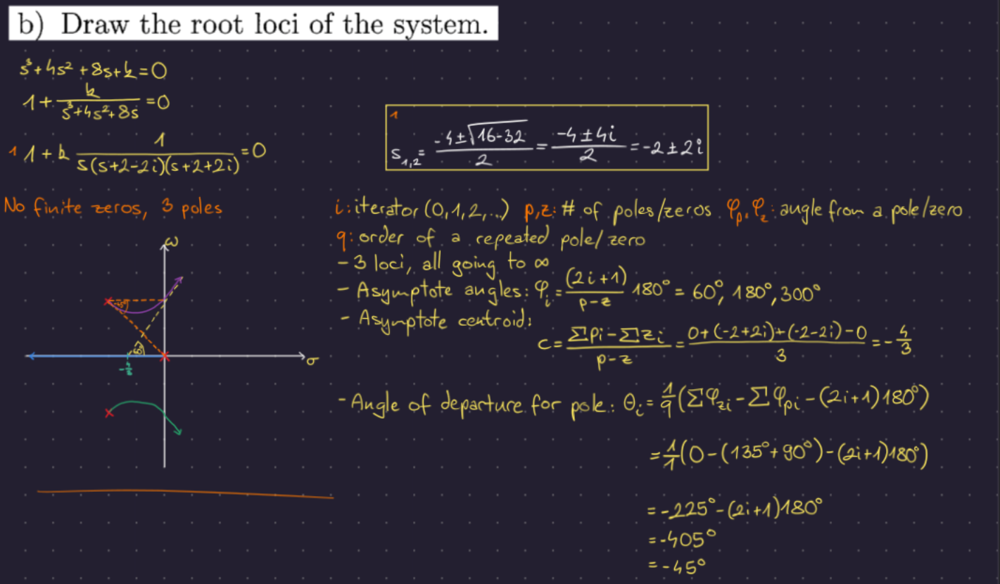 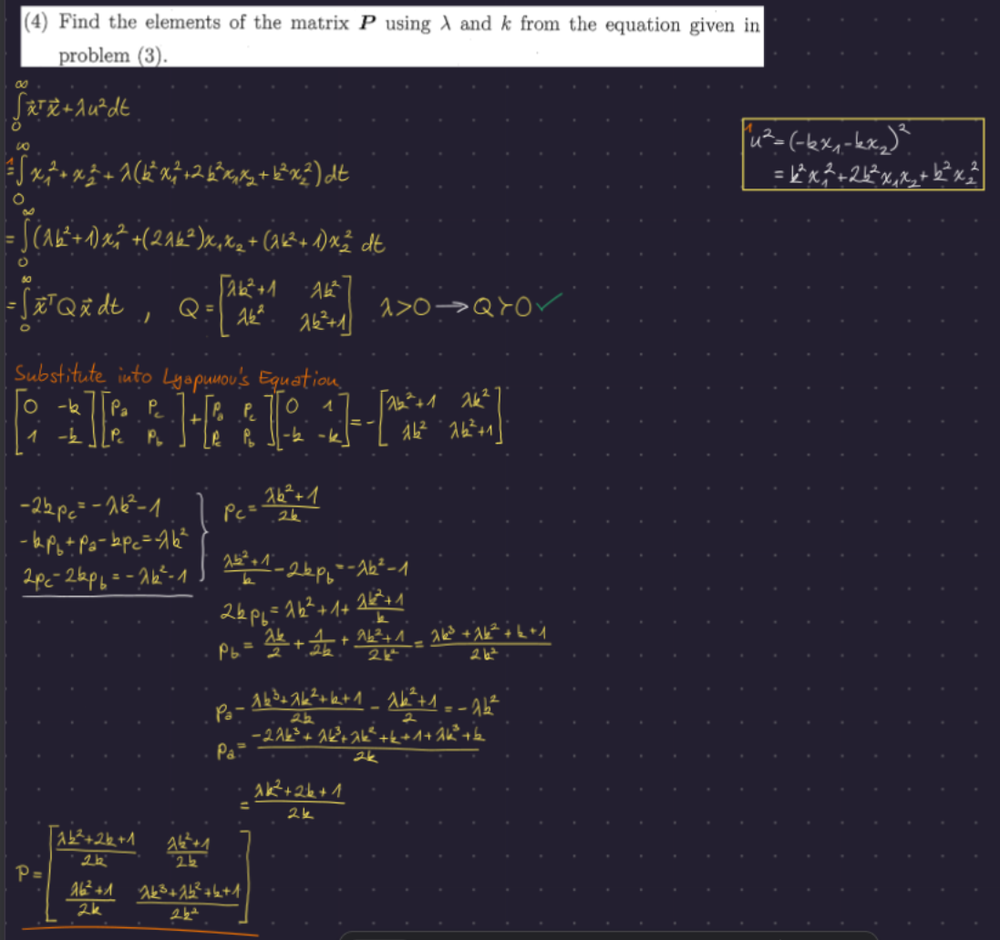

### Matek A

Ez három részből áll. Első feladat jellemzően valamiféle elemi műveleti részfeladatokból áll. Egy-egy függvény leintegrálása, limesz, szélsőértékek, végtelen sorok összegei, Taylor-polinóm generálás... Ezeket nehéz magyaráznom, igazából csak olyan alapvető dolgok, amik mindenféle gyakorlati alkalmazhatóságú dolog alapjaként szolgálnak. Nagyon változó az időigény itt. Utána van egy kis lineáris algebra. Ez kivétel nélkül mátrixműveletek sora, mint amik Irányítástechnikán előjönnek. Ez brutál időigényes tud lenni az előbb említett okokból, és ha valahol elírsz valamit, akkor nagyon pórul tudsz járni vele. Cserébe viszont relatíve maguk a folyamatok kevésbé igényelnek aktív gondolkodást. Végül pedig van egy vektoranalízis feladat. Na, ez a krémek krémje. Életemben nem tanultam ez előtt, és kifejezetten nem triviális. Az egésznek az alapja a vektormező, ami egy olyan függvény ami az értelmezési tartomány pontjaihoz vektorokat rendel. Azaz magyarul, olyasmi, mint időjárásjelentéseken a széltérkép: a térkép minden pontján láthatjuk, hogy milyen irányba és milyen erővel fúj a szél. Bumm, vektormező. Csak akkor ugyanezt 3D-ben. Így modellezünk például drónok irányítórendszerei a szelet (nekik fontos a fel-le irányú erő is), mágneses tereket, folyadékáramokat, satöbbi. Nagyon érdekes technika, de nulláról csak Youtube-videók alapján tanulva izzasztó.

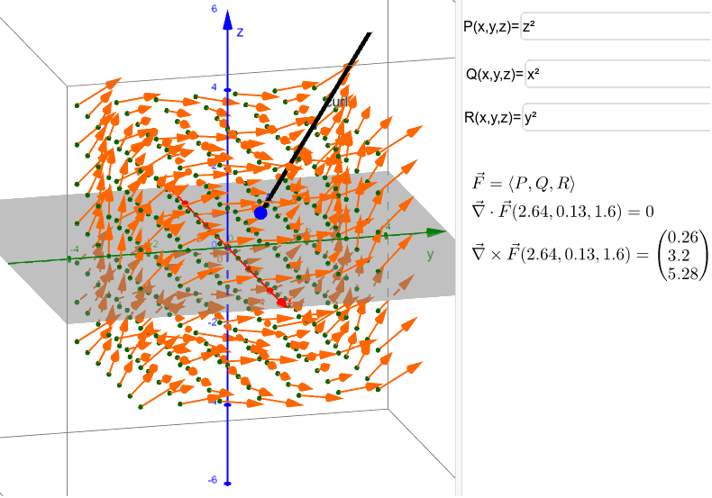

### Matek B

Na, ez a végső ellenség. Ide kerülnek be a legszárazabb tananyagrészek a mérnöki matematikán belül. Ordináris differenciálegyenletek jellemzően az első feladat. Ezek esetén lényegében az egyetlen amit tenni tudsz, hogy ránézel, és vagy tudod élből, hogy kell megoldani ezt a fajtát, vagy ugrasz a következőre. Kifejezetten kegyetlen dög, és nagyon sok az eltérő megoldási megközelítés rájuk, amibe bele tud az ember futni, de az összefogó kapocs az, hogy ránézel az egyenletre, és tudod milyen alakja van a megoldásnak, onnantól pedig csak a konkrét számokat kell feltörnöd. A végére összeállítottam egy folyamatábrát, és ezen zongoráztam magamat végig fejben minden ilyen feladatnál:

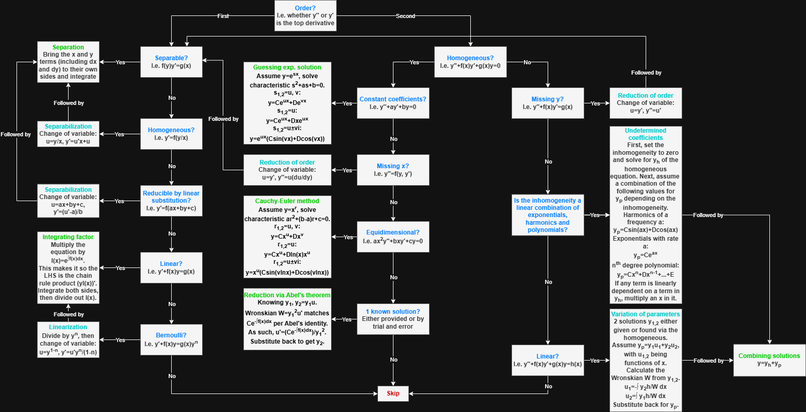

Van utána egy kis parciális differenciálegyenletezés. Olyasmi mint az ordináris, csak többváltozós függvényekre, szóval kábé mint amit az irányítástechnika szekcióban említettem. Na hát annak annyi az "előnye", hogy baromi limitált, hogy eleve milyen típusúaknak ismert a szimbolikus megoldási módja. Ergo effektíve csak 2-3 technikát kellett tudni ismerni, mert azokat reális hogy le tudja az adott időben valaki vezetni. Ergo ismét csak, ránézel a feladatra és vagy tudod a megoldás menetét azonnal, vagy ugrod.

És végül de nem utolsó sorban, bizonyítások amik még itt jöhetnek. Na ezeknél is (gondolom már kezditek észrevenni az itt kirajzolódó mintát) vagy már láttad az adott tételt és le tudod vezetni, vagy hagyod a fenébe. Itt mindig valamiféle elborult matematikai trükközés, Fourier/Laplace transzformációk tulajdonságai, és kifejezetten perverz függvények szoktak megjelenni. Magyarul egy bitangnagy idősüllyesztő ez is.

**És akkor van egy-egy órád per tárgy.** Számológép nuku. Hajrá. Kocka részletekre zárójel bezár.

Másfelől pedig, ha másodjára is megbuktam volna a felvételin, akkor nem tudtam volna ebbe a laborba belépni. Lévén hogy eleve csak ezt a labort pályáztam meg a kijövetelem előtt, és hogy abszolúte ebben a témában akartam a kezdetektől fogva dolgozni, ez még a legjobb esetben se lett volna ideális. De van még tovább. Merthogy az, hogy ebbe a laborba nem tudtam volna becsatlakozni, az egy dolog, de vannak más laborok az egyetemen, és vannak más egyetemek is. De ahhoz hogy válts, kell a laborigazgató aláírása. Viszont épp igazgatóváltás volt amikor csináltam a felvételit. Az előző igazgatóról tudni lehetett, hogy ha nem jön össze a felvételi, akkor nem enged váltani. Haza lesz az ember küldve, és ennyi volt. Az új igazgató ennél jelentősen méltányosabbnak tűnik az eddigi tapasztalataim alapján, de voltak beszélgetéseink amik adtak rá indokot, hogy azt feltételezzem, hogy rám is ez a sors várna.

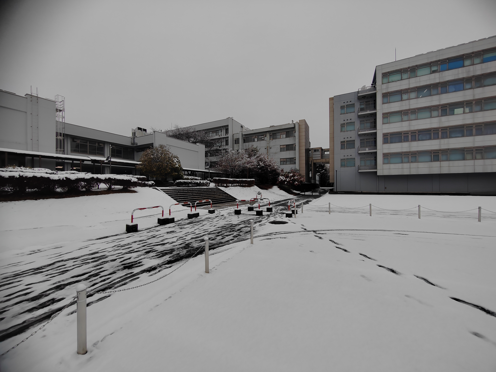

Ez alapján talán érthető, miért voltam úgy rástresszelve a dologra. Nyilván az így kialakult alváshiány se sokat segített a dolgon. Pro tipp az egészségmegőrzéshez a jövőre nézve mindnyájótoknak: *Ne tegyétek a bevándorlási státuszotokat attól függővé, hogy képesek vagytok-e Laplace-párokat megjegyezni.*

## Egyetem 2: Leszámolás

Engem lepett meg a legjobban, de csodával határos módon átmentem. A százalékokat ne kérdezzétek, nem volt bátorságom megérdeklődni nekem se. Ami számít az az, hogy el tudtam engedni a napi 8 óra matektanulást. Ergo idén áprilistól már rendes diákként vagyok benn az egyetemen. Kaptam rendes, nem "laminált papír" diákigazolványt is, meg minden 😁 Ennek a cikknek a borítóképén is engem láthattok a felvételi ceremónián.

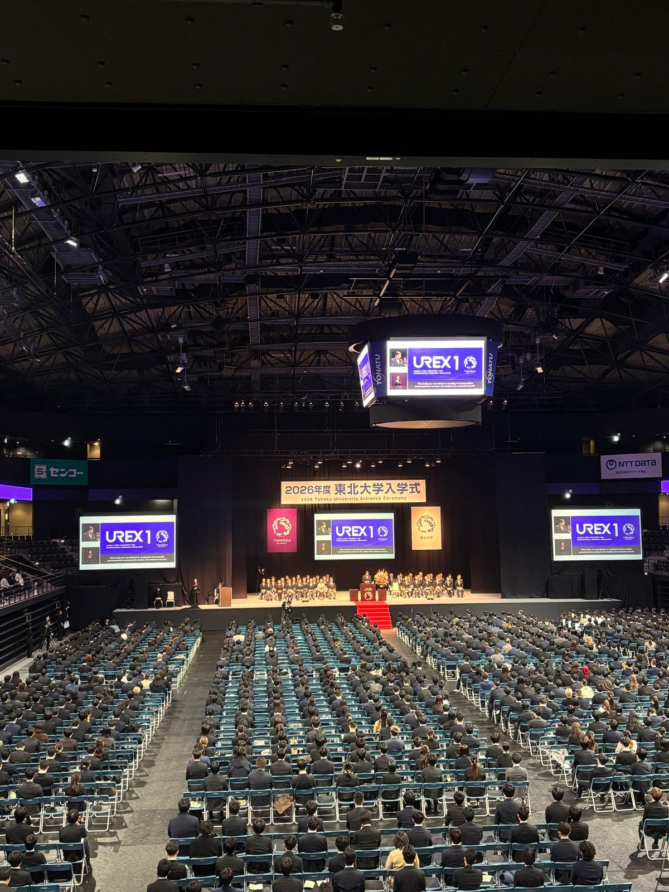 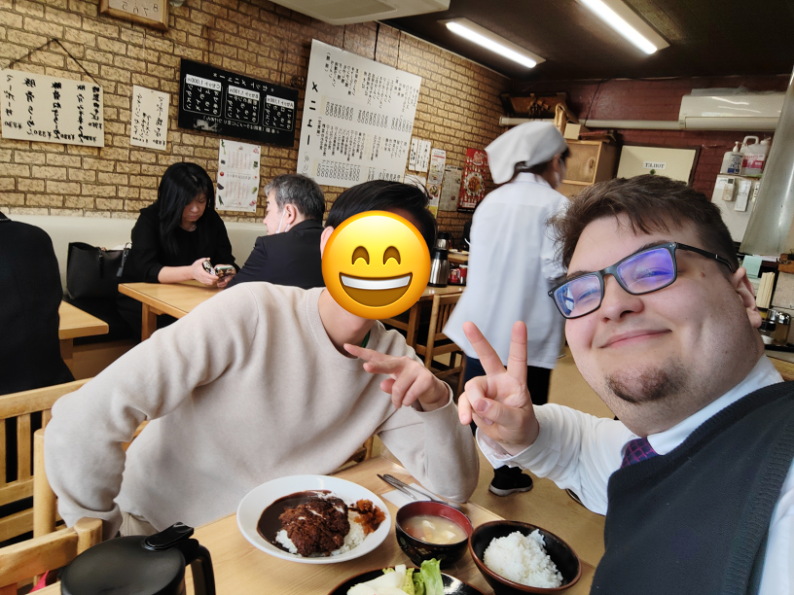

Ergo most lettek megint óráim, meg beadandók, ilyesmi. Érdekes mód arra számítana az ember, hogy ugyebár a nagy, tiszta, iszonyat szabálykövető Japánban ezek az órák biztos brutál nehezek lesznek, és napi 16 órában kell majd tanulni hogy kettessel átmenjen rajtuk az ember, mint azokban a rémhírekben amik terjednek a nyugati médiában Kínáról meg Koreáról. Meglepő módon viszont ez itt mesterképzésen abszolút nincs így. Potom 7 darab kurzust kell teljesítenünk a mesterdiplomához, ennek a fele meg humán tárgyak. Ebből ötöt fel is vettem az első félévemben a négyből. A maradék kreditet pedig a laborban történő képzés és a kutatási eredmények adják. Egy szó mint száz, az órák konkrétan mindennél inkább kifogásnak érződnek, mint bármi. Teljesen arra van itt mindenki ráállva, hogy csináld amit jöttél csinálni.

## Amit jöttem csinálni

Sikerült is kiválasztani a kutatási projektemet. Mint említettem korábban, katasztrófavédelmi robotika az általános téma. Azon belül amit csinálok, az egy részterület részterületének részproblémájának alproblémája. Iszonyat specifikus, és elég nehéz is lenne elmagyarázni részletesen. Ráadásul mivel publikusan amúgy se szabad beszélnem róla amíg nincs szabadalmaztatva, ezért meg se fogom próbálni. De annyit elmondok, hogy baromi izgi és nagyon sok érdeklődés van iránta több nagy pénzforgalmú iparágban, ha majd doktori után úgy döntök, hogy átmennék a versenyszférába.

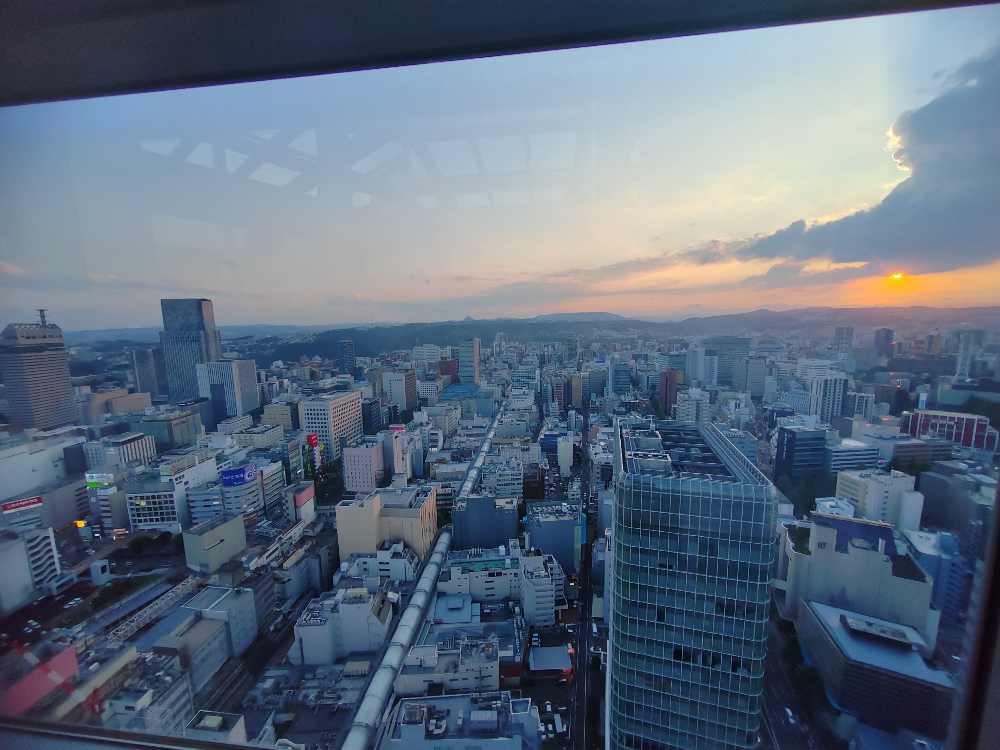

## Levelek

Ha már így bármiféle fanfár nélkül le is pörgött az első évfordulóm idekinn, gondoltam megérett az ideje kis önreflexiónak. Hol is jobb kezdeni, mint egy korábbi bejegyzésben egy elvarratlan szálnak véget vetni. A tavaly júliusi Tasirodzsimai bejegyzésemben említettem, hogy voltak amolyan kihívásaim amiket az unokatesóimtól kaptam. Pár példa:

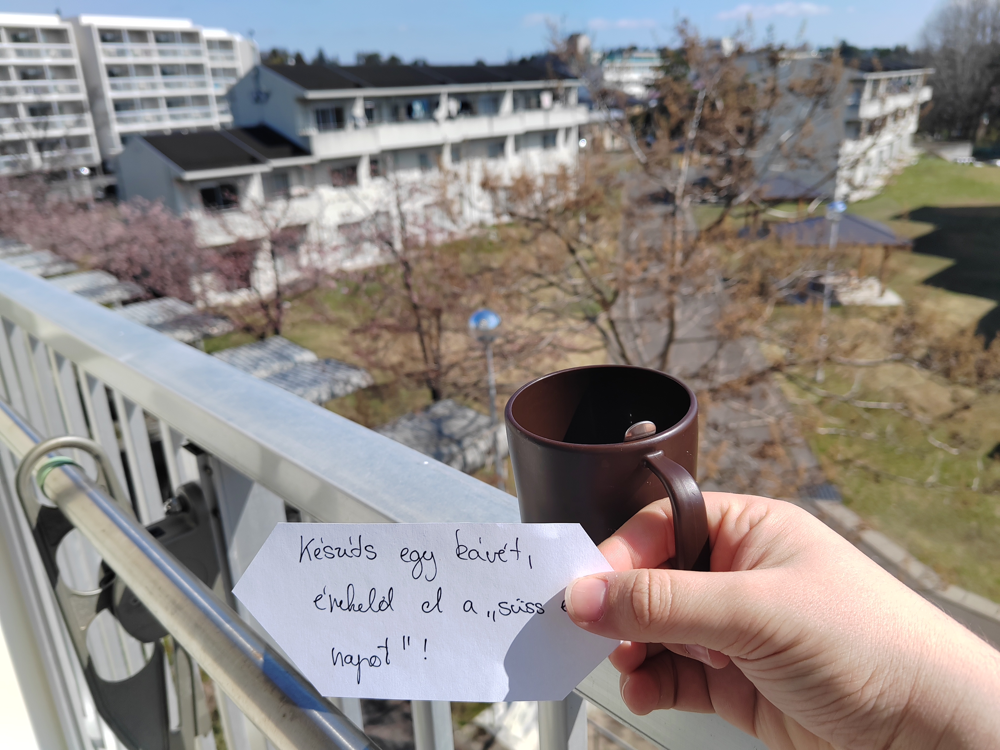 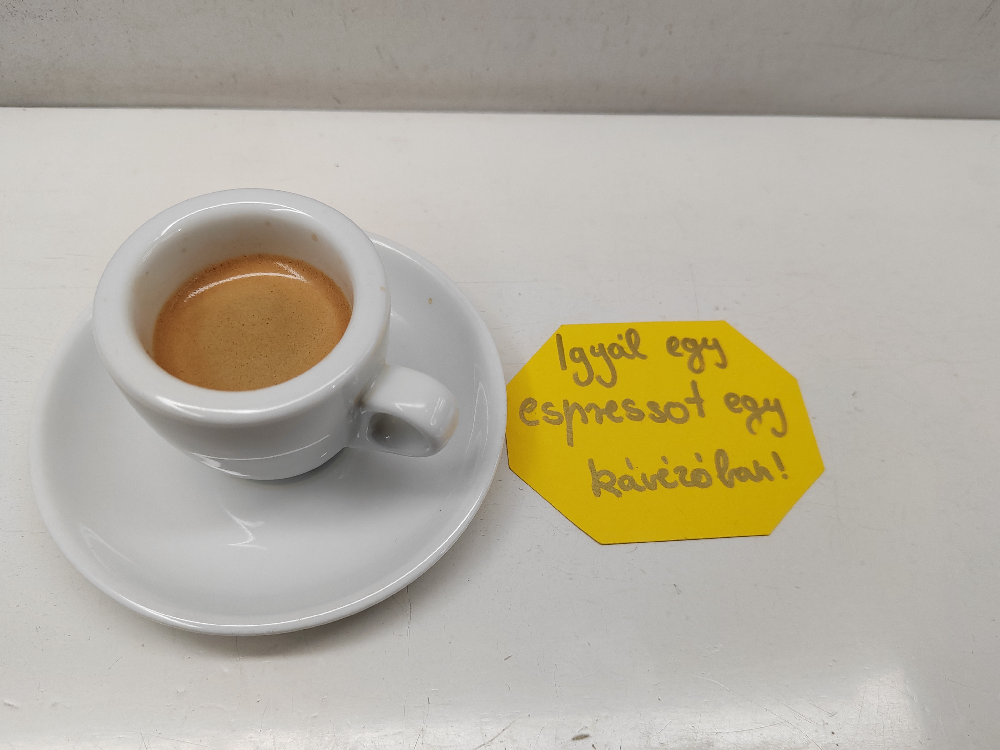

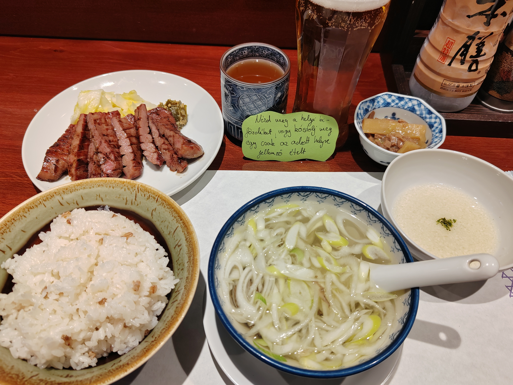

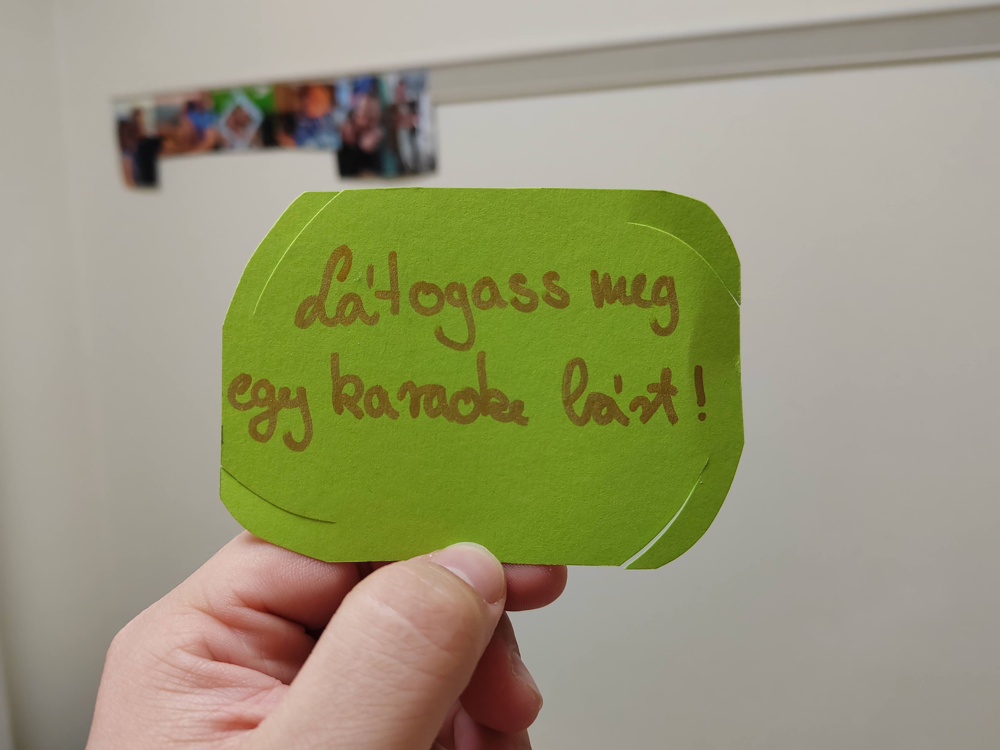


Ezekről annyit érdemes tudni, hogy még mielőtt kiutaztam, kaptam egy csomag levelet, jelölve, hogy milyen esetben kell kinyitnom őket. Nem mellesleg nagyon szépen ki is voltak dekorálva, mint lentebb láthatjátok! Ezekben a levelekben volt mindig az adott alkalomhoz alkalmazkodó kihívás, amelyeket igyekeztem legjobb készségem szerint teljesíteni.

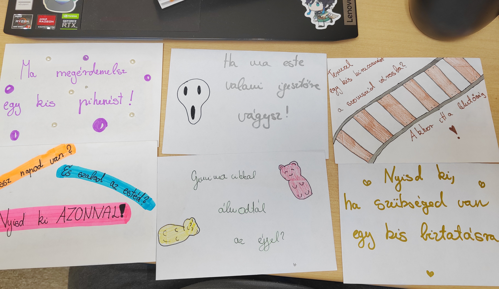

Emellett voltak még bennük közös fényképek, amik erősen tartották bennem a lelket, főleg az ittlétem elején. Nem egyszer jöttem haza eleinte úgy, hogy senkihez egy érdemre való szót nem szóltam, és olyankor az egy konzisztens kapaszkodóm ezek a falra kitűzött képek voltak. Az albérletem falára is kirögzítettem őket a költözés után, és azóta is minden este szembe találom magamat velük. Szerencsére viszont már nem rajzszöggel vannak felfüggesztve. Loptam egy jelentősen esztétikusabb ötletet unokanővéremék esküvőjéről tavaly Szeptemberben.

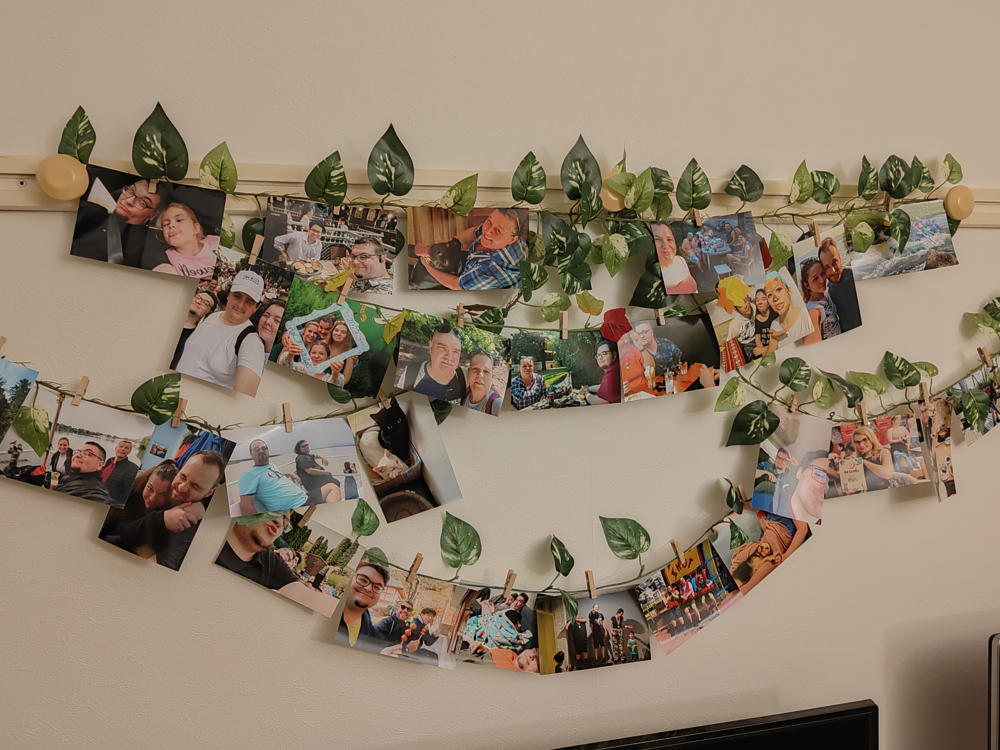

## Társaságok

Nagyon más mostmár az ittlét. Van egykét kifejezetten stabil baráti köröm, akikkel rendszeresen eljárunk éttermezni, karaokézni, fürdőzni, kirándulni, időnkét nálam filmezni... Laborban is egyre inkább azt érzem, be vagyok vonva a programokba. Péntek esténként egész rendszeresen szoktunk dobni egy kajálós-filmezős, időnként társasozós banzájt. Van amikor rendelünk csirkét, van hogy főzünk rizst, hozunk tengeri herkentyűket, oszt mindenki összerak magának tetszőleges sushit. Következőnek majd egy pókerpartit próbálok összeverbuválni, de nem tudom mennyire lesznek vevők rá a többiek. Egy próbát viszont mindenképp megér.

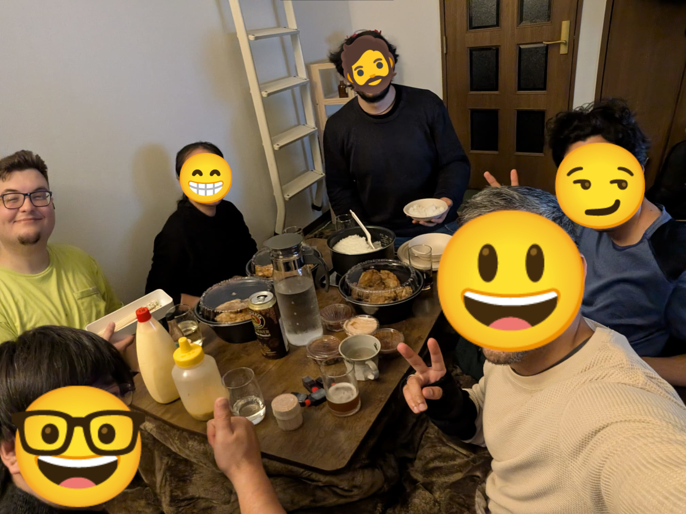

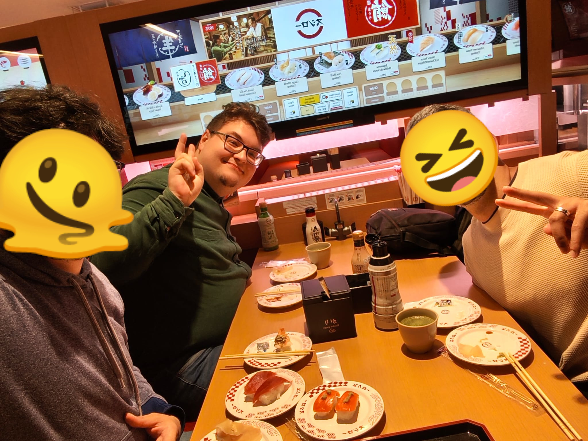 

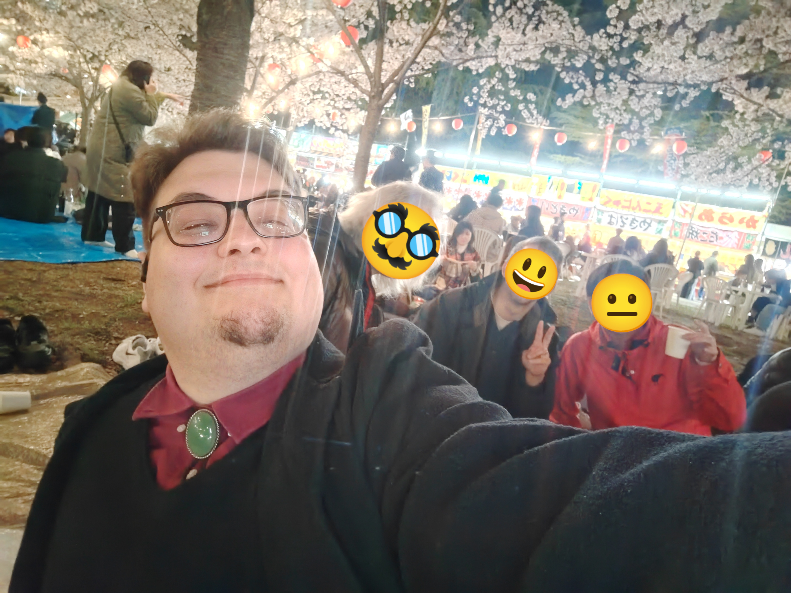

## Amik hiányoznak

Ezen a ponton már éltem itt kinn eleget, hogy a "nászút" fázisa a dolognak elmúljon, úgyhogy az újdonság mámorától független módon tudok értekezni. Baromira hozzászoktam az itteni élethez ezen a ponton. A havi 2-3 karaoke, a mindennapi curry, a relatív gyakori sushizás és az éjszakánkénti hazaút közben a medvékkel való találkozás elkerüléséért imádkozás... Egészen mindennapivá vált. Épp ezért az átlag embernél elmondásaik alapján jóval kevesebb dolog indukál bennem honvágyat. Ami viszont mégis, az nagyon.

Hiányzik anyámmal a 6 négyzetméteres konyhában az éneklés közben párhuzamos sütés-főzés. Még ha az időközönkénti töltöttkáposztától a falra is tudtam volna mászni.

Hiányzik apámmal a legrandomabb helyeken nyaralások és a spontán összehívott esti szomszédsági pókerezések. Még ha ott is megvoltak a nehézségek.

Nagymamámmal a fürdőzések. Unokabátyámékkal az egész napos társasozások. Nagybátyámmal a mindenféle fura cseh és német sör végigkóstolása. Nagynénéméknél a meszámlálhatatlan nassolnivalóból szemezgetés. Barátaimmal az évi Pride vonulás a kiállhatatlan dögmelegben, és az univerzum leglucskosabb Sloppy Joe szendvicsét kilónyi jalapenoval megpakolt bezabálása közbeni kártyajátékozás. A Bajcsi Pointerben vagy a Cosmoban a legutóbb megnézett animéink kibeszéléséből a szociálpolitikai diskurzuson keresztül az egymást sírva-ölelve a legnehezebben kimondható gondolataink megosztásába fulladó hosszú éjszakák.

Magyarország őszintén baromira nem hiányzik. De Ti nagyon hiányoztok.

...

Ja meg amúgy a frissen sült pékárúk. Itt minden ilyen albán stílusú felfújt vacak. Pékségek felének francia a neve, de helyettük igazán tanulhattak volna a németektől. De kábé ennyi.

## Konklúzió: Megérte?

Meg. Nagyon élvezem alapjáraton a mindennapokat most, hogy elmúlt az a cefet kínos egy év felvételi időszak. Érzem, hogy meg van becsülve itt a jelenlétem mind szakmai, mind személyi szempontból. Rendszeresen van társaságom szabadidőmben, és el tudom foglalni magam akkor is amikor épp nincs. Nyilván még egy élettárs, meg egy kocsi, meg egy kávézós terasz nem ártana, de szép fokozatosan dolgozom rajta. *Jó lesz ez.*

 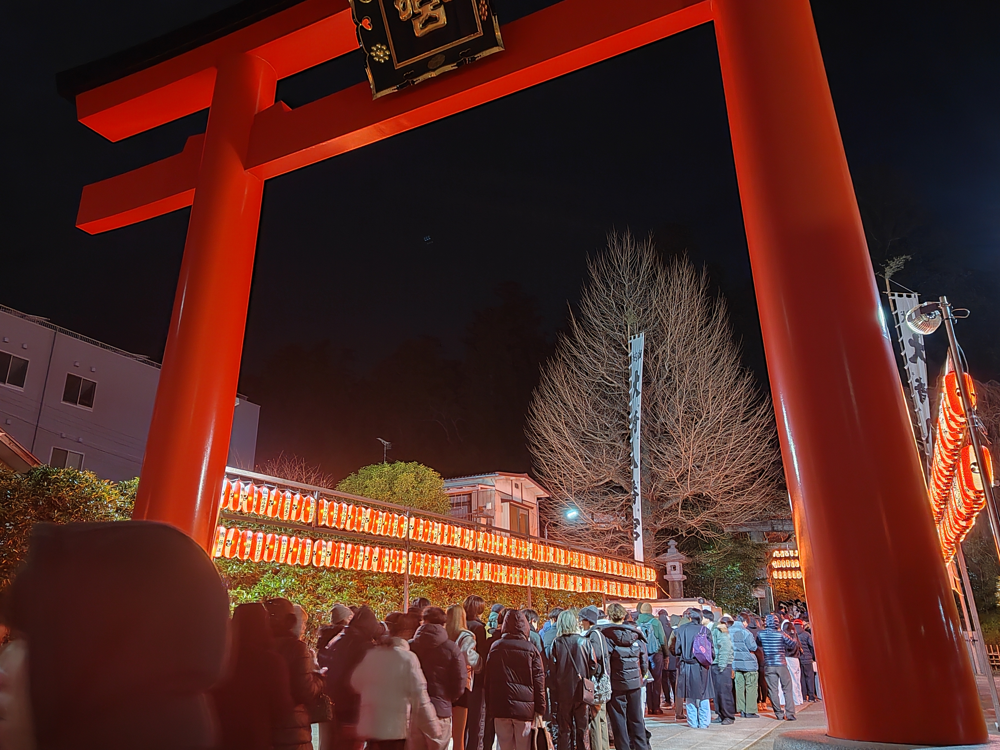

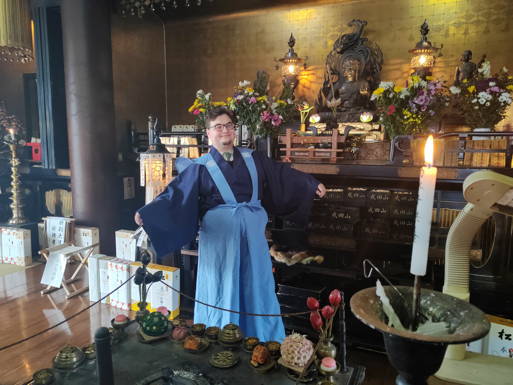

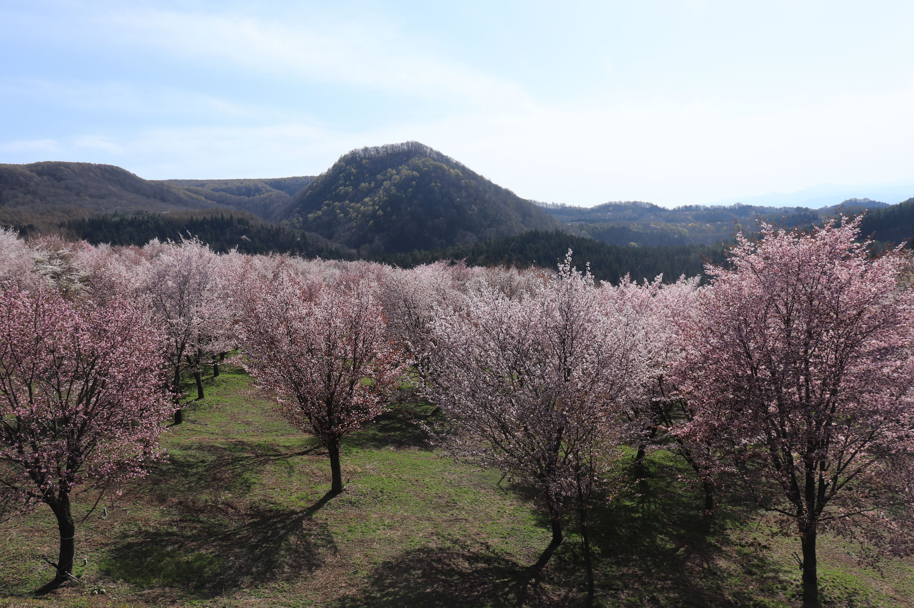 

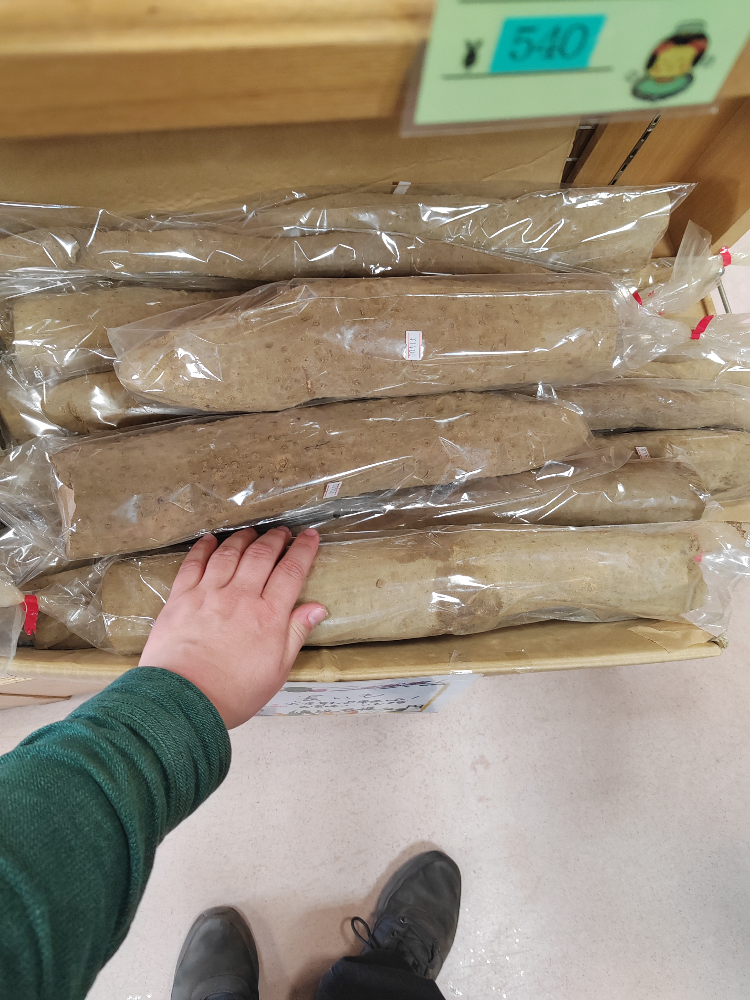
